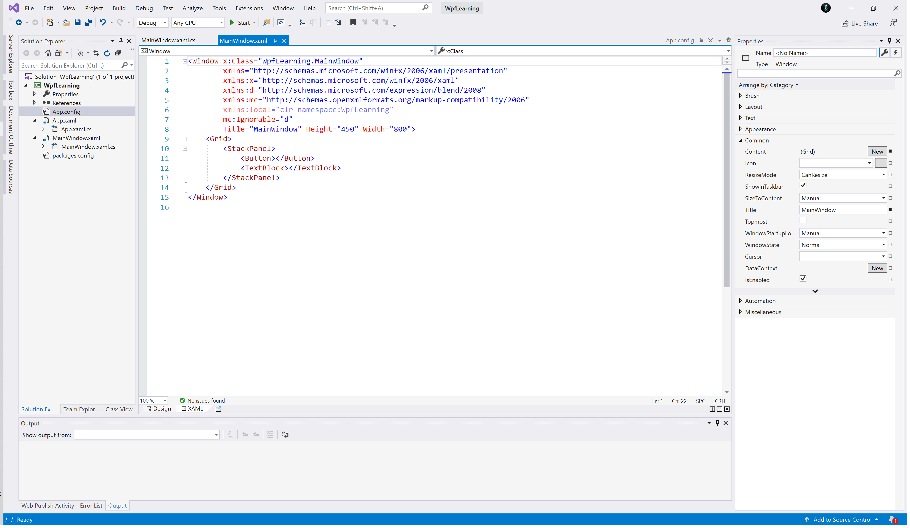
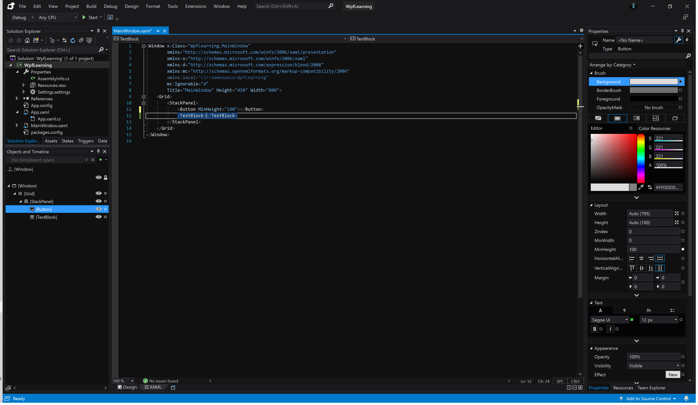
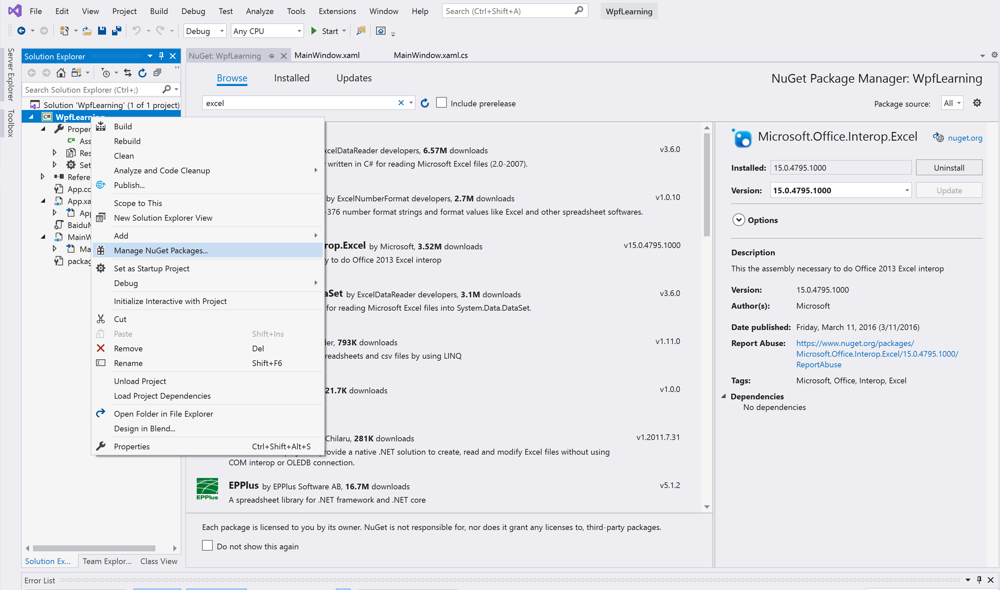

# 	WPF笔记

[TOC]

## 一.入门

#### 1.Hello WPF

​	使用VS创建WPF类型的程序，点击运行就可以弹出一个空白的窗口。

​	背后VS为我们做的事很多，比如使用C#编译器（C Sharp Compiler，csc）将其编译为.exe文件`esc /r:[path to wpf.dll] /t:winexe MyApp.cs`。

​	VS提供了许多编译条件和编译模板，在新建的项目中引入相对应需要的dll和编译环境。事实上，背后加上了包括版本、编译后名称等的几十个参数。



项目资源管理器的层级结构为

```

Solution（相当于Idea中Project）

​	Project（相当于Idea中Module）

​	​	Properties（项目设置存储的位置）

​	​	Refereces（添加外部引用的磁盘位置）

​	​	App.xaml+App.xaml.cs（代表应用本身，在这里指定启动主窗体）

​	​	MainWindow.xaml+MainWindow.xaml.cs
```

MainWindow.xml和MainWindow.xmal.cs的关系：MainWow.xml.cs的窗口类定义使用了`partial`关键字，添加这个关键字的作用就是将类、结构或接口的定义拆分到两个或多个源文件中。在后台文件中的`InitializeComponent`实际上就是xmal的方法。

#### 2.XAML

##### ①引言

​	XAML是在XML的基础上发展的一种声明式语言：每出现一个标签就声明一个对象，标签之间的嵌套关系表现为对象之间的父子关系。

MainWindow.xaml如下：

```
<Window x:Class="WpfLearning.MainWindow"
        xmlns="http://schemas.microsoft.com/winfx/2006/xaml/presentation"
        xmlns:x="http://schemas.microsoft.com/winfx/2006/xaml"
        xmlns:d="http://schemas.microsoft.com/expression/blend/2008"
        xmlns:mc="http://schemas.openxmlformats.org/markup-compatibility/2006"
        xmlns:local="clr-namespace:WpfLearning"
        mc:Ignorable="d"
        Title="MainWindow" Height="450" Width="800">
    <Grid>
        <StackPanel>
            
        </StackPanel>
    </Grid>
</Window>
```

`xmlns:x`：xml名称空间，相当于python中的`import xaml as x`。之前已经提到过，xaml中没出现一个标签就声明一个对象，而名称空间就相当于Java中的package、C#中的namespace，目的是准确地定位元素（尽管看上去像一个网址，实际上和com.xindelvcheng.java.main一样）。

​	值得注意的是，有一个`xmlns`可以不写别名，且会被当作默认命名空间，当前文件中的没有指明namespace的元素都会被当作这个命名空间中的元素。这个命名空间通常是presentation，而Window、Grid、StackPanel、各种控件都在这个命名空间下。

`x:Class`：指示编译成的xmal文件应该和哪个后台文件编译在一起。

##### ②属性赋值方法

编译器解析xaml文件中的声明式配置生成对应的对象。每个标签都是一个对应类的对象，而这个对象的属性则有三种复制方法：

（1）Attribute=Value

​	如`Title="MainWindow" Height="450" Width="800"`，这种语法和xml中的属性赋值形式一样，最简单、直观，是推荐的方式。尽管给的value都是字符串，但因为对应的类加了TypeConverterAttribute(typeof(ClassNameOfConverter))特性，因此能自动完成字符串到对象的转换。

（2）属性标签

​	类似Button.Background这样的标签，并不会生成一个对象，而是用于给Button对象的一个属性赋值。只有这个属性需要一个复杂的、不能用字符串表示直接转换的值的时候才使用这种方式，且若内容是集合则可以省略包裹的集合标签。

```xaml
<Button>
    <!--标签的Content(不是对象的Content）-->
    <Button.Content>
        <TextBlock Text="HellO!"></TextBlock>
    </Button.Content>
    <Button.Background>
        <SolidColorBrush Color="Blue"></SolidColorBrush>
    </Button.Background>
</Button>
```

（3）标记扩展

​	标记扩展是xaml支持的一种使用`{}`转义标签为属性赋值的方式。WPF 应用编程中最常用的标记扩展是Binding、StaticResource、DynamicResource。

```xaml
<TextBlock x:Name="tb" Text="{Binding ElementName=sld,Path=Value}"></TextBlock>
<Slider x:Name="sld"></Slider>
```

#### 3.Blend

Blend是MS提供的专门设计界面的工具。可以看到控件的树形结构。而Winform之类则是平面结构，即窗口相当于一张画布，在上面绘制的控件没有父子关系。当然，在WPF中使用Canvas也可以实现类似的效果。



#### 4.事件

事件是.NET平台对象的通信机制，是由Win32的“消息”演化而来，实际上一个系统预定义的委托对象，支持`+=`，`-=`操作

源码：

```C#
public event RoutedEventHandler Click;

public delegate void RoutedEventHandler(object sender, RoutedEventArgs e);

private void Btn1_Click(object sender, RoutedEventArgs e)
{
    MessageBox.Show("Hello!");
}
```

①注册事件处理函数

（1）xmal方式

```xaml
<Button x:Name="btn1" Click="Btn1_Click" Content="点击！"></Button>
```

（2）C#方式

```C#
btn1.Click += Btn1_Click;
```

#### 5.网络

```C#
public string getResponseContent(string keyword)
{
    string result = "";
    string url = "http://localhost:8808/query/" + keyword;
    HttpWebRequest req = (HttpWebRequest)WebRequest.Create(url);
    HttpWebResponse resp = (HttpWebResponse)req.GetResponse();
    Stream stream = resp.GetResponseStream();
    try
    {

        using (StreamReader reader = new StreamReader(stream))
        {
            result = reader.ReadToEnd();
        }
    }
    finally
    {
        stream.Close();
    }
    return result;
}
```


#### 6.NuGet

NuGet是C#的包管理器，和pip的作用类似，使用时可以直接在VS中打开的项目上右键选择“Manage NuGet packages”进行图形化安装和管理NuGet包。



## 二.扩展

#### 1.Map

在WPF中添加Bing地图。需要先下载`Microsoft.Maps.MapControl.WPF.dll`并添加到Reference中。

##### ①在xaml中添加命名空间

```xaml
xmlns:m="clr-namespace:Microsoft.Maps.MapControl.WPF;assembly=Microsoft.Maps.MapControl.WPF"
```

然后便可以使用`<m:Map`标签添加地图控件了。

##### ②地图的API

（1）定位

```C#
private void locate(double x,double y)
{
    mainMap.Center = new Location(x, y);
}
```

（2）添加图钉

```C#
private void AddPushpinToMap(double latitude, double longitude, string pinLabel)
{
    Location location = new Location(latitude, longitude);
    Pushpin pushpin = new Pushpin();
    pushpin.Content = pinLabel;
    pushpin.Location = location;
    mainMap.Children.Add(pushpin);
}
```

（3）添加图层/图片

```C#
private void addLayer(string imgSource)
{
    MapLayer newLayer = new MapLayer();
    Image image = new Image();
    BitmapImage bi = new BitmapImage();
    bi.BeginInit();
    bi.UriSource = new Uri("EG.PNG", UriKind.Relative);
    bi.EndInit();
    image.Stretch = Stretch.Fill;
    image.Source = bi;
    mainMap.Children.Add(image);
}
```

（4）画几何体、折线

```C#
private void addNewPolyline(string[] points)
{
    MapPolyline polyline = new MapPolyline();
    polyline.Stroke = new System.Windows.Media.SolidColorBrush(System.Windows.Media.Colors.Blue);
    polyline.StrokeThickness = 5;
    polyline.Opacity = 0.7;
    polyline.Locations = new LocationCollection();
    for (int i = 0; i < points.Length; i++)
    {
        string point = points[i];
        Location dest = LocalDataset.queryLocalCoordinatesDatabase(point);
        polyline.Locations.Add(dest);
    }
    ;

    mainMap.Children.Add(polyline);
}

private void addNewPolygon(string[] points)
{
    MapPolygon polygon = new MapPolygon();
    polygon.Fill = new System.Windows.Media.SolidColorBrush(System.Windows.Media.Colors.Blue);
    polygon.Stroke = new System.Windows.Media.SolidColorBrush(System.Windows.Media.Colors.Green);
    polygon.StrokeThickness = 5;
    polygon.Opacity = 0.7;
    polygon.Locations = new LocationCollection();
    for (int i = 0; i < points.Length; i++)
    {
        string point = points[i];
        Location dest = LocalDataset.queryLocalCoordinatesDatabase(point);
        polygon.Locations.Add(dest);
    }

    mainMap.Children.Add(polygon);
}
```

（5）捕获并处理地图双击事件

```C#
private void MapWithPushpins_MouseDoubleClick(object sender, MouseButtonEventArgs e)
{
    // Disables the default mouse double-click action.
    e.Handled = true;

    // Determin the location to place the pushpin at on the map.

    //Get the mouse click coordinates
    Point mousePosition = e.GetPosition(this);
    //Convert the mouse coordinates to a locatoin on the map
    Location pinLocation = mainMap.ViewportPointToLocation(mousePosition);

    // The pushpin to add to the map.
    Pushpin pin = new Pushpin();
    pin.Location = pinLocation;
    Console.WriteLine($"Localtion1:{pinLocation}");

    // Adds the pushpin to the map.
    mainMap.Children.Add(pin);
}
```

#### 2.Excel

在WPF中中处理Excel文件。需要先在NuGet中安装`NPOI`包。

