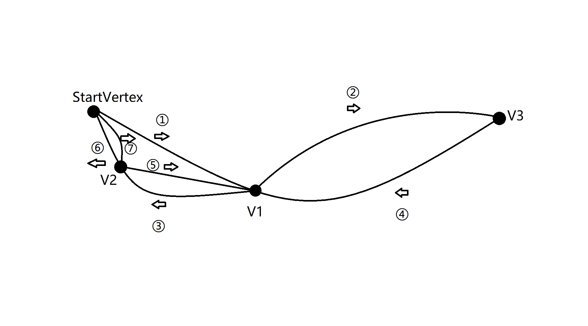

Graph Fundamental

[TOC]

## 一.概念

#### 1.强连通

(Strongly Connected)是指一个有向图(Directed Graph)中任意两点v1、v2间存在v1到v2的路径(path)及v2到v1的路径。

#### 2.弧

有向图中的边，弧头与箭头对应，弧尾与箭头尾对应

#### 3.回路

路径中有重复的节点

含回路的图无拓扑排序序列

#### 4.简单回路

回路中除没有重复节点

## 二.算法

#### 1.强连通子图搜索算法

连通：从A能到B

强连通：不仅能从A到B，还能从B能返回A

因此要找出所有的强连通分量，要遍历两边图，第一遍将节点存到一个栈中，然后反转所有的弧，从栈弹出元素进行dfs。

原理：

实际上，你可以将一个强连通分量看做一个顶点，建立一个新的有向无环图。反转所有的弧，并不会让强连通分量内部产生变化，而是反转了强连通分量之间的关系。

也就是说，正向时A->B，反向时A-/>B，这就区分了强连通分量。（当然，此时反向也会产生一些正向无法到达的弧，只是这些弧的弧尾一定在此之前就已经被访问了）

算法复杂度O(E+V)

#### 2.寻环算法

##### （1）基本思想

显然，回路只会出现在强连通分量内部。因此将图划分为多个强连通子图，分而治之。

##### （2）实现的细节

在普通的BFS或DFS中，我们通常只需维护一个visited集合来确保不会重复遍历节点，而在寻环算法中，我们往往需要维护顶点的三种状态，常被形象地表示为三种颜色，即white（顶点未被发现）、gray（正在遍历）、black（遍历已完成）。当我们在DFS的过程中遇到标记为gray的顶点时，可知该有向图中有环；遇到white顶点需要递归DFS；遇到black顶点则相当于在visited中见到，直接跳过。

如果需要得到回路的路径，你可以维护一个map，记录顶点的parent，当遇到环的时候就可以递推回去。

想要优化循环算法，你需要维护一个blocked set和一个blocked map

从StartVertex开始：

- blocked set：实际就是普通DFS中的visited，因为我们寻找的是简单路径，除了StartVertex之外的顶点不应该重复出现；出现了这种情况，是因为出现了StartVertex为起始点之外的回路。（内在的思想是当你在前面的dfs中遇到了这个节点，实际上你就已经了解了这个节点之后的全部路径信息，不需要再dfs一次。）

  

- blocked map：blocked map是两个顶点之间的映射，用来。

  

  图中就是在dfs中遇到其他回路的情况，因为blocked set的存在，不会出现①②④③⑥这种情况（不是简单回路）。但一个节点显然是可以出现在多个简单回路中的，当我们解决了⑦⑥这个环时，就应该从blocked set中删除环中的V2，否则①③⑥将不会被发现（因为如果此时V2被锁，⑥是不通的）

   

以上的算法复杂度为O(E+V)(C+1) c为环的数量。