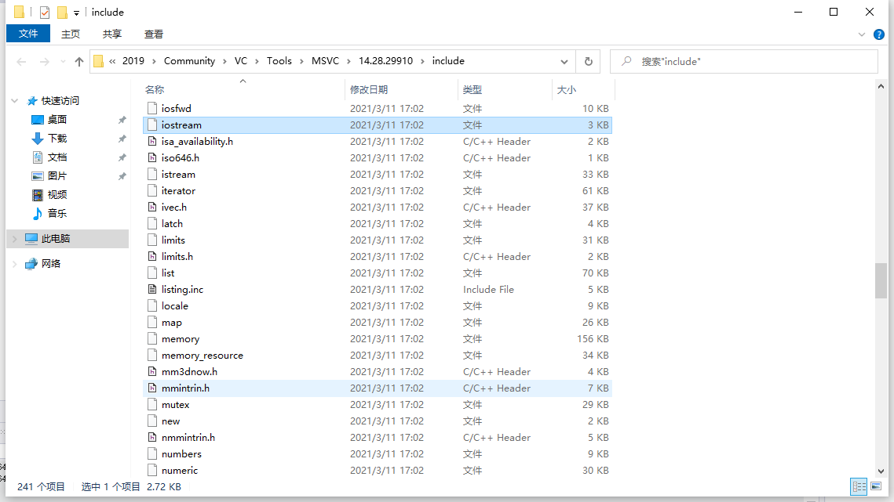
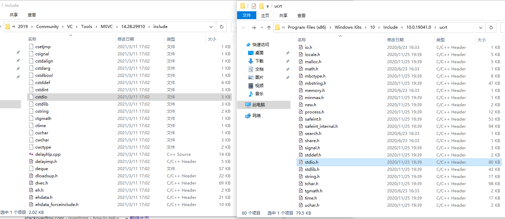

# C++11

[TOC]

## 一.基本语法

## 1.头文件

头文件供编译器和程序员使用，当在.cpp文件中使用`#include "head_file_relative_path"`语法包含一个标准库头文件之后，会将头文件中的内容（通常是一些函数和类的声明）拷贝到当前.cpp中。使用这句指令时一般使用头文件相对搜索路径的路径（尽管绝对路径也可以）。

代码如下：

```C++
#include "test.h"
```

对.cpp中的一个函数调用而言，编译器只要知道它的参数列表和返回值，就知道这次调用是否合法，至于通过函数名查找函数体在哪里，那是链接器的职责。

特别地，如果引入的头文件来自标准库，可以使用`#include <head_file_relative_path>`语法。使用这种方式搜索路径将不包括用户目录。

##### ①.标准库的头文件

标准库中的头文件不带.h后缀名，形如vector、iostream，如下图所示



对C语言标准库（如stdio.h）仍可用，但更推荐使用不带后缀名的cstdio（新式C头文件取消后缀名，添加"c"前缀，如下图所示：



> 它们并不在一个路径下，cstdio在VisualStudio的安装目录下，stdio.h在WindowsKits的通用C运行时(ucrt)下，它们的关系是cstdio中`#include <stdio.h> `引入了stdio.h。

##### ②自定义的头文件

自定义的头文件一般以.h结尾，用于插入文本的以.inc结尾。

### 2.命名空间

命名空间用于隔离作用域，防止命名冲突。例如UnrealEngine和OpenCV都定义了check宏且参数不同，但它们没有使用命名空间包裹，这导致两者编译时只能选择删掉OpenCV中的check，否则会发生错误。

> 宏是没有重载一说的，定义两个只会有一个生效。

C++标准库的中的类都被放在命名空间std中，例如使用vector，使用时需要使用域作用符，代码如下：

```c++
#include <vector>

int main() {
	std::vector<float> array;
}
```

也可以使用using声明，代码如下：

```c++
using std::vector;

int main() {
	vector<float> array;
}
```

使用using声明的文件和引入该文件的文件中vector都会被当成std::vector；

但不应该使用using指示，该语法会污染命名空间。

```c++
using namespace std;

int main() {
	vector<float> array;
}
```

### 3.可变参数模板

可以实现类似Python中位置参数*arg的作用，让函数接收任意数量的参数。

### 4.auto自动推断类型

使用auto的场合：

##### ①类型写出来较长的局部变量

例如：

```C++
std::vector<float> array = { 1,2,3,4,5 };
for (std::vector<float>::iterator it = array.begin(); it != array.end(); )
{
	if (*it == 3)
	{
		it = array.erase(it);
	}
	else
	{
		it++;
	}
}
```

可以使用auto简化：

```c++
std::vector<float> array = { 1,2,3,4,5 };
for (auto it = array.begin(); it != array.end(); )
{
	if (*it == 3)
	{
		it = array.erase(it);
	}
	else
	{
		it++;
	}
}
```

##### ②Lambda表达式

```c++
float key = 10;
auto search_function = [key](float e) {
    if (e == key)
    {
        return e;
    }
};
```

### 5.初始化列表

C++11之前创建对象可以使用小括号，但下面的情况会出现歧义：

```C++
Matrix matrix();
```

这句代码既可以看作使用Matrix类的无参构造函数创建一个名为matrix的对象，也可以看作声明了一个名为matrix、无参、返回值为Matrix类型的函数。

C++11之后创建对象统一用大括号，代码如下：

```c++

```

### 6.std::move和std::forward

std::move用于将左值转为右值（临时对象），可以转交资源也可以重利用表达式的值;

std::forward不改变左值右值特性转发。例如，有两个函数，分别接受左值和右值：

```c++
struct Color
{
    uint8_t R, G, B;
};

void func(const Color& color)
{
    printf("Call const&");
}

void func(Color&& color)
{
    printf("Call &&");
}
```

这时候我使用另一个函数调用func（例如转发到线程），代码如下：

```c++
void forward(Color&& color)
{
    func(color);
}
```

那么会调用`func(const Color& color)`还是`func(Color&& color)`呢？是`func(const Color& color)`，因为函数的参数总是左值，输出：

```bash
Call const&
```

> 注意，引用&并不是一种属性类型（例如int& b = a;b的数据类型是int而不是int&），&&也不是（不能将一个右值引用赋给另一个右值引用），它们更像是一种语法糖或者编译器的记号。

那么怎么保留&&记号呢？使用std::forward即可，代码如下：

```c++
void forward(Color&& color)
{
    func(std::forward<Color>(color));
}
```

输出：

```
Call &&
```

move和forward只是给编译器看的一种“语义”，它们运行期什么都不做。

### 7.std::thread

用于多线程，其构造函数接受一个函数（仿函数，lambda表达式）和任意数量的参数（将会转发给内部的函数），只要有函数就会启动线程执行函数（而使用无参构造创建时不启动）。当子线程启动后，主线程要调用.join等待某个子线程结束（此函数将会阻塞直到子线程结束），否则若主线程在子线程之前结束将会出现异常。除了join之外也可以使用detach，让子线程转入后台运行，虽然与主线程无关了，但也失去控制了。调用了join或detach将不能再join或detach（因此不能先detach再join），可使用joinable查看是否可join或detach。