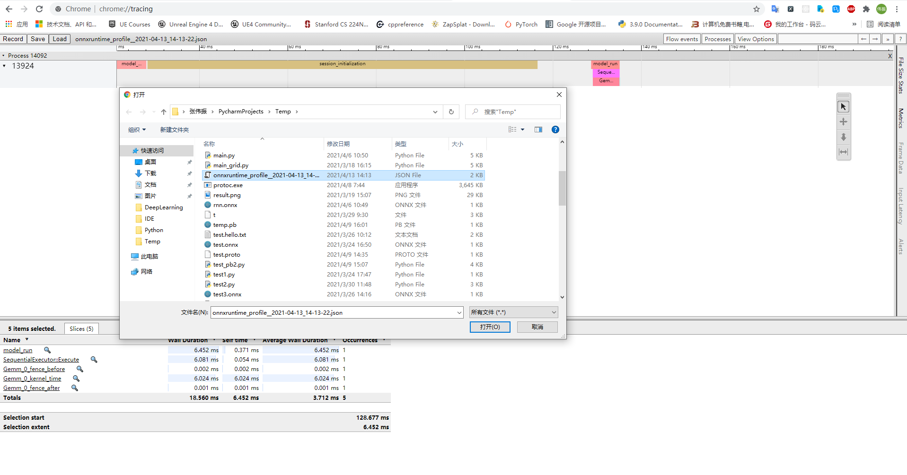

# Onnx

[TOC]

## 一.入门

ONNX是通用模型表示格式（类似Web中的json），可以使用Netron查看ONNX格式的模型，并使用ONNXRuntime运行。

### 1.安装

```bash
$ pip install onnx onnxruntime
```

### 2.使用`torch.onnx.export`函数导出模型

##### ①定义模型：

```python
class Model(torch.nn.Module):
    def __init__(self):
        super(Model, self).__init__()
        self.fc = torch.nn.Linear(784, 1000)

    def forward(self, x):
        return self.fc(x)
```

##### ②静态导出：

使用函数`torch.onnx.export(模型对象，输入参数，文件名或类文件对象，输出参数名称)`

```python
model = Model()
data = torch.randn(100, 784)

torch.onnx.export(model, data, "test.onnx")
```

可能的原理是运行一遍模型记录下计算图（因此需要转入数据）。网络的结构固定（不能包含if和for），模型的输入输出形状固定。

需要的变量（包括输入参数，各种超参数）可以指定名称，后面在运行时按名称传入（如果不指定则按forward方法参数的顺序传入）。

<font color=red>当参数不止一个的时候还是使用@torch.jit.script的时候会导致input_names中的name和模型中实际参数名不同（可以从input_data变成input_data.1，这时候可以通过export添加-verbose=True来判断</font>。

```python
torch.onnx.export(model, data, "test.onnx", input_names=["images"])
```

> 多个参数则在data的位置放一个元组，如果最后一个参数是一个元组，须在最后放一个空的字典（否则会被当成关键字参数列表）

需要注意的是，只会导出Model中forward函数中参与output的计算（作为PyTorchAPI中函数的参数）的那些参数，否则即便在forward函数的参数列表中也不会被导出（且这样会导致export时的参数和run时需要的参数不同）。

如果要让一个维度可变（例如batch_size不确定），则需要在dynamic_axis中指定：

```python
``dynamic_axes = {'input':[0]}``
```

这里即便维度只有1个也要给出列表，否则报错。

##### ③运行模型：

实例化onnxruntime.InferenceSession，调用其run方法。

```python
ort_inference_session = ort.InferenceSession("./test.onnx")
outputs = ort_inference_session.run(None, {"images": np.random.randn(100, 784).astype(np.float32)})
```

> 注意，这里数据是传给Model.forword方法而不是Model类的。

错误：RuntimeError: Input must be a list of dictionaries or a single numpy array for input '0'.：输入数据应是numpy.ndarray不能是torch.Tensor

##### ④.原则

构建网路时避免使用numpy，使用.detach代替.data

### 3.TorchScript

TorchScrip是PyTorch对模型的中间表示，可用于让模型运行在C++中。如果需要使用导出动态的onnx模型（即中间含有if或for让模型结构会发生变化的），则需要使用TorchScript。

使用torch.jit.trace，传入模型和参数，将执行该模型并记录为一个torch.jit.ScriptModule对象中的graph属性。

```python
graph(%self.1 : __torch__.MyCell,
      %input : Float(3, 4, strides=[4, 1], requires_grad=0, device=cpu),
      %h : Float(3, 4, strides=[4, 1], requires_grad=0, device=cpu)):
  %21 : __torch__.torch.nn.modules.linear.Linear = prim::GetAttr[name="fc"](%self.1)
  %23 : Tensor = prim::CallMethod[name="forward"](%21, %input)
  %14 : int = prim::Constant[value=1]() # C:/Users/wzzhang4/PycharmProjects/Temp/test1.py:16:0
  %15 : Float(3, 4, strides=[4, 1], requires_grad=1, device=cpu) = aten::add(%23, %h, %14) # C:/Users/wzzhang4/PycharmProjects/Temp/test1.py:16:0
  %16 : Float(3, 4, strides=[4, 1], requires_grad=1, device=cpu) = aten::tanh(%15) # C:/Users/wzzhang4/PycharmProjects/Temp/test1.py:16:0
  %17 : (Float(3, 4, strides=[4, 1], requires_grad=1, device=cpu), Float(3, 4, strides=[4, 1], requires_grad=1, device=cpu)) = prim::TupleConstruct(%16, %16)
  return (%17)
```

这是一个低级表示，可以通过.code可以查看对应的Python代码：

```python
def forward(self, input: Tensor, h: Tensor) -> Tuple[Tensor, Tensor]:
    _0 = torch.add((self.fc).forward(input, ), h, alpha=1)
    _1 = torch.tanh(_0)
    return (_1, _1)
```

这种模型是静态的，如果有循环将被展开，若有条件判断将走trace时的路径。如果要获得动态的，则需要使用torch.jit.script方法。

①ScriptFunction

```python
@torch.jit.script
def loop_func(loop_num):
    for i in range(loop_num):
        ...
```

使用该函数在export时能正确地导出控制流：if变为`onnx:if`，for变为`onnx::loop`。

②ScriptModel

```python
model = Net()
scripted_model = torch.jit.script(model)
```

导出scripted_model时能正确地导出控制流。

## 二.Onnx规范

### 1.概述

Onnx中的”推理/训练模型“意为一个无/有状态的函数，它有以下由高到低的几个层级：

##### ①onnx.ModelProto

模型，包含一些描述信息（如onnx版本、op_set信息、onnx导出工具信息）和一个Graph

##### ②onnx.GraphProto

图，包含模型参数和运算节点。构成图的节点以拓扑排序保存（因此不能有环），每个节点代表一个Op。

	1. node:List[Node]：构成计算图的拓扑排序保存的节点列表
	2. input:List[ValueInfo]：图的输入参数
	3. initializer:List[Tensor]：命名张量列表，通常用于保存网络的权重、偏置等参数。可以来自外部文件，这时网络中的tensor需要提供外部文件名不能提供值
	4. output:List[ValueInfo]:网络的输出参数。

其中ValueInfo示意如下：

```c
struct ValueInfo{
    string 	name,		# 用于与initializer中的张量匹配
    Type	type,		# 包含数据类型和形状信息
    string	doc_string
}
```

它用于Graph指定inputs和outputs的属性。

而Tensor示意如下（不符合数组语法）：

```c
struct Tensor{
    int32 		data_type;
    ...
    bytes[]		raw_data;
    TensorShape[]		shape;
}
```

其中TensorShape示意：

```c
struct TensorShape{
    struct Dimesion{
        int64 	dim_value;
    	string	dim_param;
    }
    Dimesion[]	dims;
}
```

Dimesion两个变量只会有一个有效，一个维度要么是一个数字，如128，要么是一个字符串，如dynamic_axis_1。输入和输出的形状需要指定秩（即有几个维度），不过每个维度具体的大小则可以是不确定的。

##### ③onnx.NodeProto

节点，主要包含一个Op的名称。Op的参数有inputs和attributes，前者是数据，后者是配置（例如卷积层的kernal_size,stride等）。一张图中所有节点的output的name必须是唯一的。如果有子图（例如If和Loop节点），子图在attributes中。

1. input:List[string]：传递给Op作为inputs的值，只能为图的input或initializer中的一个张量或其他Node的输出（的名称）。当选择其他Node的输出作为输入时，将会建立一条边（Edge）。子图中的节点的输入可以指向外部图也可以指向子图中的值，外部的节点不能指向子图中的值。
2. output:List[string]：接受Op的输出，只能为graph中的另一个节点的输入或图的输出（的名称）
3. attribute:List[Attribute]：常量，传递给Op的配置信息
4. op_type：节点调用的Op的名称（如Gather、If）

ONNX表示中的值分为两种：inputs/outputs值和attribute值，前者在运行时确定（包括来自Graph和Node输入输出、initializers，其中initializers可以来自外部的文件），后者是静态的文本。

Attribute中可能存放不同数据类型的值，ONNX的做法是定义一个结构里面有所有可能的数据类型成员，但是1个Attribute中只能有1种数据有效，示意如下（不符合数组语法）：

```c
struct Attribute{
    string name;
    string doc_string;
    Attribute Type;
    
    float f;
    int64 i;
    byte[] s;
    Tensor t;
    Graph g;
    float[] floats;
    int64[] ints;
    byte[][] strings;
    Tensor[] tensors;
    Graph[] graphs;
}
```

### 2.常见Op

##### ①Contant

单独tensor的包装，相当于torch.tensor()

##### ②ConstantOfShape

指定数值填充的指定形状的tensor，相当于torch.full()

##### ③Gather

类似于pandas的iloc，用于索引和提取数据

##### ④Cast

用于转换数据类型，示例如下：

```onnx
onnx::Cast[to=1](%input)
```

其中to为枚举TensorProtoDataType，从1开始，依次为FLOAT、UINT8、INT8、UINT16、INT16、INT32、INT64、STRING、BOOL、FLOAT16、DOUBLE、UINT32、UINT64、COMPLEX64。例如to=1意为将input的dtype转成FLOAT（32位浮点），to=7意为将input的dtype转为INT64。

### 3.PyTorch导出信息

如果打印onnx.load().graph（即ModelProto.graph），会发现打印了一个链表，可读性很差。如果在PyTorch导出时设置verbose=True，会获得一份相对可读的模型信息，如下：

```onnx
graph(%0 : Float(2, 3, 4, strides=[12, 4, 1], requires_grad=0, device=cpu)):
  %1 : Long(3, strides=[1], requires_grad=0, device=cpu) = onnx::Constant[value= 0  0  1 [ CPULongType{3} ]]()
  %2 : Float(3, 3, 4, strides=[12, 4, 1], requires_grad=0, device=cpu) = onnx::Gather[axis=0](%0, %1) # C:/Users/wzzhang4/PycharmProjects/Temp/test12.py:11:0
  return (%2)
```

graph就像一个函数，%0是参数（参数名是"0"），“:”后是其数据类型，Float类型，形状为[2,3,4]，stides则是每个维度单位偏移（因为Tensor底层都是线性存储的，使用坐标定位就要用到便宜，例如坐标(0,1,2)实际在$rank=0\times 12+1\times4+2\times1=6$的位置上），requires_grad为是否参与求导，device为所在设备。

graph中可以看到一些赋值预算，是%1等变量 = 一个onnx运算符的输出。一个onnx运算符类型类似一个可调用对象（torch.nn.Module），方括号[]中的是运算符的属性（Attribute），类似可调用对象构造函数的参数（如nn.Linear的in_features: int, out_features），而小括号中是其运算的参数。例如`%2 = onnx::Gather[axis=0](%0, %1)`可以理解为

```
gather = onnx.Gather(asis=0)
var2 = gather(var0,var1)
```

或：

```
var2 = onnx.Gather(asis=0)(var0,var1)
```

##### 3.手动创建ONNX模型

可以使用onnx包提供的make_tensor_value_info、make_node等函数手动创建ONNX模型。

```python
import onnx
from onnx import helper
from onnx import AttributeProto, TensorProto, GraphProto
```

##### ①创建输入输出

使用函数onnx.helper.make_tensor_value_info()。这样创建的只是描述，不是数据。

```python
import onnx
from onnx import  TensorProto

X = onnx.helper.make_tensor_value_info('X',                 # name
                                       TensorProto.FLOAT,   # data_type
                                       [10, 1])             # dims
```

这样创建的X类型为ValueInfoProto，它相当于节点间的插口，网络的输入输出也是该类型。

##### ②创建张量

使用函数onnx.helper.make_tensor()。

```python
W = onnx.helper.make_tensor('W',                # name
                            TensorProto.FLOAT,  # data_type
                            [1, 1],             # dims
                            [2])                # vals
```

##### ③创建节点

```python
node_def = helper.make_node(
    'Pad', 					# node name
    ['X', 'pads', 'value'], # inputs
    ['Y'], 					# outputs
    mode='constant', 		# attributes
)
```

这样得到的NodeProto。

##### ④创建图（GraphProto）

```python
graph_def = helper.make_graph(
    [node_def],
    'test-model',
    [X, pads, value],
    [Y],
)
```

##### ⑤创建模型（ModelProto）

相对图而言多了ir_version、op_set等描述信息。

```python
model_def = helper.make_model(graph_def, producer_name='onnx-example')
```

##### ⑥保存模型

```python
onnx.save(model_def,"demo.onnx")
```

##### ⑦完整例子

```python
import torch
import onnx
from onnx import TensorProto

X = onnx.helper.make_tensor_value_info('X',
                                       TensorProto.FLOAT,
                                       [10, 1]) 
W = onnx.helper.make_tensor('W_value',
                            TensorProto.FLOAT, 
                            [1, 1], 
                            [2])  

Y = onnx.helper.make_tensor_value_info('Y', TensorProto.FLOAT, [10, 1])

node_W = onnx.helper.make_node(
    'Constant',
    [],
    ["W"],
    value=W
)

node_matmul = onnx.helper.make_node(
    'MatMul',
    ['X', 'W'],
    ['Y']
)

graph = onnx.helper.make_graph(
    [node_W, node_matmul],
    'test_model',
    [X],
    [Y]
)

model = onnx.helper.make_model(graph, producer_name='onnx_example')
onnx.checker.check_model(model)
onnx.save(model, "test13.onnx")

```

## 三.ONNX Runtime

ONNX Runtime用于运行onnx格式的模型。

### 1.安装

##### ①CPU版本

```bash
$ pip install onnxruntime
```

##### ②GPU版本

```bash
$ pip install onnxruntime-gpu
```

### 2.使用

```python
import onnxruntime as ort

session = ort.InferenceSession("test.onnx")
result = session.run(None, {session.get_inputs()[0].name: x.numpy()})
```

注意这里run传入的input是一个“输入名：数据”字典而不是单独的数据。

### 3.性能调优

onnxruntime这里借用了chrome v8的性能监视器。

##### ①获得.json

在创建session时传入一个SessionOptions，其中设置enable_profiling为True。

```python
import onnxruntime as rt

session_option = ort.SessionOptions()
session_option.enable_profiling = True
session = ort.InferenceSession("test25.onnx", sess_options=session_option)
result = session.run(None, {session.get_inputs()[0].name: x.numpy()})
```

这样会在当前文件夹下创建一个名如`onnxruntime_profile__2021-04-13_14-13-22.json`的包含性能信息的json文件，

##### ②打开谷歌浏览器，输入chrome://tracing/加载该json文件



### 4.IOBinding

IOBinding用于指定输入和输出所在的设备。onnxruntime中的输入和输出默认设备都为CPU，例如：

```python
result = session.run(None, {session.get_inputs()[0].name: x.numpy()})
```

网络在GPU上运行，x将会被拷贝到GPU上，运算完再从GPU拷到result中。

如果上一轮结果当作下一轮输出循环调用一个模型，这种拷贝就需要避免，做法是从session获得io_bindding对象指定输入输出所在设备。

```python
X = np.random.randn(5,3).astype(np.float32)
X_ortvalue = onnxruntime.OrtValue.ortvalue_from_numpy(X, 'cuda', 0)

session = onnxruntime.InferenceSession('model.onnx')
io_binding = session.io_binding()
io_binding.bind_ortvalue_input('input', X_ortvalue)
io_binding.bind_output('output', 'cuda')
session.run_with_iobinding(io_binding)
result = io_binding.get_outputs()[0].numpy()
```

