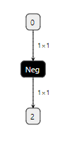

# TorchScript导出注意

##### 1.不能使用列表的.append，使用+=[]来代替

例如：

```python
result = []
result.append(hi) #报错
result += [hi] #正确
```

> 列表里只能放同种元素,[True,2]报错。

##### 2.变量必须具有确定的静态类型，不能因为if的分支变成两种不同的数据类型

例如：

```python
# 报错

import torch

@torch.jit.script
def an_error(x):
    if x:
        r = torch.rand(1)
    else:
        r = 4
    return r
```

> 一般地，TorchScript中的类型检查比Python中的更加严格

##### 3.不是Tensor类型的参数需要显示给出类型，不是Tensor参与控制流会被展开

例如：

```python
# 报错
def forward(self,x,mask=None):
    ...
```

> 实际上给Tensor之外类型的默认值都不是不行的，float之类基本数据类型也不行。

如果要给其他数据类型的默认值，需要使用注释

```
def forward(self, x=2):
    # type: (int) -> int
    return x
```

或者类型提示：

```python
def forward(self, x: int = 2):
    return x
```

需注意，在Python中这种类型提示不是强制的，如果不符合会报警告，但在TorchScript中是强制的，如果不符合会报错误。

但是，即便编译能够通过，如果一个变量不是Tensor，那么它会变成一个常量，不能作为输入，它参与的If也会被展开：

```python
@torch.jit.script
def test(x, index:int):
    if index == 0:
        ret = x
    else:
        ret = -x
    return ret


class Net(torch.nn.Module):
    def __init__(self):
        super(Net, self).__init__()

    def forward(self, x, i):
        return test(x, i)
```

图：



尽量使用Tensor代替其他数据类型：

```python
index = torch.tensor(index,dtype=torch.long,device=data.device)
```

使用时可以强转

```python
for i in range(int(index)):
    pass
```


##### 4.不能使用字典（除非简单数据类型和Tensor）

可以使用的如Dict[str, Tensor]（此类型来自Python自带的typing模块），不可以使用的如Dict[str,Module]。

> collections.namedtuple是可以使用的。

如果使用setattr和getattr，需注意参数都是字符串不能是变量。

例如：

```python
# 报错

class Net(torch.nn.Module):

    def __init__(self):
        super().__init__()
        setattr(self, 'res_block', torch.nn.Linear(5, 3))

    def forward(self, x):
        block_name = 'res_block'
        return getattr(self, block_name)(x)
torch.jit.script(Net())
```

这样是正确的：

```python
    def forward(self, x):
        return getattr(self, 'res_block')(x)
```

##### 5.不能在forward中使用torch.nn.Module的属性，例如\_parameters、\_modules等

例如：

```python
# 报错

class Net(torch.nn.Module):
    def __init__(self):
        super(Net, self).__init__()
        self.fc = torch.nn.Linear(5, 10)

    def forward(self, x):
        return self._modules["fc"](x)
```

但是可以使用ModuleDict和ModuleList，例如：

```python
class MyModule(nn.Module):
    def __init__(self):
        super(MyModule, self).__init__()
        self.choices = nn.ModuleDict({
            'conv': nn.Conv2d(10, 10, 3),
            'pool': nn.MaxPool2d(3)
        })

        self.activations = nn.ModuleDict({
            'lrelu': nn.LeakyReLU(),
            'prelu': nn.PReLU()
        })

    def forward(self, x):
        x = self.choices['conv'](x)
        x = self.activations["lrelu"](x)
        return x


scripted_model = torch.jit.script(MyModule())
```

但需注意，这里取字典使用的key和getattr一样只能是直接字符串，不能是变量。


##### 6.不能在\_\_init\_\_以外的函数创建（会被forward调用的）torch.nn.Module

例如：

```python
#报错
class Net(torch.nn.Module):

    def __init__(self):
        super().__init__()

    def test(self):
        return torch.nn.Linear(2, 3)

    def forward(self, x):
        return self.test(x)


torch.jit.script(Net())
```

forward中也不可以

```python
#报错
def forward(self, x):
    return torch.nn.Linear(2, 3)(x)
```

##### 7.不能在\_\_init\_\_以外的函数创建（会被forward调用的）成员变量

```python
# 报错

class Net(torch.nn.Module):

    def __init__(self):
        super().__init__()

    def init_parameters(self):
        self.test_value = 2

    def forward(self, x):
        return x + self.test_value
```

##### 8.不能使用try-catch

##### 9.不能使用可变参数和关键字参数，不能使用自动解包传参

例如：

```python
shape = [4,6]
x.view(shape) 	# OK
x.view(*shape)	# 报错
```

##### 10.不能转成ndarray使用numpy操作


对trace和script两种导出方式都是如此

##### 11.不能将torch.nn.Module作为参数

```python
# 报错

@torch.jit.script
def fc(linear_model: torch.nn.Module, x):
    return linear_model(x)
```


……

##### 不能使用的高级API

截至opset_version=12明确不能直接使用的有：

torch.linspace

torch.broadcast_tensors

iter()

random.random

