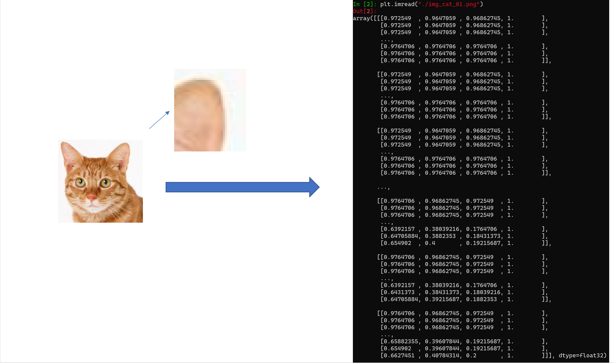

# 1.2什么是神经网络？

## 引言

观察下面的图片，它展示了一些房屋的面积和售价

你可以看出来，它们之间似乎有线性关系，因此你可能会写出这样一个公式

$y = wx+b$ 

y是售价，x是房屋的面积，w和b是参数。

通过最小二乘法或者单纯地拿出几个点估计，我们可以知道w和b的值，当别人想要卖房子的时候，告诉我们他房间的面积，我们就可以带入这个线性公式算出它的大概售价。

但是显然，这个估计是十分不精确的，因为房屋的售价不仅与面积有关，还与许多因素有关，且这些因素所占的权重都不同。

在传统的机器学习算法中，首先要进行的就是所谓的特征工程，也就是找出可能影响结果的那些变量，然后搜集它们的数据并进行训练。

而神经网络呢？

神经网络的神奇之处就在于，我们不需要自己去处理原始数据，只要定义一个神经网络模型，然后把数据丢给它，让它自己学习这些变量和结果之间的关系。

或者

然而这具体是怎么做的呢？

基于一种叫做梯度下降的算法。

## 深度学习三部曲：

（监督学习）

##### 1.定义模型

##### 2.定义损失函数

##### 3.开始训练

所有的数据都可以表示成数字，比如一张猫的图片，实际上就是许许多多像素点构成，每个像素都由（红，绿，蓝）三个值组合而成。同时需要人工给每一张图片添加标注，例如0代表猫，1代表狗。

### 1.定义模型

### 2.损失函数

损失函数代表模型输出值与真实值的差距。

比如输入猫的图片进入网络后输出0.3，而我们标注的是1，它们的差距就为$Loss = (0-0.3)^2$

显然，当Loss=0时，代表模型的输出完全正确。

	

### 3.训练

调整模型中W和B的值，让Loss最小。

所用的算法为梯度下降算法。也就是求Loss对w和b的梯度，以找到能使Loss最快下降的方向。

我们从简单的情况寻找直觉，现在我们有个Loss曲线为图中的棕色线，随机选一个开始的x为1，也就是图中灰色的点，那么我们怎样找到Loss的最低点？

我们在这一点求导，得到其周围的变化趋势，然后将x更新为能让y减少的一个值，并重复此过程，最终x将停在(0,0)的附近

推广至影响Loss的W和B都极多的情况，我们求其梯度，按Loss下降最快的方向前进，最终会到达一个局部最低点

