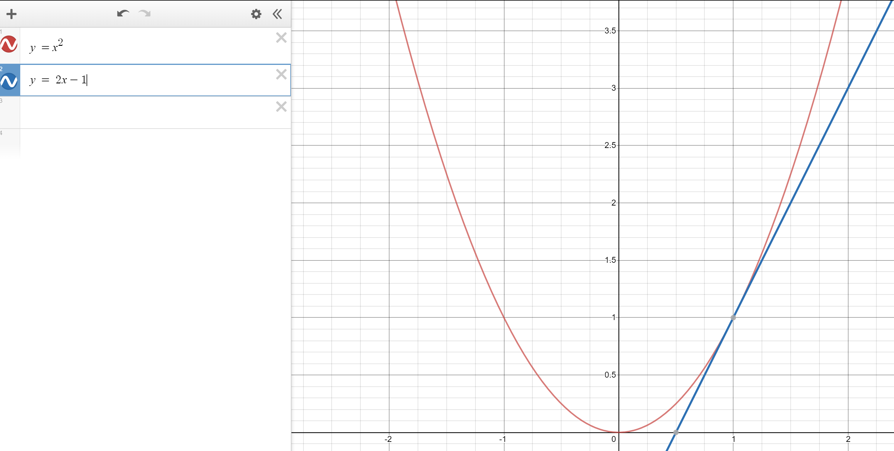

# 3.2预备知识 求函数的最小值



## 安装Ipython

ipython是友好的交互式python环境，每按回车输入一句python代码就执行一句

```
$ pip install ipython
```

## 求函数$y = x^2$的最小值

x是自变量，y是因变量，y对x求导为
$$
y' = 2x
$$


由高中数学知，当$y'$>0时，y随x单调增加；当y'<0时，y随x单调减少

### 选择x=1开始

显然，在选择的点x = 1周围导数都是大于零的，y随x的增加而增加，随x的减少而减少，我们要求y的最小值，自然要减少x，那减少多少呢？

先减少个0.25吧！减少x后y减少了。

### 选择x=-1开始

如果我们选择了x=-1开始，我们就需要增加x的值来到达y的最小值。

### 统一的表示

那么怎么用公式表示这个过程呢？
$$
x = x - \eta y'(x)
$$
$\eta$是一个控制更新速度的系数，常取0.001

