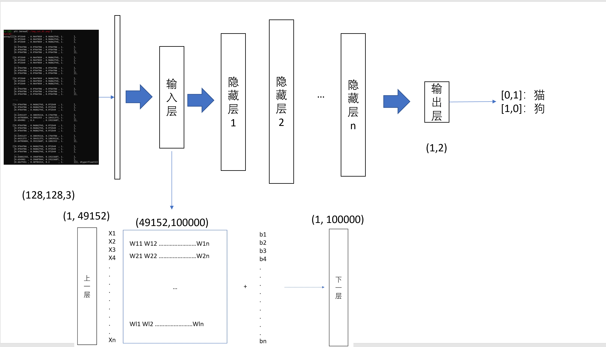
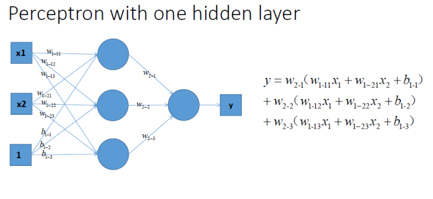
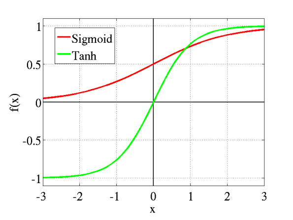
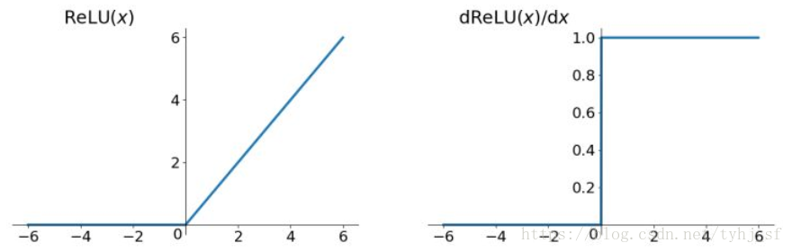
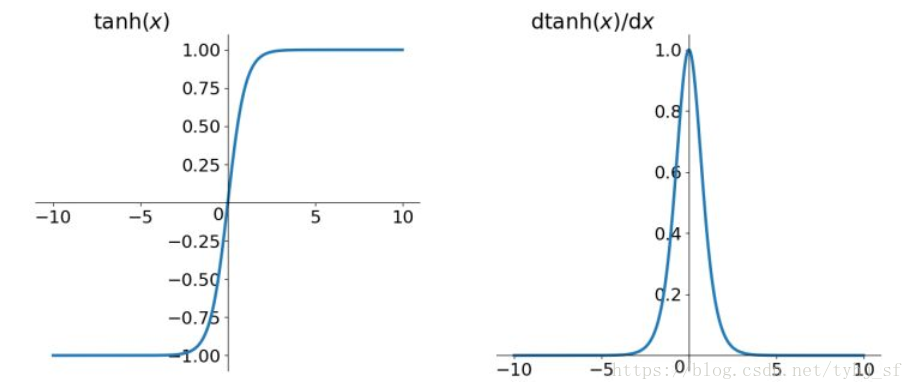
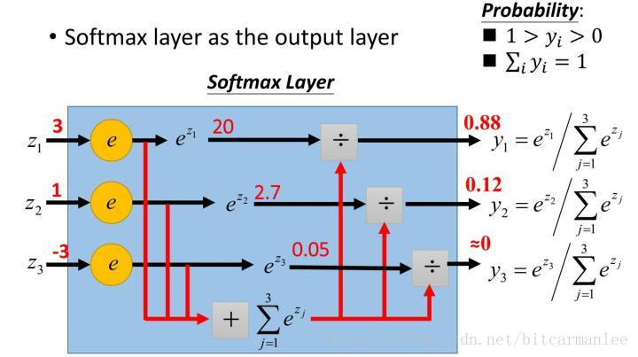
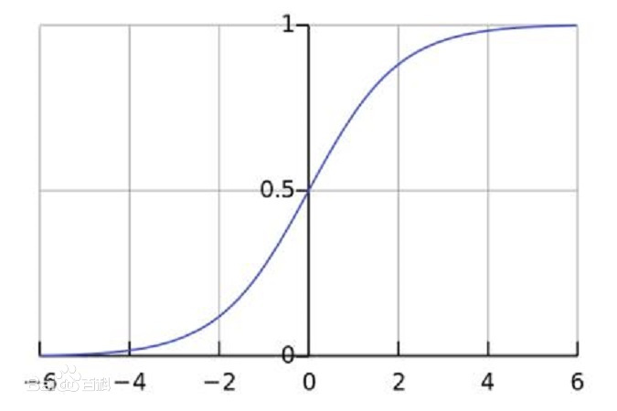

# 3.3 预备知识 激活函数

我们知道神经网络就是由一堆矩阵构成的一个巨型函数，输入x经过每一层都是进行

$x = Wx+b$

的运算。

但是只是单纯地叠多层并没有什么意义，因为在神经网络中，每一层输出的都是上一层输入的线性函数，所以无论网络结构怎么搭，输出都是输入的**线性组合**。

所以，我们需要在传递下一层数据之前，加上一个激活函数

这样神经网络的每一层就变成了
$$
y = \sigma (Wx+b)
$$
两层就是
$$
y = \sigma(W_2\sigma (W_1x+b_1)+b_2)
$$
这样深度的神经网络才有意义。

## 常见的激活函数

### 1.Relu函数

$$
	\left\{  
             \begin{array}{**lr**}  
             y=x & x>=0 \\  
             y=0, & x<0.\\  
                
             \end{array}  
\right.
$$

### 2.双曲正切

$$
tanh(x) = \frac{e^x-e^{-x}}{e^x+e^{-x}}
$$

### 3.Softmax

$$
S_i = \frac{e^i}{\sum_je^j}
$$

用于分类问题

## Pytorch中的激活函数

### 