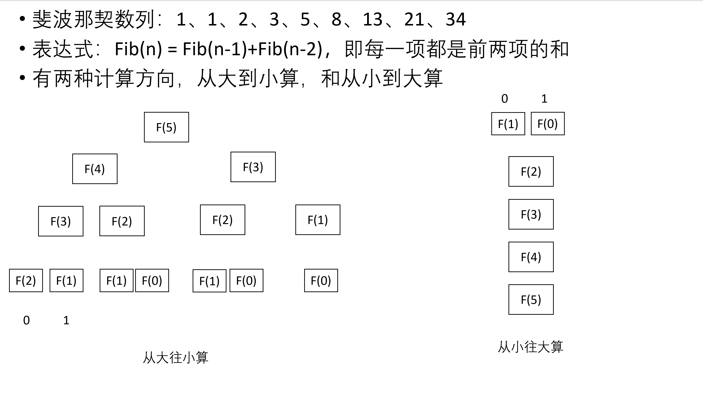

# 3.4反向传播算法

## 重叠子问题

显然，从大往小算比从小往大算花的时间多得多，为什么？

##### 因为它重复求解了很多节点的值

## 复合函数链式求导法则

$$
[g(f)]'(x) = g'(f(x))*f(x)'
$$

例如:

$f(x) = 2x+1\\
g(x) = x^2\\
则复合函数g(f(x)) = (2x+1)^2=4x^2+4x+1\\
g'(x)=8x+4\\
如果使用链式求导法则：
g(f(x))'=g'(f(x))*f'(x)=2(f(x))*2=8x+4$

## 反向传播算法

我们知道神经网络就是由一堆矩阵构成的一个巨型函数，输入x经过每一层都是进行

$a = \sigma(Wx+b)$

的运算，再传给下一层。

我们优化其中的W和b让其能输出正确的值的方法是定义现在和正确答案的差距然后使用梯度下降算法降低这个差距。

$$
w = w- \eta\frac{\partial Loss}{\partial w}
$$
那么，还有什么问题呢？

Loss对权重和偏置的导数$\frac{\partial Loss}{\partial W}$和$\frac{\partial Loss}{\partial b}$怎么求！

我们将问题简化以下，写出以下公式

$经过第一层：a_1 = \sigma(W_1x+b_1) ，也就是a_1=f_1(x)\\
经过第二层：a_2 = \sigma(W_2x+b_2) =\sigma(W_2(\sigma(W_1x+b_1))+b_2) 也就是a_2 = f_2(f_1(x))\\
...\\
...\\
...\\
经过第n层：\frac{\partial Loss}{\partial W_1} = \frac{\partial Loss}{\partial f_n}*\frac{\partial f_{n}}{\partial f_{n-1}}*...\frac{\partial f_3}{\partial f_2}*\frac{\partial f_2}{\partial f_1}*\frac{\partial f_1}{\partial w_1} 也就是a_n = f_n(...(f_2(f_1(x))...)\\
$

如果我们按照神经网络的前后依次计算导数，则根据链式法则

Loss对第一个权重的的偏导数为：
$$
\frac{\partial Loss}{\partial W_1} = \frac{\partial Loss}{\partial f_n}*\frac{\partial f_{n}}{\partial f_{n-1}}*...\frac{\partial f_3}{\partial f_2}*\frac{\partial f_2}{\partial f_1}*\frac{\partial f_1}{\partial w_1}
$$
Loss对第二个权重的偏导数为：
$$
\frac{\partial Loss}{\partial W_2} = \frac{\partial Loss}{\partial f_n}*\frac{\partial f_{n}}{\partial f_{n-1}}*...\frac{\partial f_3}{\partial f_2}*\frac{\partial f_2}{\partial w_2}
$$
显然，这两个式子中大部分都是重复的！这说明我们计算的姿势不对！那应该怎么算？

反着算！用之前得到的值简化计算！

从最靠近输出的最后一个权值开始计算
$$
\frac{\partial Loss}{\partial W_n} = \frac{\partial Loss}{\partial f_n}*\frac{\partial f_n}{\partial w_n}
$$
导数第二个
$$
\frac{\partial Loss}{\partial W_{n-1}} = \frac{\partial Loss}{\partial f_n}*\frac{\partial f_n}{\partial f_{f_n-1}}*\frac{\partial f_{n-1}}{\partial w_{n-1}}
$$
，这里的$\frac{\partial Loss}{\partial f_n}$我们之前算过了。

这就是反向传播！一直到第一个权值。
$$
\frac{\partial Loss}{\partial W_{1}} = \frac{\partial Loss}{\partial f_n}*\frac{\partial f_n}{\partial w_{f_n-1}}*...*\frac{\partial f_3}{\partial f_{f_2}}*\frac{\partial f_2}{\partial f_{f_1}}*\frac{\partial f_1}{\partial w_1}
$$
而这个式子中的大部分项其实我们在之前已经算过了。

## 总结

反向传播是一种高效计算导数的算法，为神经网络优化时使用的梯度下降算法服务，它的设计思路类似动态规划，也就是避免求解子问题。