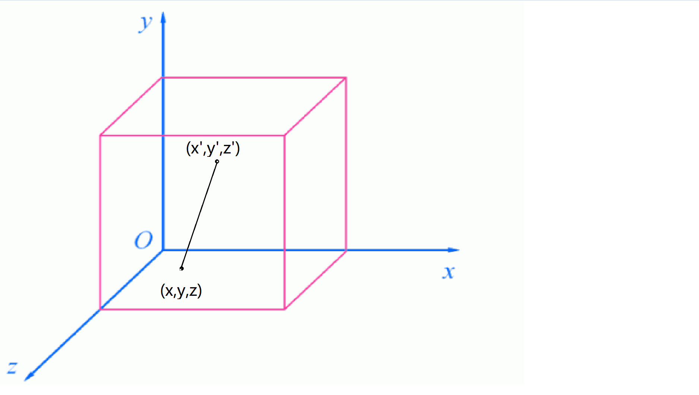

# 2.5预备知识 损失函数

我们之前多次提到用模型的输出值和真实值做差得到损失Loss，其实是一种简化的说法。这里我们介绍两种常用的计算Loss的方式，也就是衡量两个变量差距的方法。

## 均方根误差

可用于回归任务。

我们知道，三维空间中任两点A(x,y,z)和B(x',y',z')的距离为

$L = \sqrt{(x-x')^2+(y-y')^2+(z-z')^2}$

例如，原点（0，0，0）与三维空间中某点（1，2，3）的距离为$\sqrt{(1-0)^2+(2-0)^2+(3-0)^2}=\sqrt{14}\approx3.7$



实际上，这可以推广为n维向量模型的预测值$y_predict(y_1,y_2,...y_n)$与人工标注的真实值$label(y_1',y_2',...y_n')$的差距

$L = \sqrt{(y_1-y_1')^2+(y_2-y_2')^2+(y_3-y_3')^2}$

#### 但这并不是Pytorch中MSE的公式

Pytorch中MSE公式的形式为
$$
L(y_{predect},y_{label})=\frac{\sum_{i=1}^{i=n}{(yi-yi')^2}}{n}
$$


在Pytorch中，使用$torch.nn.MSELoss()$获得一个可执行对象，传入y_predict和y_label获得loss的值。

例如，向量[0,0,0]与向量[1,2,3]的MSELoss为$((1-0)^2+(2-0)^2+(3-0)^2)\div3= （1+4+9）\div3 \approx4.6$

至于现在为何普遍没有使用原始距离公式，而是使用了这个求差平方再取平均数的方式，我没有考证，或许是因为求根号比求平均值的运算复杂不少，又没有过高的收益。

## 交叉熵

主要用于分类问题，公式来自于信息论。

### 信息论

#### 例一

观察下面无扰通信过程。

| 消息  | 编码 | 发送端概率    | 当收到0，接收端猜测结果 | 当收到01，接收端猜测结果 | 当收到011，接收端猜测结果 |
| ----- | ---- | ------------- | ----------------------- | ------------------------ | ------------------------- |
| $x_1$ | 000  | $\frac{1}{8}$ | $\frac{1}{4}$           | 0                        | 0                         |
| $x_2$ | 001  | $\frac{1}{8}$ | $\frac{1}{4}$           | 0                        | 0                         |
| $x_3$ | 010  | $\frac{1}{8}$ | $\frac{1}{4}$           | $\frac{1}{2}$            | 0                         |
| $x_4$ | 011  | $\frac{1}{8}$ | $\frac{1}{4}$           | $\frac{1}{2}$            | 1                         |
| $x_5$ | 100  | $\frac{1}{8}$ | 0                       | 0                        | 0                         |
| $x_6$ | 101  | $\frac{1}{8}$ | 0                       | 0                        | 0                         |
| $x_7$ | 110  | $\frac{1}{8}$ | 0                       | 0                        | 0                         |
| $x_8$ | 111  | $\frac{1}{8}$ | 0                       | 0                        | 0                         |

#### 例二

假设明天天晴或下雨可能性各为50%，当从天气预报中获知明天会下雨时，明天天晴的可能性减少而下雨的可能性增加。

##### 结论：

1.信息，描述的是消除不确定性的东西

2.获取了信息，就是减少了结果的可能性，或者说消除了不确定性。

### 自信息

我们需要用数学抽象和描述信息，与信息的具体内容和形式无关。

由于概率可以描述随机事件的不确定性，因此信息的多少应该是概率的函数。

> 信息是概率的函数，但并不是概率

它应该满足某些条件，以符合我们对信息，即不确定性的直觉：

##### 1.当概率为1，信息为0。

电视台播放新闻，太阳每天从东边升起，废话，概率为1，信息量为0.

##### 2.信息量随概率单调递减

信息1：电视台播放德国队打进世界杯了，这件事可能性很高，信息量很低。

信息2：电视台播放中国队打赢德国队了，这件事可能性很低，信息量很高。

##### 3.独立可加

投掷硬币两次正面朝上的信息量，是一次正面朝上的两倍。

香农给出了这个公式：
$$
I(p) = log(\frac{1}{p})
$$
当底数为2时，单位是bit；当底数为e时，单位是nats。

这个公式称为自信息公式。

例如上面的发送信息例子中，当一个字节都没有收到时，我们需要的信息为log(8) = 3bit，当收到0时，需要的信息为log(4) = 2bit，做差之后算出我们收到的是1bit数据，显然，这是符合直觉的。

对于天气预报的例子，即便天气预报又有图片又有文字，这些内容存储在磁盘上可能1MB，但本质上和只是发送一个“0：晴天；1：下雨”一样，发送的信息可能还不到1bit。


出于打印的需要我们会使用换底公式将这个$\frac{1}{p}=p^{-1}$提出来，写成如下形式
$$
I(p)=-log(p)
$$


1.香农给出的这个描述信息的公式满足我们的直觉，即那三个性质，但并不是说就是标准答案，是完美无缺的。

2.自信息公式是信道无扰情况的情况，实际上是接收方能接收的信息的最大值。

### 离散集平均子信息——熵（Entropy）

在前面的例子中，我们获取$x_1到x_8$的可能性相同，但现实情况往往不是这样，即事件的信息量不是都相等的，梅雨季节获知明天下雨显然没有获知明天天晴有价值——前者都已经习惯了，后者意味着你可以出去玩了。

平均自信息定义为集X的期望，表示信源能发给你的平均信息量

$\because E(X)=-\sum_{i\in{X}}{p(x_i)*f(x_i)}$
$定义H(p)=\sum_i{p_iI(p)}（i\in{X}）为集X的熵$
$由I(p)=-\sum_i{p_ilog(p)}（i\in{X}）$
$$
\therefore H(x)=-\sum_i{p_ilog(p_i)}​
$$


这里pi是-log(p)信息量出现的真实概率，得到就是熵，在数学意义上，它是对依据概率p生成的符号进行编码所需的比特数在平均意义上的下界；

如果拿模型预测的y_predict来当作pi呢？

### 相对熵（KL散度）

对同一个随机变量x，有单独的概率分布P(x)和Q(x)，下面的公式是它们的差异:

$D_{KL}=ExpI(Q)-ExpI(P)\\$
$=Exp[logP(x)-logQ(x)]$

### Cross Entropy 交叉熵

如果要使用KL散度衡量人工标注的真实值与模型的预测值和之间的区别，

X服从两个不相等的概率分布P(x)、Q(x)，则P(x)与Q(x)的不同程度（散度）为：

$L = E_{x\sim P}[logP(x)-logQ(x)]$

但是我们获得区别的目的是为了梯度下降，$E_{x \sim P}[logP(x)]=H(x)$，即熵，是一个常数，求导之后就消失了，所以我们干脆就不计算它，变成

$L=-E_{x \sim P}[logQ(x)]$

这个式子用P分布的概率*Q分布算出的信息量，所以叫做交叉熵

展开这个期望，表达式是

$L=-\sum_i{y_i'log(y_i)}$

这就是交叉熵的公式。

##### 例子

罗马数字识别模型，输出为Ⅰ,Ⅱ,Ⅲ三种类别，对某张图片

标签实际值：[1,0,0]

模型预测值1：[0.7,0.1,0.1]（正确）

$Loss(p1) = -1*log(0.7) \approx 0.35$

模型预测值2：[0.2,0.7,0.1]（错误）

$Loss(p2) = -1*log(0.2) \approx 1.6$

>此处log底数为e，且约定0log0=0，即看作$\lim\limits_{x\to0}xlnx=0$

显然$Loss(p1)<Loss(p2)$，即预测值1比预测值2更加准确。

```python
label = torch.tensor(0).reshape(1)
y_predict_1 = torch.tensor([0.7,0.2,0.1]).reshape(1,3)
y_predict_2 = torch.tensor([0.2,0.7,0.1]).reshape(1,3)
print(criterion(y_predict_1,label))
```

## 总结

损失函数不止MSE和CrossEntropy，只要满足能度量两个不同的向量差距的函数都可以作为损失函数。

MSE和CrossEntropy这两个损失函数只是我们试验出来的效果比较好的函数，但它们既不是标准答案也不是万金油，例如风格转换和人脸识别，你都需要自定义损失函数。

