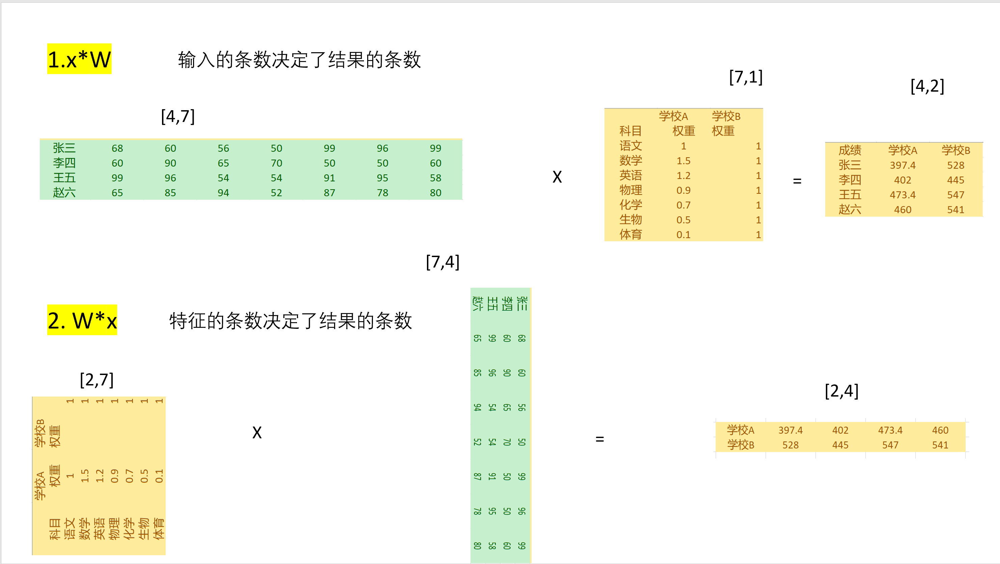
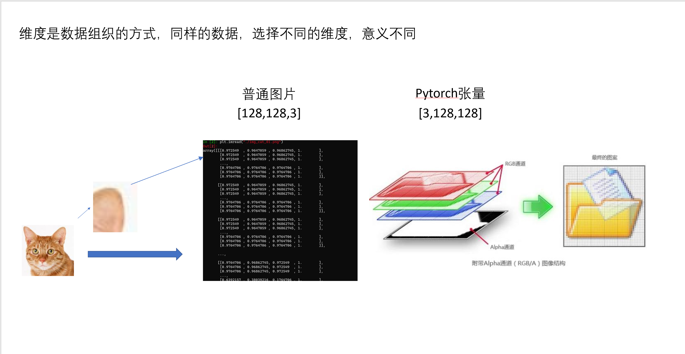

# 3.4在Pytorch中搭建神经网络

## 1.Pytorch全连接层

```python
model = torch.nn.Linear(input_size, output_size)
```

例如

输入一个x，形状为[15,1]，也就是15个1个特征的数据，如房屋的面积

经过model 为`torch.nn.Linear(1,1)`

那么的输入[15,1]和[1,1]相乘，得到了[15,1]的数据，加上偏置之后就是预测值y_predict。

我们将其与真实值y_data做差得到loss，并使用梯度下降算法优化Linear中的w和b，多次迭代并使loss最小。

## 2.示例

```python
import torch
import torch.nn as nn
import numpy as np
import matplotlib.pyplot as plt


# Hyper-parameters
input_size = 1
output_size = 1
num_epochs = 60
learning_rate = 0.001

model = nn.Linear(input_size, output_size)
# Toy dataset
x_train = np.array([[3.3], [4.4], [5.5], [6.71], [6.93], [4.168],
                    [9.779], [6.182], [7.59], [2.167], [7.042],
                    [10.791], [5.313], [7.997], [3.1]], dtype=np.float32)

y_train = np.array([[1.7], [2.76], [2.09], [3.19], [1.694], [1.573],
                    [3.366], [2.596], [2.53], [1.221], [2.827],
                    [3.465], [1.65], [2.904], [1.3]], dtype=np.float32)
# Loss and optimizer
criterion = nn.MSELoss()
optimizer = torch.optim.SGD(model.parameters(), lr=learning_rate)

# Train the model
for epoch in range(num_epochs):
    # Convert numpy arrays to torch tensors
    inputs = torch.from_numpy(x_train)
    targets = torch.from_numpy(y_train)

    # Forward pass
    outputs = model(inputs)
    loss = criterion(outputs, targets)

    # Backward and optimize
    optimizer.zero_grad()
    loss.backward()
    optimizer.step()

    if (epoch+1) % 5 == 0:
        print ('Epoch [{}/{}], Loss: {:.4f}'.format(epoch+1, num_epochs, loss.item()))

# Plot the graph
predicted = model(torch.from_numpy(x_train)).detach().numpy()
plt.plot(x_train, y_train, 'ro', label='Original data')
plt.plot(x_train, predicted, label='Fitted line')
plt.legend()
plt.show()

```

## 3.torch.nn.Linear源码解析

```python
class Linear(Module):
    def __init__(self, in_features, out_features, bias=True):
            super(Linear, self).__init__()
            self.in_features = in_features
            self.out_features = out_features
            self.weight = Parameter(torch.Tensor(out_features, in_features))
            if bias:
                self.bias = Parameter(torch.Tensor(out_features))
            else:
                self.register_parameter('bias', None)
            self.reset_parameters()
    def forward(self, input):
        return F.linear(input, self.weight, self.bias)
```

为什么W是(out_features, in_features)而不是(out_features, in_features)呢？

查看F.linear的源码

```python
output = input.matmul(weight.t())
```

也就是调用了model(x)后
$$
output = xW^T + b
$$
为什么是$xA^T + b$而不是我们所说的$Wx + b$?

因为Wx + b的结果不符合直觉



## 4.FeedForwardNetwork

刚才我们完成了一个线性回归模型，并认识了全连接层torch.nn.Linear，这节课我们来搭建一个完整的全连接神经网络。

### 1.准备数据

##### 下载MNIST数据集

```python
train_dataset = torchvision.datasets.MNIST(root='./data',
                                           train=True,
                                           transform=transforms.ToTensor(),
                                           download=True)

train_dataset = torchvision.datasets.MNIST(root='./data',
                                          train=False,
                                          transform=transforms.ToTensor())
```

可以将train_dataset和train_dataset看作两个存储了（图片，标签）的列表。

##### 查看其中的一张图片

```python
plt.imshow(train_dataset[1][0].reshape(28, 28))
plt.show()
```



##### 使用DataLoader加载数据

使用DataLoader而不是直接迭代train_dataset可以实现分批、打乱、多线程加载。

```python
train_loader = torch.utils.data.DataLoader(dataset=train_dataset,batch_size=batch_size,shuffle=True)
test_loader = torch.utils.data.DataLoader(dataset=test_dataset,batch_size=batch_size,shuffle=False)
```

### 2.搭建全连接神经网络

##### 定义

```python
class NeuralNet(nn.Module):
    def __init__(self, input_size, hidden_size, num_classes):
        super(NeuralNet, self).__init__()
        self.fc1 = nn.Linear(input_size, hidden_size) 
        self.relu = nn.ReLU()
        self.fc2 = nn.Linear(hidden_size, num_classes)  
    
    def forward(self, x):
        out = self.fc1(x)
        out = self.relu(out)
        out = self.fc2(out)
        return out
```

##### 实例化

```python
model = NeuralNet(input_size, hidden_size, num_classes).to(device)
```

### 3.定义损失函数和优化器

使用CrossEntropyLoss作为损失函数，Adam作为优化器

```python
criterion = nn.CrossEntropyLoss()
optimizer = torch.optim.Adam(model.parameters(), lr=learning_rate)  
```

### 4.训练模型

```python
total_step = len(train_loader)
for epoch in range(num_epochs):
    for i, (images, labels) in enumerate(train_loader):  
        # Move tensors to the configured device
        images = images.reshape(-1, 28*28).to(device)
        labels = labels.to(device)
        
        # Forward pass
        outputs = model(images)
        loss = criterion(outputs, labels)
        
        # Backward and optimize
        optimizer.zero_grad()
        loss.backward()
        optimizer.step()
        
        if (i+1) % 100 == 0:
            print ('Epoch [{}/{}], Step [{}/{}], Loss: {:.4f}' 
                   .format(epoch+1, num_epochs, i+1, total_step, loss.item()))

```

### 5.模型评估

```python
# Test the model
# In test phase, we don't need to compute gradients (for memory efficiency)
with torch.no_grad():
    correct = 0
    total = 0
    for images, labels in test_loader:
        images = images.reshape(-1, 28*28).to(device)
        labels = labels.to(device)
        outputs = model(images)
        _, predicted = torch.max(outputs.data, 1)
        total += labels.size(0)
        correct += (predicted == labels).sum().item()

    print('Accuracy of the network on the 10000 test images: {} %'.format(100 * correct / total))


```

### 6.保存模型

```python
torch.save(model.state_dict(), 'model.ckpt')
```

