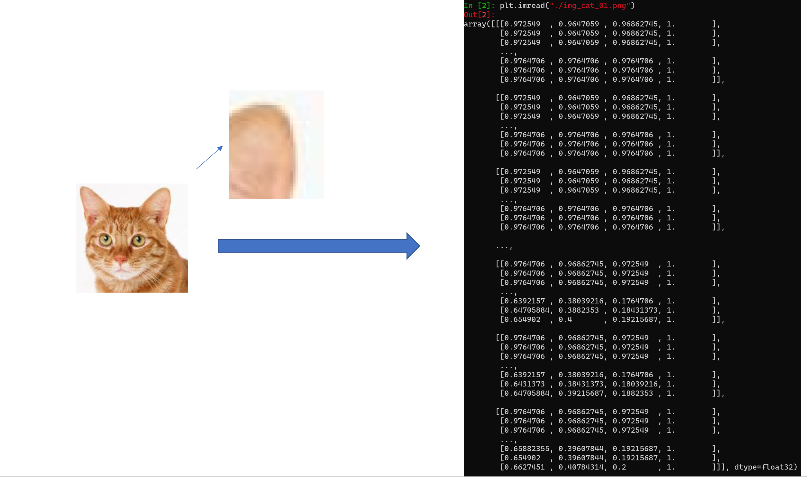
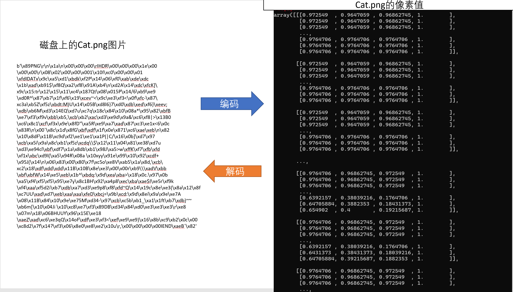

# 4.2读取数据

## 读取图片

我们知道，图片就是很多很多像素点，每个像素点都有一个像素值，如果是彩色图片就是（红，绿，蓝），如果是黑白图片就是用数字表示的颜色深浅程度



你可能注意到了，我这里使用了一个名为imageread的函数来读取图片，为什么我不使用open的方式来打开和读取图片呢？

因为png格式的图片为了减少体积，并不是直接将像素的值存入文件，而是将其通过算法压缩，然后再存入！这个过程称之为编码。所以直接使用open读取的话，你只能得到一堆“意义不明”的数字。

```python
b'\x89PNG\r\n\x1a\n\x00\x00\x00\rIHDR\x00\x00\x00\x1e\x00\x00\x00\r\x08\x02\x00\x...
```

使用open读取得到的png图片是一个二进制流，如果需要还原为像素值，就需要使用算法将这些“意义不明”的数字还原为像素值，并排列成图片的形状，比如[128,128,3].



### 使用matplotlib读取图片

但是幸运的是我们并不用真的学习png文件的编码格式自己做解码这件事，使用matplotlib库的`imread`方法就可以轻松愉快地读取png图片了。

```python
image = plt.imread("./data/train/00000/702.png")
print(image)
plt.imshow(image)
plt.show()
```

## 读取标签

### walk函数

递归遍历文件夹

```python
os.walk(path) 
```

可以得到一个三元tupple(dirpath, dirnames, filenames)地生成器

第一个为起始路径，第二个为起始路径下的文件夹，第三个是起始路径下的文件。

dirpath 是一个string，代表目录的路径，

dirnames 是一个list，包含了dirpath下所有子目录的名字。

filenames 是一个list，包含了非目录文件的名字。

这些名字不包含路径信息，如果需要得到全路径，需要使用os.path.join(dirpath, name).

### 构造数据集

创建格式为[(图片1,标签1)，(图片2,标签2),(图片3,标签3)...]的列表

```python
for root, dirs, files in os.walk('./data/train'):
    for file in files:
        image = plt.imread(os.path.join(root, file))
        image = cv2.resize(image, (28, 28))
        image = cv2.cvtColor(image, cv2.COLOR_BGR2GRAY)
        image = image.reshape(28, 28, 1)
        train_dataset.append((transforms.ToTensor()(image), int(root.split("\\")[-1])))

for root, dirs, files in os.walk('./data/test'):
    for file in files:
        image = plt.imread(os.path.join(root, file))
        image = cv2.resize(image, (28, 28))
        image = cv2.cvtColor(image, cv2.COLOR_BGR2GRAY)
        image = image.reshape(28, 28, 1)
        test_dataset.append((transforms.ToTensor()(image), int(root.split("\\")[-1])))
```