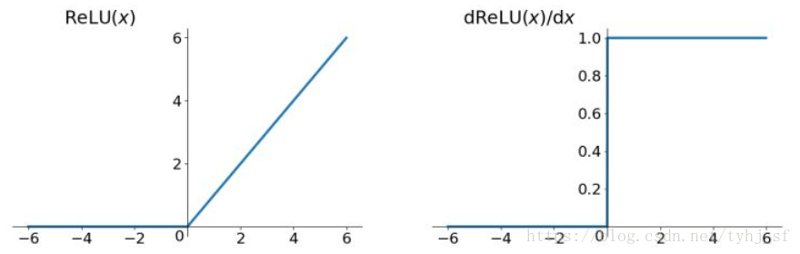

# 4.3搭建神经网络

我们已经准备好了数据，现在终于要开始搭建神经网络了。

众所周知，神经网络就是一个函数，用以模拟一个复杂的映射，如一张脸的图片到这个人的名字，一段声音到识别的文字，或者一篇文章到它的摘要。


## 复习

在前面的课程中，我们已经阅读过源码，明白了在Pytorch中，全连接层nn.Linear就是一个可调用对象，它继承自nn.Module类并重写了forward方法。

当我们创建一个Linear对象，并传入数据x时，调用其`__call__()`方法，而在nn.Module中我们清楚地看到，它调用了子类重写的forward方法。

##### 1.定义一个全连接层

```python
model = torch.nn.Linear(1, 1)
```

##### 2.传入数据，model作为可调用对象被当作函数调用，并输出返回值y_predict

```python
y_predict = model(x_data)
```

### 源码

做了一定程度的简化

```python
class Module(object):
    #当子类被当作可调用对象调用时，会调用其重写的forward方法
    def __call__(self, *input, **kwargs):
        result = self.forward(*input, **kwargs)

class Linear(Module):
    #构造函数，初始化参数权重矩阵W和偏置b
    def __init__(self, in_features, out_features, bias=True):
        super(Linear, self).__init__()
        self.in_features = in_features
        self.out_features = out_features
        self.weight = Parameter(torch.Tensor(out_features, in_features))
        if bias:
            self.bias = Parameter(torch.Tensor(out_features))
    # 重写的forward方法，实际上就是计算x*W^T
    def forward(self, x):
        return x.matmul(weight.t())
```

## 结论

##### 定义神经网络一个层的方法是继承nn.Module并重写其forward方法，forward方法接受输入并返回该层的输出

### 定义一个神经网络的方法

##### 同样是继承nn.Module并重写其方法，forward方法接受输入并返回模型的输出！

我们来看torchvision提供的一个写好的模型ResNet的源码

（简化）

```python
class ResNet(nn.Module):
    def __init__(self, block, layers, num_classes=1000, zero_init_residual=False,
                 groups=1, width_per_group=64, replace_stride_with_dilation=None,
                 norm_layer=None):
        super(ResNet, self).__init__()
        self.conv1 = nn.Conv2d(3, self.inplanes, kernel_size=7, stride=2, padding=3,
                               bias=False)
        self.bn1 = norm_layer(self.inplanes)
        self.relu = nn.ReLU(inplace=True)
        self.maxpool = nn.MaxPool2d(kernel_size=3, stride=2, padding=1)
        self.layer1 = self._make_layer(block, 64, layers[0])
        self.layer2 = self._make_layer(block, 128, layers[1], stride=2,
                                       dilate=replace_stride_with_dilation[0])
                                       
    def forward(self, x):
        x = self.conv1(x)
        x = self.bn1(x)
        x = self.relu(x)
        x = self.maxpool(x)

        x = self.layer1(x)
        x = self.layer2(x)
        x = self.layer3(x)
        x = self.layer4(x)

        x = self.avgpool(x)
        x = torch.flatten(x, 1)
        x = self.fc(x)

        return x
```

使用

##### 1.定义一个ResNet

```python
model = torch.nn.ResNet()
```

##### 2.传入数据，model作为可调用对象被当作函数调用，并输出模型的返回值y_predict

```python
y_predict = model(x_data)
```

## 认识我们将使用的几种层

### 前言

##### 在此之前我们思考一下，在Pytorch中Linear这样的层、Relu这样的激活函数，和ResNet这样的模型有什么区别？

#### 没有区别！

##### 它们都是继承自`nn.Module`，都是以可调用对象的方式被当作函数传值进forward方法并返回输出。

只不过我们通常会在Linear这样的**层 里面定义简单的运算**，比如在构造函数中初始化权重W和偏置b，在forward中与输入x进行计算得到输出output返回；

而在ResNet这样的**模型中定义稍复杂的预算**，比如在构造函数中初始化几个层，在forward中与输入x计算并得到输出output返回。

### 我们将用到的几种层

##### ①nn.Conv2d

卷积层，定义采样器在原图中搜索与其相同的形状

```python
image = torch.tensor(
    [[0, 1, 0, 0, 0, 0, 0, 0], [0, 0, 1, 0, 0, 0, 1, 1], [1, 0, 0, 1, 0, 0, 1, 1], [0, 1, 1, 1, 0, 0, 1, 1],
     [0, 0, 1, 1, 0, 0, 1, 1], [1, 1, 0, 0, 0, 0, 1, 1], [0, 1, 0, 0, 1, 0, 0, 0], [0, 0, 1, 0, 0, 1, 0, 0]]
    , dtype=torch.float32).reshape(1, 1, 8, 8)

conv1 = torch.nn.Conv2d(1, 1, 3, 1, 1)
kernel = torch.tensor([[1, 0, 0], [0, 1, 0], [0, 0, 1]],dtype=torch.float32).reshape(1, 1, 3, 3)
kernel = torch.nn.Parameter(kernel)

conv1.weight = kernel
print(conv1(image))
```


##### ②MaxPool2d


##### ③nn.ReLU

### Relu激活函数

$$
\left\{  
             \begin{array}{**lr**}  
             y=x & x>=0 \\  
             y=0, & x<0.\\  
                
             \end{array}  
\right.
$$




##### ④Linear

##### ⑤Sequential

相当于

## 搭建网络


### 预处理

将大小不一的图片文件通过opencv-python的resize方法转为大小相同的方形图片，并转为能够计算梯度的Pytorch数据类型张量Tensor


### 第一层：卷积层

【输入】：[1,28,28]

【输出】：[16,14,14]

在第一层使用16个3*3的卷积核进行采样。经过池化层后长宽都减半


### 第二层：卷积层2

【输入】：[16,14,14]

【输出】：[32,7,7]

在第一层使用32个3*3的卷积核进行采样。经过池化层后长宽都减半


### 第三层：全连接层

【输入】：[32,7,7]

【输出】：[1,7\*7\*32]


