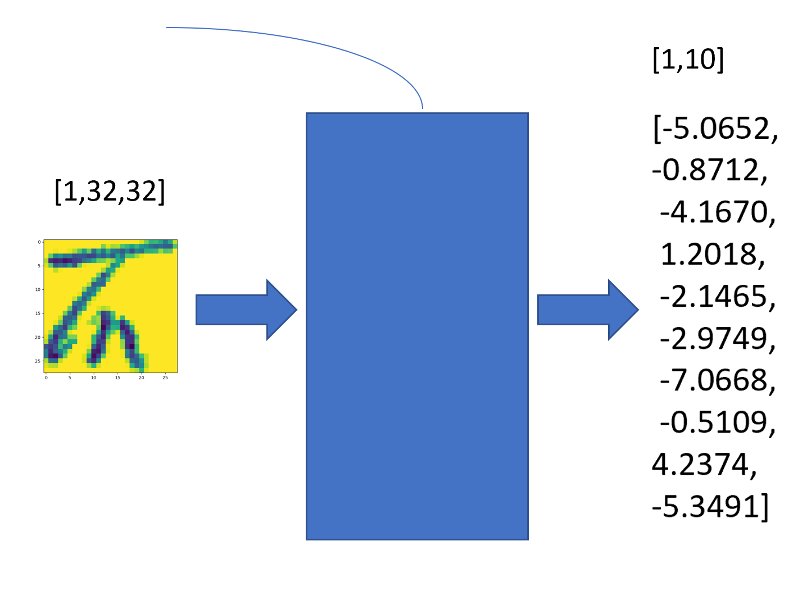

# 4.4模型的评估

在前面的课程中，我们已经完成了训练过程，并且观察其在训练集上的Loss曲线得到了模型正确拟合的结论，但我们还需要量化的指标。

精确率(Precision)：你认为的正样本，有多少猜对了（猜的精确性如何）

召回率(Recall)：正样本有多少被找出来了（召回了多少）。

## 精确率

准确率是最直观的指标，即模型的输出和人工标注的真实值相同的占预测总个数的比值。即
$$
Accuracy=\frac{Nums(y_{predict}==y)}{Nums(y_{predict})}
$$

### 认识torch.max

我们的模型接受一张图片，返回一个十维的向量，分别对应一个汉字，表示模型对图片是该汉字的把握，又叫置信度。

尽管信息更多，但并不是直接输出汉字类别对应的序号，我们需要使用torch.max将这个最大值取出来，每一个十维向量中最大的那个数对应的序号当作模型的输出值。



torch.max有两种使用方式

### 1.torch.max(tensor)

寻找tensor中的最大数输出

### 2.torch.max(tensor,dim)

##### dim是维度，取0，1……

取某维度在其上求最大值，那个维度就会消失。

如[2,3,4]形状的张量，在dim=0求最大值就会变成[3,4]，在dim=1求最大值就会变成[2,4]

##### 返回值是一个元组

前面是最大值的具体数值，后面是最大值所在的位置。这个位置就是我们所需要的对应汉字的序号。

### 我们应该在哪个维度上求最大值呢？

1.假设我们的输出是[50,10]，即有50张图片，每张图片经过模型输出10种类别的置信度向量。

2.取某维度在其上求最大值，那个维度就会消失。

如果在dim=0求最大值，那么输出是[10]，这显然不对

如果在dim=1求最大值，那么输出是[50]，即50张图片，每张图片一个数字作为结果，这样就对了！不过我们要得不是置信度具体的置，而是这个最大值在的位置的下标，所以我们取

```python
confidence, predicted = torch.max(outputs.data, 1)
```

然后我们将正确的数量记录到变量correct中，总数记录到total中

```
correct += (predicted == labels).sum().item()
```

在遍历过所有数据集之后，通过`correct / total`就可以得到模型的正确率了

## 召回率

召回率(Recall)：正样本有多少被找出来了（召回了多少）。

需要注意的是，我们的汉字识别是十分类的任务，因此我们的定义方式需要发生一些改变，考虑某个结果为真样本时，将其他分类统一视作负样本。

为此，我们需要新建一个列表，分别存储每个类别的TP、FP、FN、TN，再遍历测试集，填这张表

```
data = [{"TP": 0, "FP": 0, "FN": 0, "TN": 0} for _ in range(10)]

[OUT:]
[{'TP': 0, 'FP': 0, 'FN': 0, 'TN': 0},#data[0]
 {'TP': 0, 'FP': 0, 'FN': 0, 'TN': 0},#data[1]
 {'TP': 0, 'FP': 0, 'FN': 0, 'TN': 0},#data[2]
 {'TP': 0, 'FP': 0, 'FN': 0, 'TN': 0},#data[3]
 {'TP': 0, 'FP': 0, 'FN': 0, 'TN': 0},#data[4]
 {'TP': 0, 'FP': 0, 'FN': 0, 'TN': 0},#data[5]
 {'TP': 0, 'FP': 0, 'FN': 0, 'TN': 0},#data[6]
 {'TP': 0, 'FP': 0, 'FN': 0, 'TN': 0},#data[7]
 {'TP': 0, 'FP': 0, 'FN': 0, 'TN': 0},#data[8]
 {'TP': 0, 'FP': 0, 'FN': 0, 'TN': 0}]#data[9]
```

TP（True Positive）：预测是某类，事实也是那个类

TN（True Negative）：预测不是某类，事实也不是那个类

FP（False Positive）：预测是某类，事实却不是那个类

FN（False Negative）：预测不是某类，事实却是那个类

例如，我们考察一条`（y_predict，y_label） = （1，1）`，即模型的输出和真实值都是1，则

```python
data[1].TP += 1

data[0].TN +=1
data[2].TN +=1
data[3].TN +=1
...
data[9].TN +=1
```

考察`(y_predict,y_label) = (1,2)`,即模型的输出1,真实值却是2则

```
data[1].FP += 1

data[2].FN +=1

data[0].TN +=1
data[3].TN +=1
...
data[9].TN +=1
```

遍历完测试集之后，我们就可以得到十个类各自的准确率和召回率了

```python
for j in range(10):
    Precision = (self.data[j]["TP"]) / (self.data[j]["TP"] + self.data[j]["FP"])
    Recall = (self.data[j]["TP"]) / (self.data[j]["TP"] + self.data[j]["FN"])
```


## F1 score

我们通常希望查准率和查全率都要高，但它们本身就是矛盾的，如果查的很全免不了出错，如果要非常精确免不了会漏掉一些。

有一个指标能同时考察查准率和查全率，名为F1 score，定义如下
$$
F1=2*\frac{Precision*Recall}{Precision+Recall}
$$


### 完整代码

```python
class Counter:
    def __init__(self):
        self.data = {}
        for j in range(10):
            self.data[j] = {"TP": 0, "FP": 0, "FN": 0, "TN": 0}

    def add_record(self, y, y_predict):
        if y_predict == y:
            self.data[y]["TP"] += 1
            for j in range(10):
                if y != j:
                    self.data[j]["TN"] += 1
        else:
            self.data[y_predict]["FP"] += 1
            self.data[y]["FN"] += 1
            for j in range(10):
                if y != j and y_predict != j:
                    self.data[j]["TN"] += 1

    def get_f1_score(self):
        f1_score_list = []
        accuracy_list = []
        for j in range(10):
            P = (self.data[j]["TP"]) / (self.data[j]["TP"] + self.data[j]["FP"])
            R = (self.data[j]["TP"]) / (self.data[j]["TP"] + self.data[j]["FN"])
            accuracy_list.append(P)
            f1_score_list.append(2 * R * P / (R + P))
        return accuracy_list, f1_score_list
```

