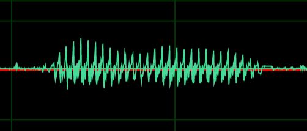
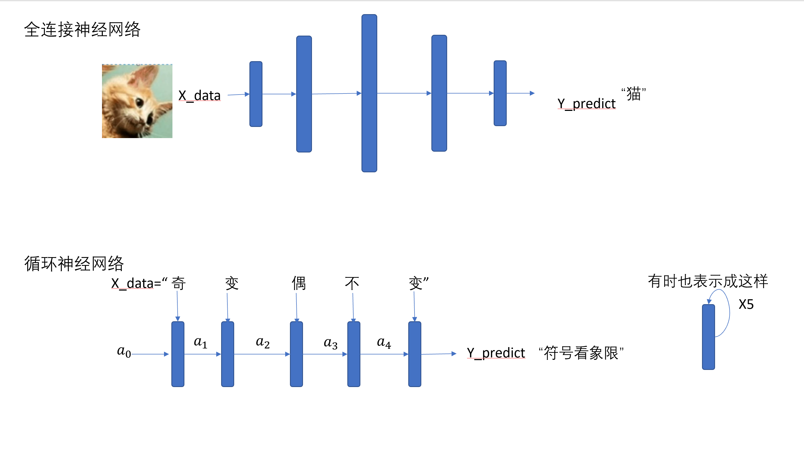
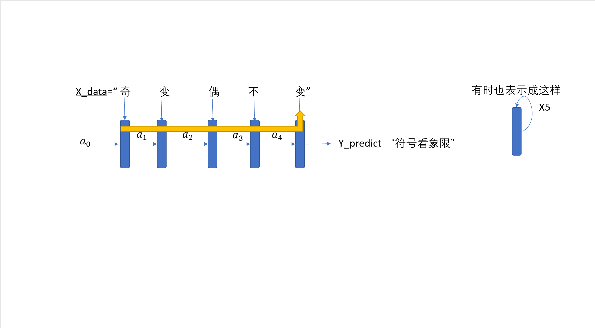

# RNN

[TOC]

## 一.循环神经网络

### 1.引言

在很多网络小说，经常能看到这样的剧情——某某公司做出了个次世代全沉浸式VR游戏，人们可以通过神经连接进入这个虚幻世界，里面有许多外表和言行举止与人类无异的NPC。

但是制作过游戏的同学们都知道，现在我们编写游戏中的NPC的行为都是基于行为树之类的算法，和我们想象中地人工智能完全不一样。一方面是考虑到机能的限制，另一方面也因为神经网络的兴起并没有几年，目前的焦点还在人机大战上，比如AlphaGo、王者荣耀绝悟。

那么用已经学过的深度学习知识，能造出一个更像真人的NPC吗？

让NPC拥有视觉其实不用深度学习，高射炮打蚊子；但是让NPC能听懂玩家的话而不是让我们在选项中选一个，可以做到吗？

我们通常输入神经网络的都是长度固定的数据，例如裁剪过后的图片；

但是我们生活中还有另一类被称作序列、长度可定的数据，例如我们写给NPC的一段文字、说的一段话，如果让NPC真正地进行回答，应该怎么做呢？

为了解决这样的问题，我们需要学习序列模型。

| 任务     | 输入                                                         | 输出                                                         |
| -------- | ------------------------------------------------------------ | ------------------------------------------------------------ |
| 对话     | How are you?                                                 | Fine,thank you,and you?                                      |
| 语音识别 |  | 今天天气真好                                                 |
| 语音生成 | 今天天气真好                                                 |  |
| 文本生成 | 使用“斗帝追斗者”造句                                         | “我是一位斗者，一位斗帝正在追我，但我一点都不慌，因为他的马没我的跑得快。“ |
| ...      |                                                              |                                                              |

### 2.BasicRNN

RNN（RecurrentNeuralNework），中文循环神经网络/递归神经网络。

它的出现有两种解释：

1.拥有“记忆”的神经网络

2.使用共享参数的方式减少参数的神经网络

前者是一种有趣的说法，后者则可能更接近发明它的初衷。



写成公式则为：

$x=x^{<t1>}x^{<t2>}...x^{<tn>}$

$y = y^{<t1>}y^{<t2>}...y^{t<n>}$

其中$y^{t<n>}=\sigma(W'a_{n-1}+Wx^{t<n>}+b)$

t表示x和y可能是时序序列，例如一段音频，但不管是不是，我们一般都用这种表示方法表示x是由一组独立输入神经网络的序列构成，它们各自的输出组成了y的序列，途中$a_1$等箭头表明，$y^{<t>}$的输出不仅和$x^{<t>}$有关，还会接受上一个时刻的输出$y^{<t-1>}$参与运算，而这个$y^{<t-1>}$，其实包含了前面$x^{0},x^{1},...x^{t-1}$的信息（这就是”记忆“这个说法的由来）。



> 考虑到有时候只知道前面几项的信息不够，有时候我们会使用双向的RNN

### 二.编码

### 1.One-Hot

我们在图像分类任务里需要对类别编码成数字，才能让其参与运算，在序列模型中同样如此，如果我们有一个句子

“道可道,非常道.名可名,非常名”要输入网络，就需要对其中每个字/词进行编码，例如

$道:0$

$可:1$

$非:2$

$常:3$

$名:4$

那么以上句子就可以编码为$[0,1,0,2,3,0,4,1,4,2,3,4]$。（这里为了方便省去“，”编码）

如果我们把新华字典拿过来，然后把里面的每个字标一个序号，几乎所有的文章就都可以表示成一串可以运算的数据了。

但这样做有个有个缺点，因为字与字之间是没有高低贵贱的，但数字是有大小区别的，所有我们经常会表示这样

$道:[1,0,0,0,0]$

$可:[0,1,0,0,0]$

$非:[0,0,1,0,0]$

$常:[0,0,0,1,0]$

$名:[0,0,0,0,1]$

也就是对应位置的为1，其他都为零，各个编码各占一个位置，也就是经常听见的One-hot编码。

这样《道德经》的第一句话就会被编码成一个二维矩阵

```
[
[1,0,0,0,0],
[0,1,0,0,0],
[1,0,0,0,0],
[0,0,1,0,0],
[0,0,0,1,0],
[1,0,0,0,0],
[0,0,0,0,1],
[0,1,0,0,0],
[0,0,0,0,1],
[0,0,1,0,0],
[0,0,0,1,0],
[0,0,0,0,1],
]
```

这里我们也可以看出RNN的必要性，如果使用普通的神经网络，设常用汉字为2000个，那么这个网络第一层的节点就有句子长度*2000的数量，十分巨大。

