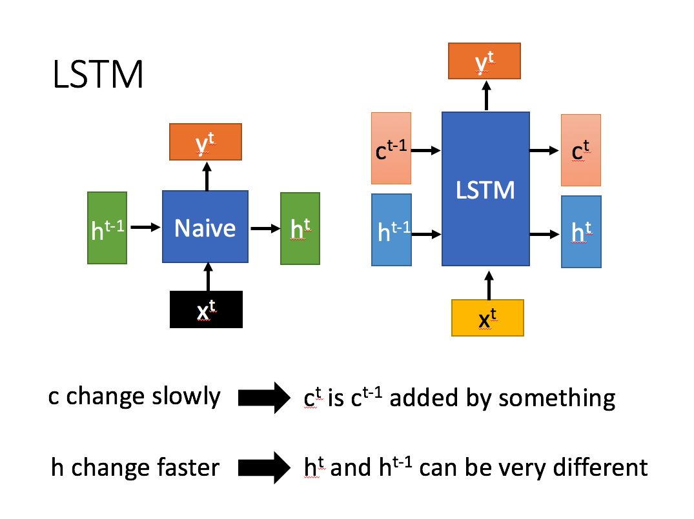

# 2.LSTM

### 梯度爆炸/梯度消失

曾经，深层网络只能低于150层。后来人们发明了残差网络、LSTM、Transformer等网络结构，才让网络层数突破这个限制。

例如，（考虑以下简易情况）Loss对于网络中第一个权重W的导数为，
$$
\frac{\partial Loss}{\partial W_1} = \frac{\partial Loss}{\partial f_n}*\frac{\partial f_{n}}{\partial f_{n-1}}*...\frac{\partial f_3}{\partial f_2}*\frac{\partial f_2}{\partial f_1}*\frac{\partial f_1}{\partial w_1}
$$


中间有许多项连乘积，假设

$$
\frac{\partial f_1}{\partial w_1}=\frac{\partial f_2}{\partial w_1}=...\frac{\partial f_n}{\partial f_{n-1}}=1.5
$$
那么
$$
\frac{\partial Loss}{\partial W_1}=1.5*1.5*1.5...*1.5
$$
我们都知道指数爆炸

$1.5^{10}=57$

$1.5^{20}=3325$

如果网络叠到100层

$\frac{\partial Loss}{\partial W_1}=1.5^{100}=406561177535215200$

这个导数很快就会超过计算机能表示的最大数，然后溢出，这就是梯度爆炸。

反之这个数为0.5时会让网络里靠前的权重和偏置的导数小于计算机能表示的最小浮点数，发生下溢，也就是梯度消失。

因为以上两点原因，普通人从零训练一个复杂的网络非常困难。

那么难道只有堆得起数据、堆得起显卡的大公司才能使用复杂模型吗？普通人只能使用两三层、十几层的小网络？

当然不是，我们可以使用迁移学习，拿来大公司训练完成的网络和参数，进行微调，以完成自定义任务。幸运的是，目前最优秀的神经网络都是开放源码和训练完成的参数的，包括Bert、LXNet、BigGAN等。




$$
\begin{array}{ll} \\
        i_t = \sigma(W_{ii} x_t + b_{ii} + W_{hi} h_{t-1} + b_{hi}) \\
        f_t = \sigma(W_{if} x_t + b_{if} + W_{hf} h_{t-1} + b_{hf}) \\
        g_t = \tanh(W_{ig} x_t + b_{ig} + W_{hg} h_{t-1} + b_{hg}) \\
        o_t = \sigma(W_{io} x_t + b_{io} + W_{ho} h_{t-1} + b_{ho}) \\
        c_t = f_t \odot c_{t-1} + i_t \odot g_t \\
        h_t = o_t \odot \tanh(c_t) \\
    \end{array}
$$

## Pytorch中的LSTM

```python
import torch
from torch.utils.data import DataLoader
import matplotlib.pyplot as plt

train_dataset = [(torch.randn(1, 100), torch.randn(1,1)) for i in range(1000)]

train_loader = DataLoader(dataset=train_dataset, batch_size=100, shuffle=True)

# model = torch.nn.Linear(100, 1)
model = torch.nn.LSTM(input_size=100, hidden_size=1, num_layers=1, bias=True, batch_first=True)

criterion = torch.nn.MSELoss()
optimizer = torch.optim.Adam(model.parameters(), lr=0.001)

loss_list = []
for epoch in range(5):
    for x_data, y_label in train_loader:
        output, (hn, cn) = model(x_data)

        loss = criterion(y_label, output)
        loss_list.append(loss.item())
        optimizer.zero_grad()
        loss.backward()
        optimizer.step()

plt.plot(loss_list)
plt.show()
```