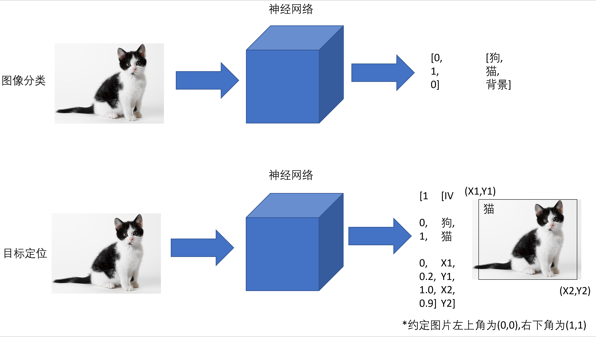
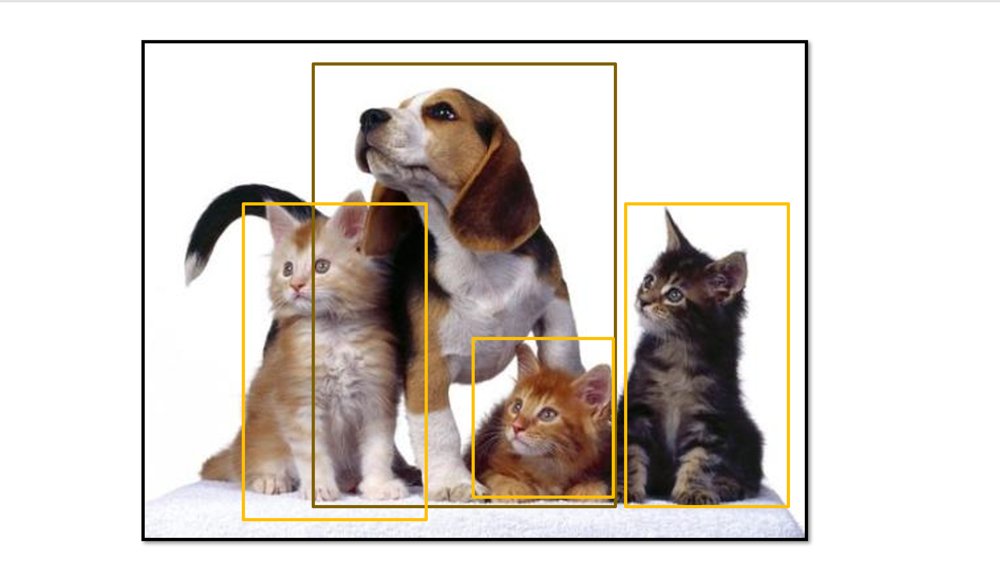

# 目标检测

目标检测相比图片分类任务是更加新兴的课题。

这门课将介绍两种目标检测算法，YOLO V1和FasterR-CNN，前者速度非常快，后者效果非常好。

## 引言

### 目标定位

相信各位对图片分类并不陌生，而目标定位，就是不仅要识别图片中是什么东西，还需要多输出四个值代表一个框标出它的位置。

> 看似在监督学习中改变了我们索要的输出形式就改变了网络的功能，其实并非如此，因为如果要训练网络输出坐标，必须有人工标注的数据集，所以我们改变的其实是提供的供网络学习的数据 。

IV（is vaild）表示图中是否有可检测的物体V，如果IA为0其他的值都将无效。



显然，单个图片的目标检测非常简单，只要有按$[IV,c1,c2...cn,X1,Y1,X2,Y2]$的数据集，使用MSELoss就可以训练。

$IsValid=1,L(y_{label},y_{predict})=(\hat y_1-y1)^2+(\hat y_2-y_2)^2+...(\hat y_n-y_n)^2$

$IsValid=0,L(y_{label},y_{predict})=(\hat y_1-y1)^2$

IsValid=0时，此时其他的值都无效，此时只需要关注模型判断图像是否有效的准确度。

##### 注

1.通常我们会对$c_1,c_2...c_n$分类信息采用CrossEntropyLoss，而边框的坐标使用MSELoss进行回归。

2.我们这里输出的是边框坐标，也可以输出其他的值，例如猫眼中心坐标或其他特征点，取决于你是否有相对应的数据集。

那么如果图片有许多个目标，怎么样输出所有的边界框呢？

## 目标检测

在图片中对可变数量地目标进行查找和分类



我们知道在Python中，函数的返回值只能有一个。如果你返回了多个值，Python会将其包装为元组

```python
def func(a,b):
	return a+b,a*b,a-b,a/b
print(func(1,2))

[out]:(3, 2, -1, 0.5)
```

因此我们想输出图片个多个目标的坐标，只需要让网络输出一个坐标的元组就可以了。

>必须有相对应数据集

```
[
[IV,X1,Y1,X2,Y2],#物体1，仅当IV>0.6时坐标有效
[IV,X1,Y1,X2,Y2],#物体2，仅当IV>0.6时坐标有效
[IV,X1,Y1,X2,Y2],#物体3，仅当IV>0.6时坐标有效
...
[IV,X1,Y1,X2,Y2],#物体256，仅当IV>0.6时坐标有效
]
```

兑现为代码就是

```python
fc = nn.Linear(hidden_size, 256*5)

output = fc(x)
positions = []
for i in range(256):
    if(hidden_size < 0.6):
        continue
    positions.append((output[i*5+1],output[i*5+2],output[i*5+3],output[i*5+4]))#添加一个坐标
```

显然，这个方法的缺点是①会有重复输出②检测物体数目不能超过256个。

  