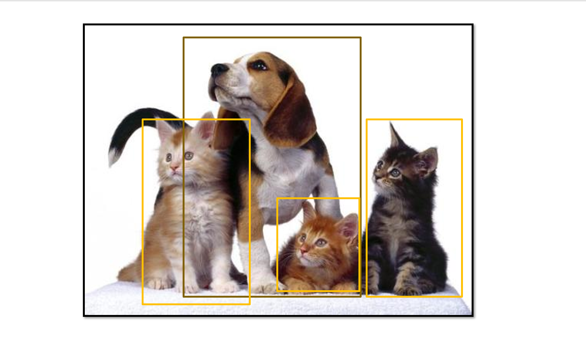

# 滑动窗口

一种简单的目标检测算法的思路非常直觉，我只需要一个训练好的图像分类网络，然后使用它在图像上寻找目标。

然后你选择大小不同的方块重复以上操作

### 滑动窗口检测的缺点

滑动窗口算法的缺点是性能，如果你需要细粒度地检测，传递给分类网络的小图片会非常多；如果你选择更大的窗口、大踏步地进行切块，虽然传给分类网络的小图片数量减少了，但显然会影响结果的准确度。

### 改进

至于产生这种问题的原因是在滑动窗口移动的过程中大量的重复计算。事实上，整张图片只需要执行一次卷积，由于**卷积并不会打乱原来子图像的相对位置**，左上角的卷积结果会出现在左上角，右下角的卷积结果会出现在右下角，只要你输出一个四维向量而不是拉直输进全连接层变成一个数，每个值各自便代表了一个子区域的卷积结果。

因此，需要获得图片上所有滑块输入卷积网络的结果，不用真的分割图片，只需对整张图片卷积，然后输出的维度改变为你所需要的滑块数量即可。

### 卷积实现的滑动窗口的缺点

不够精确，目标不一定都是正方形，我们需要更多形状的滑块

### 关于[Size,Size]和[1,1]卷积

[Size,Size]可用于替换全连接层，[1,1]卷积可用于改变输出的维度。

