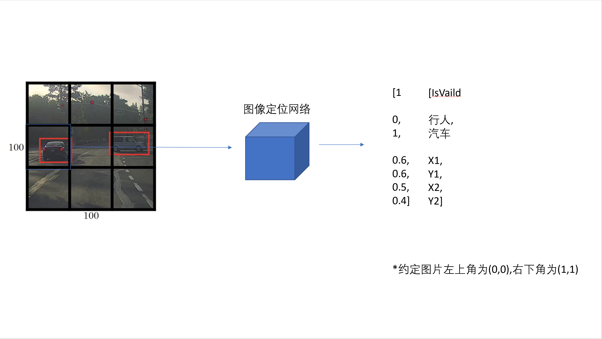
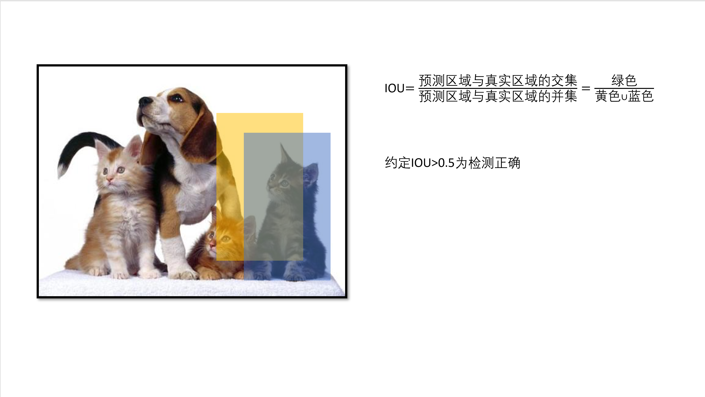
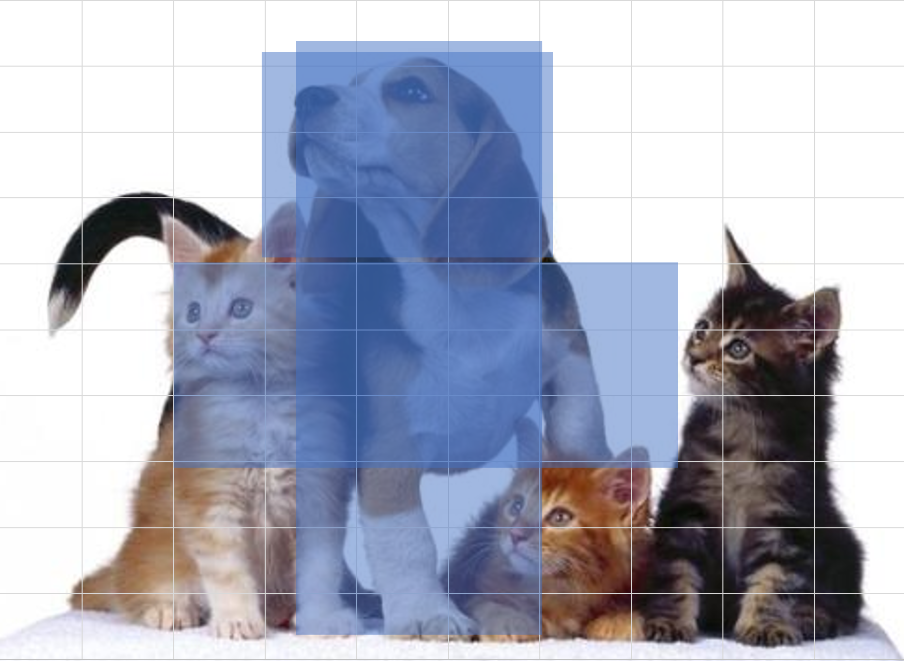

## YOLO V1

YOLO（You only look once）是一种速度非常快的目标检测算法，可以用于实时识别。它基于图像分类和图像定位，它的基本思路是将画面分为许多方块，在每个方块里进行图像定位。

 如果某个物体跨过多个格子，人工标注时应将其分配给其中点$(\frac{X1+X2}{2},\frac{Y1+Y2}{2})$所在的格子输出。一个格子输出5维的向量的个数决定了它能输出的检测框个数；但一个物体能只能归属于一个格子。

途中的9格经过网络后输出维度为[3,3,7]的结果。

网格越精细，不同物体被分配到同一个框中发生冲突的可能性就越低。

综上，我们可能选择YOLO网络的输出为7x7x(2x5+C)，C为需要检测的物体类别数量

YOLO可以让神经网络输出任何形状的矩形边界框。

## IOU

Intersection over union（交并比）

## 非极大值抑制

当将图片细粒度划分时，因为物体只有一个中点，只应该出现在一个格子里，但实践中发现可能会有多个格子认为某一个物体在自己框内。	这样我们就需要在结果中在那些IOU很高的框中选择一个IA最高的，也就是最确信物体在自己框内的那个结果。

具体是做三件事：

1.剔除所有IA<0.6的结果

2.遍历剩下的结果，找到IA最高的一个结果，输出到结果，并剔除剩下选择框中与其IOU高的那些边界框。

3.重复第二步，直到没有未输出未结果的边界框。

> 如果有多个类别，你需要对每个类别分别进行非极大值抑制。

### 缺点

YOLO V1对密集的小物体识别性能非常差