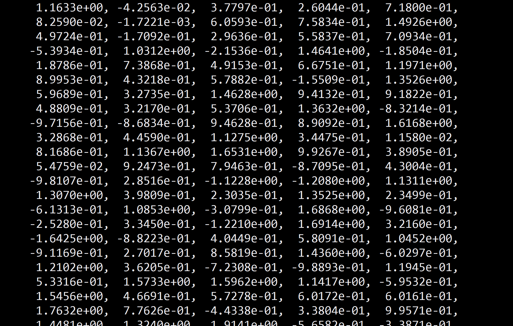
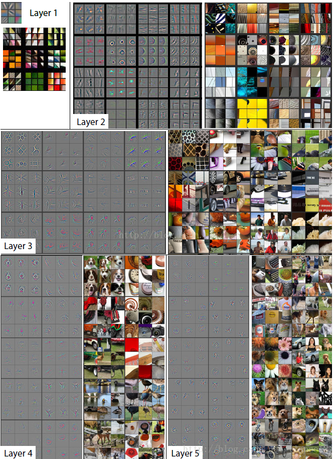

# 迁移学习

> 生产力是社会发展的最终决定力量。——马克思

## 引言

在深度神经网络的训练过程中，除了标注数据集不够多之外，还有两个巨大的阻力：

##### 1.参数多，训练慢

例如GPT-3有高达1500亿参数，模型大小超过700G，普通计算机根本无法运行，更不要说训练。

即便是resnet-18，想从零开始训练也比较困难。

而像谷歌这样的公司，可以堆显卡并行化训练，据说训练一次XLNet模型需要6万美元。



##### 2.梯度爆炸/梯度消失

这曾经是条拦路虎，深层网络只能低于150层。后来人们发明了残差网络、LSTM、Transformer等网络结构，才让网络层数突破这个限制。

例如，（考虑以下简易情况）Loss对于网络中第一个权重W的导数为，
$$
\frac{\partial Loss}{\partial W_1} = \frac{\partial Loss}{\partial f_n}*\frac{\partial f_{n}}{\partial f_{n-1}}*...\frac{\partial f_3}{\partial f_2}*\frac{\partial f_2}{\partial f_1}*\frac{\partial f_1}{\partial w_1}
$$


中间有许多项连乘积，假设

$$
\frac{\partial f_1}{\partial w_1}=\frac{\partial f_2}{\partial w_1}=...\frac{\partial f_n}{\partial f_{n-1}}=1.5
$$
那么
$$
\frac{\partial Loss}{\partial W_1}=1.5*1.5*1.5...*1.5
$$
我们都知道指数爆炸

$1.5^{10}=57$

$1.5^{20}=3325$

如果网络叠到100层

$\frac{\partial Loss}{\partial W_1}=1.5^{100}=406561177535215200$

这个导数很快就会超过计算机能表示的最大数，然后溢出，这就是梯度爆炸。

反之这个数为0.5时会让网络里靠前的权重和偏置的导数小于计算机能表示的最小浮点数，发生下溢，也就是梯度消失。

因为以上两点原因，普通人从零训练一个复杂的网络非常困难。

那么难道只有堆得起数据、堆得起显卡的大公司才能使用复杂模型吗？普通人只能使用两三层、十几层的小网络？

当然不是，我们可以使用迁移学习，拿来大公司训练完成的网络和参数，进行微调，以完成自定义任务。幸运的是，目前最优秀的神经网络都是开放源码和训练完成的参数的，包括Bert、LXNet、BigGAN等。

## 2.预训练模型

## 3.在Pytorch中使用预训练模型

非常简单，Pytorch官方定义的预训练模型都在torchvision.models下，例如，我们要获得一个完成训练的[ResNet-18](https://arxiv.org/pdf/1512.03385.pdf)网络

```python
resnet = torchvision.models.resnet18(pretrained=True)
```

查看网络结构

```python
print(model)
```

使用它进行图片预测

```
import torch
import torchvision
import cv2
import matplotlib.pyplot as plt

image = plt.imread("D:temp/image_cat_01.jpg")
image = cv2.resize(image,(224,224)).reshape(1,3,224,224)
image = torch.as_tensor(image,dtype=torch.float32)
output = resnet(image)
```

## 4.迁移学习

迁移学习的原理是任务之间的相似性。

我们知道训练完成的卷积神经网络使用采样器在原图上提取特征，低层的提取简单图形，如轮廓、直线；高层的提取复杂图形，如人脸、花草。

如果要做一个猫狗分类器，是否可以借用这些 采样器？显然，高层的不一定可以，但低层应该可以。



虽然背后的原理并不简单，但在Pytorch中实现起来很简单，如果我们要训练一个猫狗分类器，只要添加一个全连接层即可。

```
my_model = torch.nn.Sequential(
	torchvision.models.resnet18(),
	torch.nn.Linear(1000,2)
)
```

这样就可以从已经训练好的能识别物体的参数开始，训练我们自己的网络。

## 5.疑问

### 迁移学习是否和从零开始训练一个网络效果相同？

有争议，应该差不多，或者迁移学习比从零开始训练一个网络好些，因为迁移学习的起点是大公司在超大数据集上训练得到的参数，比我们能搜集到的数据往往多得多。

