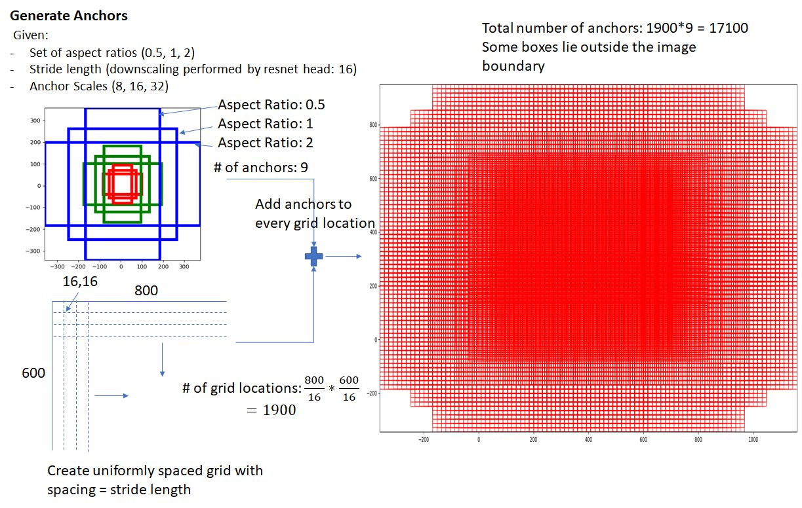
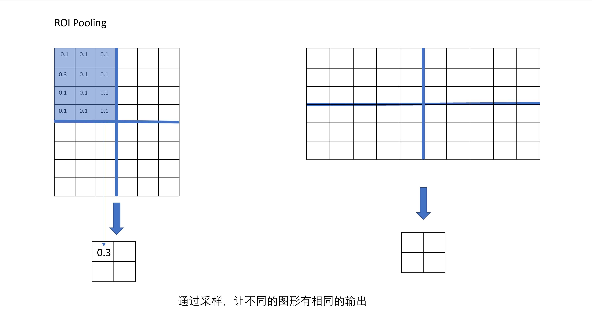

# FastRCNN

在YOLOV1我们手动地划分图片为固定的7*7块区域，然后在每个区域上识别物体，缺点显而易见——当小物体特别密集地时候，效果就会特别差。

而FastRCNN的原理就在于两步走：

第一步：找到物体所在的区域（自动划区）

第二步：在划出的每个区域上识别物体。


具体是这么做的：

在原图像上划分密密麻麻的许多形状的子图，然后通过图像定位筛选含有目标的子图，送入后续图像分类网络判断其具体类型。



## 一些细节

### RoI Pooling

由于选择框的大小不一，需要进行采样才能获得相同的输出输出到全连接神经网络。



## 实现

Pytorch官方Faster RCNN实现:[https://pytorch.org/docs/stable/torchvision/models.html?highlight=faster%20rcnn#torchvision.models.detection.fasterrcnn_resnet50_fpn](https://pytorch.org/docs/stable/torchvision/models.html?highlight=faster rcnn#torchvision.models.detection.fasterrcnn_resnet50_fpn)

### 源码导读

（经过大幅简化）

```python
class FasterRCNN():
    def __init__(self, feature_extraction_network, #提取特征使用的卷积网络，例如ResNet-18
                 transform #记录图片经过的缩放，以便在后处理中还原回选择框在原图中的位置):#

        # 设定预选框的形状
        anchor_sizes = ((32,), (64,), (128,), (256,), (512,))
        aspect_ratios = ((0.5, 1.0, 2.0),) * len(anchor_sizes)
        rpn_anchor_generator = AnchorGenerator(anchor_sizes, aspect_ratios)
        
        # 第一步中的候选框筛选网络（RegionProposal Network，rpn)
        rpn = RegionProposalNetwork(rpn_anchor_generator)
        
        # 第二步中在候选框中识别物体的网络
        roi_heads = FastRCNNPredictor()
  
	def forward(self,images,targets=None):
        images, targets = self.transform(images, targets)
    	features = self.feature_extraction_network(images.tensors)
        proposals, proposal_losses = self.rpn(images, features, targets)
        detections, detector_losses = self.roi_heads(features, proposals, images.image_sizes, targets)
        detections = self.transform.postprocess(detections, images.image_sizes, original_image_sizes)
        return detections
```


