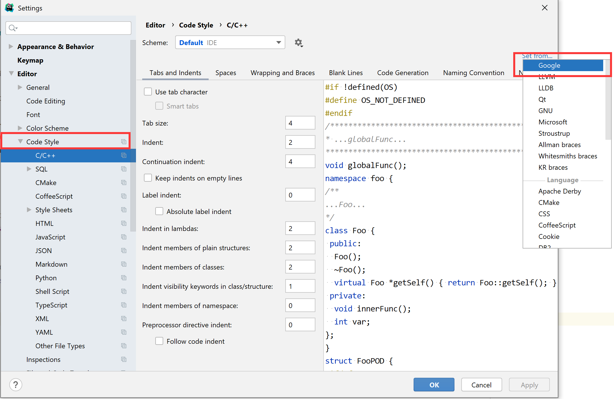

# IDEA教程

[TOC]

## 一.安装

官网：https://www.jetbrains.com/idea/

## 二.使用

#### 1. 概念

Idea中的概念从大到小依次为：Project$\rightarrow$Module$\rightarrow$package/文件夹$\rightarrow$Class/文件

Idea的Project是顶层结构，相当于eclipse的Workspace；而eclipse中的Project相当于Idea中的Module。

1. Idea中不能在一个页面下管理多个Project。每个Module（模块）都有自己的src目录。
2. 删除Module需要先Open module settings “-”模块然后才有“delete”选项。

#### 2. 基础设置

##### （1）view中的Toolbar；

##### （2）打开`Run`的自动隐藏，让其失去焦点后自动收起而不是查看结果后需要手动关闭。

##### （3）设置IDEA虚拟机参数。IDEA是基于Java开发的，本身也是运行在JVM上。

##### （4）设置光标悬停时显示文档

##### （5）设置自动导包和自动剔除未使用的包

##### （6）设置取消标签栏自动折叠

##### （7）编译设置

##### （8）仅Clion

设置Code Style为Google（这样namespace就不会缩进），

#### 3. 常用快捷键

Alt + Enter：万能修复、键入搜索任意操作

Ctrl +d 复制一行 Ctrl + y 删除当前行 Ctrl +Alt + L：格式化

Ctrl+Shift+Space：智能补全

Tab：代码补全（智能）	/	Enter：代码补全（添加式，表示确定）

[Shift]*2：万能导航	/	Ctrl + Shift + A：Action，运行编辑器命令或者修改编辑器参数，选择Learn

Alt + Insert：代码生成

[Ctrl + Space]*2：代码包裹（即选择一个函数将.前的变量作为函数参数）

Shift + F6：重构

Ctrl+W：扩选	/	Ctrl+Shift+W：缩选

Ctrl+Alt+V：变量提取 $\leftrightarrow$Ctrl+Alt+N：变量合并

Ctrl+Alt+M：函数提取

Ctrl+Alt+T：代码包裹

Ctrl+.：折叠区块

Ctrl+Shift+-：折叠所有

仅Clion：Ctrl+J生成循环

Ctrl+Shift+Alt+T：重构

Ctrl+F6：修改函数签名

Ctrl+E：最近的文件

Ctrl+Shift+F：全文检索

#### 4.模板

##### （1）常用自带模板

psvm，sout，for，fori，psfs

##### （2）自定义模板

`$var1$`、`$var2$`：变量

`$end$​`：结束时光标位置

#### 5.导航

（1）Structures面板

（2）点击标签栏类名
