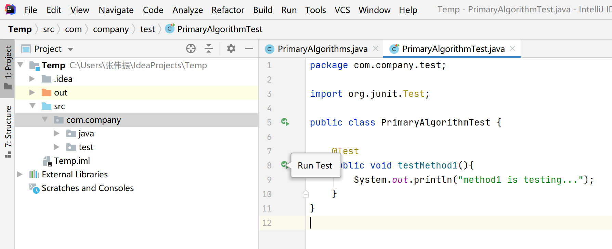

# Junit教程

[TOC]

## 一.基本使用

##### 1.Junit可以用于任何Java项目中某段业务代码的白盒测试

当添加了JUnit依赖并给一个方法打上`@test`注解后，Idea中就会在这个方法的签名前出现”运行“的按钮。

```java
@Test
public void testMethod1(){
    System.out.println("method1 is testing...");
}
```

##### 2.使用时应该按照以下约定

(1)测试代码在一个独立的包test中；

(2)测试类名为`***.Test`；

(3)测试方法名为`test***`,公开且无返回值；

(4)使用断言判断结果是否正确（而不要打印日志），若业务代码通过则显示绿色，否则显示红色。

```java
package com.company.test;

import com.xindelvcheng.java.PrimaryAlgorithms;
import org.junit.Assert;
import org.junit.Test;

public class PrimaryAlgorithmTest {

    @Test
    public void testFib(){
        int res = new PrimaryAlgorithms().fib(10);
        Assert.assertEquals(55,res);
    }
}
```

效果：



## 二.Hook

使用@before和@after注解做一些公共代码的复用。