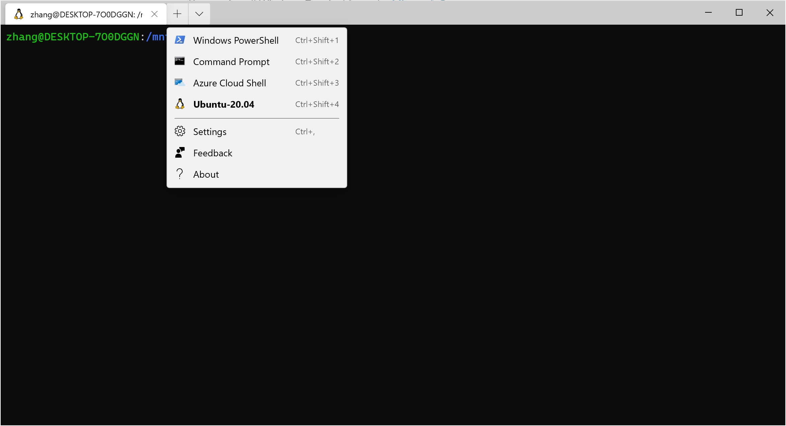

# Windows Terminal教程

[TOC]

## 一.安装

Microsoft Store中搜索Windows Terminal即可安装（lstc版本win10无Microsoft Store）

## 二.使用

可以当普通的PowerShell使用。点击向下箭头可以选择Shell种类。如果你没有开启WSL，则默认只有前三个。当安装之后，Windows Terminal会自动更新配置信息。配置json文件加一句`"cursorShape": "filledBox",`修改一下（若安装了WSL） "defaultProfile"即可。

