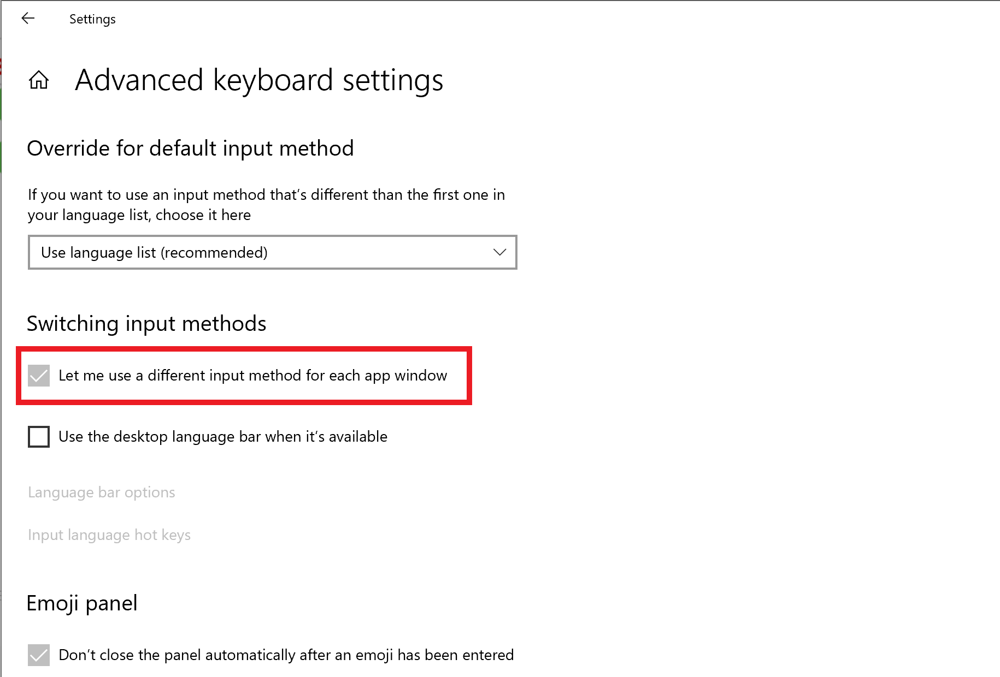

# Windows系统安装与开发环境搭建

[TOC]

## 一.系统安装与开发环境搭建

主要适用于Java、Python、C++程序员。

#### 1.安装Windows系统

前往[MSDN](https://msdn.itellyou.cn/)下载最新版的[Win10操作系统镜像](http://www.xindelvcheng.com/html/OS/镜像文件/cn_windows_10_business_editions_version_1903_updated_sept_2019_x64_dvd_2f5281e1.iso)，并使用[refus](http://rufus.ie/)写入U盘，在Bios中选择以U盘启动，一直下一步完成安装。

#### 2.安装系统工具

| 软件名          | 官网                                                         | Free | Open |
| :-------------- | ------------------------------------------------------------ | ---- | ---- |
| Chrome/NewEdge  | <https://www.google.cn/intl/zh-CN/chrome/>                   | T    | T    |
| PotPlayer       | <https://daumpotplayer.com/>                                 | T    | F    |
| ShadowsocksR    | https://github.com/shadowsocksr-backup/shadowsocksr-csharp/releases | T    | T    |
| Typora Beta     | <https://www.typora.io/>                                     | T    | F    |
| Termius         | <https://www.termius.com/>                                   | T    | T    |
| QuickLook       | <https://pooi.moe/QuickLook/>                                | T    | T    |
| Office2019      | http://officecdn.microsoft.com/pr/492350f6-3a01-4f97-b9c0-c7c6ddf67d60/media/zh-cn/ProPlus2019Retail.img | F    | F    |
| WindowsTerminal | https://github.com/microsoft/terminal/releases               | T    | T    |
| 火绒            | https://www.huorong.cn/                                      | T    | F    |
| SumatraPDF      | https://www.sumatrapdfreader.org/free-pdf-reader.html        | T    | T    |
| Sublime         | http://www.sublimetext.com/                                  | F    | F    |
| Motrix          | https://github.com/agalwood/Motrix                           | T    | T    |
| AutoHotKey      | https://www.autohotkey.com/                                  | T    | T    |

#### 3.安装开发环境

##### （0）准备

​	①[Git](https://git-scm.com/)

​	②[MariaDB](https://mariadb.com/)

##### （1）Java

​	①JDK：<https://www.oracle.com/java>

​	②IDE：<https://www.jetbrains.com/idea/>，[教程](http://www.xindelvcheng.com/html/IDE/IDEA教程.html)，可以导入本地的配置文件[idea_settings.zip](http://www.xindelvcheng.com/html/IDE/idea_settings.zip)。

##### （2）Python

​	①官网：https://www.python.org/

​	安装时建议custom勾选`for all users`，安装到C盘根目录。

​	②第三方库安装脚本

​	在windows下执行要以管理员身份打开PowerShell，Linux下要修改`pip`为`sudo pip3`

```bash
$ pip install -i https://pypi.tuna.tsinghua.edu.cn/simple pip -U ;pip config set global.index-url https://pypi.tuna.tsinghua.edu.cn/simple ;pip install -U ipython numpy matplotlib pandas jupyter requests lxml TensorFlow flask opencv-python pyqt5;echo "Complete";
```

（pytorch安装会非常慢，建议到[官网](https://pytorch.org/get-started/locally/)按照Command中的[地址](https://download.pytorch.org/whl/torch_stable.html)下载对应平台、版本的whl文件，然后使用`pip install *.whl`的方式安装；除此之外的库如pyinstaller、scrapy安装可能会报大量错误，应借助搜索引擎按需安装）

​	③打包库

```bash
$ pip install pyinstaller
$ pyinstaller -F -w main.py
```

④IDE：[Pycharm](https://www.jetbrains.com/pycharm/download/)

##### （3）C#

​	①SDK：[.NET Core SDK](https://dotnet.microsoft.com/download)

​	②IDE：[Visual Studio](https://visualstudio.microsoft.com/zh-hans/)、[ReShaper](https://jetbrains.gallery.vsassets.io/_apis/public/gallery/publisher/JetBrains/extension/ReSharper/2020.1/assetbyname/JetBrains.ReSharper.web.exe?redirect=true&install=true)、[Rider](http://www.xindelvcheng.com/)

##### （4）注

​		①Idea2020新增编辑器模式，在设置里配一下各种后缀名的默认程序就不用另外下载轻量级文本编辑器了。

​		②开源软件一般会将离线文档放在安装目录里。

#### 4.安装应用程序

此类软件更新很快，建议到官网下载。

| 软件名             | 官网                                              | 作用          |
| ------------------ | ------------------------------------------------- | ------------- |
| Everything         | <https://www.voidtools.com/zh-cn/>                | 文件搜索      |
| Notepads           | <https://www.notepadsapp.com/>                    | 文本编辑器    |
| Fliqlo             | <https://fliqlo.com/>                             | 锁屏时钟      |
| VMware-workstation | <https://www.vmware.com/products/workstation-pro> | 虚拟机        |
| WPF_JJDown         | <http://client.jijidown.com/>                     | B站下载       |
| OBS-Studio         | <https://obsproject.com/zh-cn/download>           | 录屏          |
| TIM                | <https://tim.qq.com/>                             | 即时通讯      |
| 酷狗音乐           | https://www.kugou.com/                            | 音乐/动态壁纸 |
| xaudiopro          | https://www.xaudiopro.com/                        | 在线音频剪辑  |

注：Portable一般指不用安装、带了完整运行库的应用。

## 二.系统使用

#### 1.快捷键

`Win + D`：显示桌面

`Win + 1`：启动任务栏固定的第一个程序

`Ctrl+Tab`：应用内切换标签/页面，适用于各个应用程序

`Ctrl + RClick`：新建窗口以打开链接

`Ctrl + LClick`：在后台打开链接

`Win + K`：打开「连接」设备，用于管理蓝牙连接

`Win + X`+`I`：PowerShell

`Win + X` + `T`：任务管理器

`Ctrl+Shift+C`：在终端中复制（终端中Ctrl+C是`中止程序`）

`Ctrl+Shift+V`/`Win+V`：粘贴

`Ctrl+W`：关闭当前窗口

`UP/Down/Left/Right`：在资源管理器中选择

`Tab`：下一个

`Alt`：键盘选中

`Ctrl+Shift+A`：将Tim/QQ的截图热键切换成这个

#### 2.系统设置

##### （1）自带输入法

​	微软输入法的顿号`、`为`\`而不是`/`

##### （2）每个窗口设置不同输入法

​	在某些不需要输入法的应用中始终禁用输入法



##### （3）设置常用文件夹的图标

​	右键→属性→自定义

#####  （4）设置软件自启动

Win+R，输入shell:startup会打开一个文件夹，所有放在这个文件夹中的程序/快捷方式都是在启动时执行。


#### 3.美化

##### （1）壁纸

所有壁纸均在[壁纸美化](http://www.xindelvcheng.com/html/OS/壁纸美化)下。

##### （2）鼠标

安装[罗技驱动](http://www.xindelvcheng.com/html/OS/驱动程序/Options_8.10.154.exe)，再在设置中设置滚动灵敏度和光标样式标样式

#### 4.Windows 10 Pro软件指南

（1）New Edge

​	选项→Apps→Install this site as an app

​	相当于创建一个WebApp

（2）Snip&Sketch

​	①打开Snip&Sketch→Settings→Use the PrtScn button to open screen snipping→On

​	②按下PrtSc并在顶端菜单栏选择Window Snip便可对窗口截图

​	截图结果在剪切板

（3）Sticky Notes

​	登录账户→Ctrl+N新建便签→Ctrl+W关闭

## 三.开发环境与编程学习

#### 1 学习方法

​	**官方文档**是最权威的学习资料，但基础的学习或不成熟的技术应该选用其他资料或看视频。

​	**阅读源码的正确方式**是在IDE中打断点调试。

​	热门技术的官方文档是给人一个下午通读一遍再在API文档的帮助下实现自己需求的同时掌握的。

可以读中文文档，但官网提供的中文文档有些地方感觉像机翻，如果读不通就去看看英文版的。

​	开源软件一般会将离线文档放在安装目录里，因为html跨平台的特性，一般都提供html格式而很少提供chm格式。

​	.NET 平台的代码模板可以到[商店](https://marketplace.visualstudio.com/vs)购买。

#### 2 .NET

​	[MicroSoft官方文档](https://docs.microsoft.com/zh-cn/)

​	[.net中文文档](https://docs.microsoft.com/zh-cn/dotnet/opbuildpdf/core/toc.pdf?branch=live)	

​	[.net英文API文档](https://docs.microsoft.com/en-us/dotnet/api/?view=netframework-4.8)

​	[WPF文档](https://docs.microsoft.com/en-us/dotnet/framework/wpf/introduction-to-wpf)

#### 3 Java

​	[Jdk8官方教程](https://docs.oracle.com/javase/tutorial/index.html)

​	[Oracle JavaSE官方文档](https://www.oracle.com/java/technologies/javase-downloads.html)

#### 4 虚幻4文档

​	[Epic中文文档](https://docs.unrealengine.com/zh-CN/index.html)

​	[Epic英文文档](https://docs.unrealengine.com/en-US/index.html)

​	[UE4 线上教程](https://learn.unrealengine.com/home/dashboard)

#### 5 Go

《Go in action》

#### 6 Python

Python的文档使用`python -m pydoc -p 9999`后在浏览器中查看。

#### 7 Go

中文文档：https://go-zh.org/