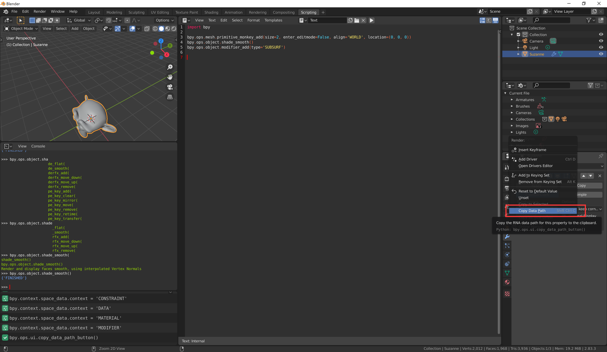

# Blender Python

Blender是开源软件，其应用层本来就是Python写的，都在bpy.ops下。如果看不到操作提示的Python接口，需要进入设置→界面→勾选PythonToolTip。


## 1.入门

在Python中点击Script布局


```python
import bpy
```

常用的有bpy.data（别名为D，场景中的物体数据）、bpy.context（别名为C，编辑器）、bpy.ops.object（对物体的操作，例如复制）


场景的物体对应着Python的一个对象，只要能通过某种方式索引到它，便可以通过修改它的属性的方式修改Blender编辑器中的物体的属性。

```python
bpy.context.active_object.name = "Hello"
```

要获取一个属性相对bpy.data.object[object_name]的相对路径，只需要右键该属性 选择CopyDataPath。



