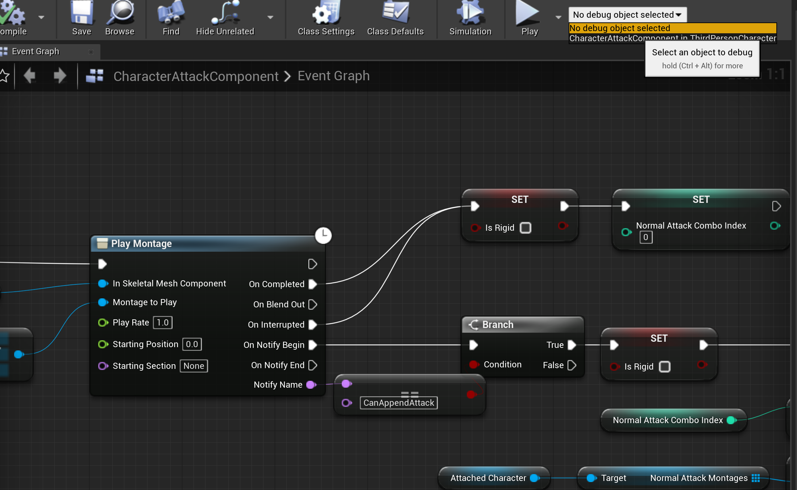

# UnrealEngine入门教程
[TOC]
## 一.界面
UE4是游戏引擎，所谓的游戏引擎，是一种用来制作游戏（或动画）的软件，例如，我们平时使用的Word，是用来编辑文档的软件；PowerPoint，是用来制作幻灯片的软件。而虚幻4，就是制作游戏的软件。

### 1.安装UE4引擎并创建项目

安装

前往[UnrealEngine4官网](https://www.unrealengine.com/zh-CN/)下载EpicGamesLauncher安装（需要注册），EpicGamesLauncher安装完成后依次点击虚幻引擎->库->引擎版本“+”按钮，即可安装UE4最新版本。

点击虚幻商城->免费，可以领取永久免费资源，且每月可以领5个限时免费资源，对独立开发者比较友好。

（2）创建项目

点击“游戏”->“下一步”->“第三人称游戏”->“下一步”->“创建项目”即可创建一个第三人称RPG游戏的模板。

### 2.引言

试想，如果让你设计一个游戏引擎，你应该怎样设计它的界面？

（1）首先肯定要有一个“场景”窗口，让我摆放物体构成关卡；而我能摆放到“场景”中的物体——例如主角、小兵、Boss、道具，都在另一个“资源”窗口。

（2）其次，放置进场景中的物体我应该能够编辑，为此我们需要场景中所有物体的列表——“世界大纲”窗口和能简单修改物体血量、颜色等属性的“细节”面板。

（3）尽管在放置物体时，我们可以简单得改变一些属性，但最好有一个专门用来编辑资源的界面。

>以Unity和UE4的界面大同小异，并不是互相抄袭，而是这些想法是很自然的，符合游戏引擎开发者的直觉。

### 3.UE4界面
UE4有两类界面：

（1）场景

放置游戏物体、道具构成关卡

（2）编辑

编辑游戏道具，不同的游戏道具因其特点不同吗，其编辑界面也不太一样。

### 4.场景布置

左边的窗口是系统预定义的游戏道具，例如灯光、摄像机；下边的窗口是我们自己设计的游戏道具，例如角色、怪物。

（1）道具放置

拖动相应的道具进场景便可以完成放置。

（2）场景漫游

**按住**鼠标右键进入场景漫游

WASD前后左右移动，E上升Q下降。

（3)笔刷

使用笔刷工具可以快速添加植物。使用Ctrl+鼠标滚轮可以调节笔刷的大小。

### 5.道具设置

点击场景中的一个物体选中它，或在世界大纲中选中它，在右下角会显示它的各个属性，有些是可以修改的，有些是不能修改的。

### 6.内容浏览器

1. ##### 搜索和集

   内容浏览器管理项目资源，可以将特定的资源加入集（Collection）中，快速检索；可以将常用的文件夹加入Favorite。通过搜索条件（如CollisionPrims==0）创建的动态集会自动更新。

2. ##### 属性矩阵

   Properties Matrix可以批量修改资源属性。

## 二.蓝图

通过将人物和资源拖入场景中并修改参数，你可以创建一个关卡，但你不能让它能响应用户的操作，比如用户按下攻击剑，主角发出攻击，打到怪物身上造成伤害。要让游戏是游戏而不是电影，你需要构建游戏运行和处理用户输入的的逻辑，构建逻辑的方式有蓝图和C++两种。

**建议使用蓝图写不能复用的部分，用C++写可以复用的部分。**

>阅读本部分内容应该尽量有面向对象的基础。面向对象是什么，目前来看比较靠谱的方法仍是多写多练其义自见。

### 1.数据类型
蓝图中的数据类型分为三类，除了C++本来就有的的基本数据类型引用数据类型，还多了一种“元数据类型”。
#### ①基本数据类型
int、float

#### ②引用数据类型
Actor对象指针，ActorComponent对象指针

#### ③元数据类型 
Actor类定义指针，ActorComponent类定义指针。所谓的元数据，就是编译器用来生成对象的那个模板，你可以通过拿这个模板生成对象。


### 2.Actor和ActorComponent
#### ①Actor
我们知道，地球上从蚂蚁到大象都有共同的祖先，即40亿年前的单细胞生物，尽管它和目前的生物有许多不同，但它是一个起点，定义诸如新陈代谢、细胞呼吸、DNA等对生命最基础、最必不可少的东西。而在UE4中，这个始祖称为Actor，任何能够放进场景中的东西，都是继承自Actor的子类。
>在UE4中还有更上层父类UObject，它实际上可以类比为“物质”，它拥有最基础的功能。Actor并不一定有实体，如APlayerController。

#### ②GamePlay
Pawn、Controller、PlayerState。

> 抽象出PlayerState是为了联机复制，Pawn和PlayerState是需要复制的，而Controller不需要。PlayState是不能跨关卡的，需要在合适的时候存入UGameSave。


#### ③Actor Component
在Unity中，位置、旋转、缩放三个向量不是物体本身的属性，而是一个Transform组件的属性，因此似乎不如直接写在Actor里的设计面向对象，但具有更高的复用性。

在组件开发的思路中，Actor只是一个傀儡，真正决定它是什么的是它挂载了什么样的组件，例如挂载了光源组件的Actor能发光，挂载了移动组件的Actor能跑步、飞行、游泳，挂载了网格组件的Actor能导入3D建模。

#### 注：Actor如何挂载`ActorComponent`的？
点击“添加组件”，搜索并选中特定的组件即可完成添加。
>实际上就是Actor有一个`ComponentList`数组，通过图形界面向其中添加了一个元素进去。

### ④生命周期

从前到后：Actor的构造函数和ActorComponent的构造函数（Actor在构造函数中使用CreateDefaultSubobject会调用ActorComponent的构造函数）->ActorComponent的InitializeComponent方法->Actor的PostInitializeComponents方法->ActorComponent的BeginPlay和Actor的BeginPlay方法（Actor调用Super::BeginPlay()会调用ActorComponent的BeginPlay）。

### 3.方法、回调方法、静态函数

蓝图是一种面向对象的可视化编程语言，面向对象即分工合作的思想，划分出一个个“角色”，每个角色有自己的特征，称为属性，例如人的名字，年龄；每个角色有自己的方法，例如人可以“跑”、可以“跳”、可以“学习”。

#### ①方法

角色的方法是特别的，但对于任何放置在场景中物体而言，他们都继承了老祖宗Actor，而Actor中有基本的移动方法，如下

```
Actor.AddActorLocalOffset(Actor target,Vector DeltaLocation)
```

#### ②事件

指在游戏中，在特定的时机被游戏调用的函数，例如当关卡加载了某物体后，会自动调用其BeginPlay方法。
除此之外我们经常用的事件：

（1）`OnComponentBeginOverlap`

当别的物体（实际上是Collision）进入触发器中时会被调用的函数。

（2）W

当按下了键盘上的键，会调用该方法。

#### ③函数和事件的区别

函数和事件最本质的区别的函数是同步的，事件是异步的。函数执行顺序不会被打乱，但触发了事件其响应的时间是不可知的。

#### ④静态函数
UE4提供的工具类中的工具方法称为静态方法，即与对象无关。
例如

（1）关卡加载
```
GamePlay.OpenLevel(String LevelName)
```

（2）打印日志至屏幕
```
GamePlay.PrintString(String message)
```
>我们待会会在案例里使用这三个函数。

### 4.逻辑流程控制

DoN（快捷键N+鼠标左键）

Foreach（快捷键F+鼠标左键）

### 5.游戏流程控制

我们通常使用触发器（即拥有碰撞组件但没有网格体组件的Actor）来控制游戏的流程。

>游戏中眼见不为实，一个东西的物理大小和显示的外形大小是分开的（例如穿模，就是物理碰撞体积小于模型的大小），外观是Mesh控制的，物理碰撞计算是基于Collision的。

#### ① 触发器

（1）创建蓝图类，继承自Actor，命名为`BoxTrigger`，点击蓝图类从“场景”视图切换到“编辑”视图

（2）添加盒型碰撞组件

（3）实现盒型碰撞组件的`OnComponentBeginOverlap`的回调方法

（4）创建引用变量`MechanismDoor`，点击修改其类型为Actor，并让其公开。返回场景视图，将一面墙赋值给`MechanismDoor`，并将其“移动性”设置为“可移动”。
>所谓公开，就是指能在“场景”视图中编辑。

（5）返回编辑视图补完逻辑，当玩家走进触发盒子中时让机关门上升。

#### ② 加载关卡
通常我们至少有四个场景：游戏场景、游戏成功、游戏失败以及开始菜单、暂停菜单。

我们已经有一个默认的游戏场景了，还需要另外创建游戏成功和游戏失败的游戏场景。同时在放置两个触发盒子，当玩家进入左边的触发盒子时，加载游戏通关场景；当玩家进入右边的触发盒子时，加载游戏失败场景。

（1）创建游戏成功和游戏失败场景

（2）修改盒子，创建公开的`IsGoodEnd`变量，作为Branch选择两条`OpenLevel`语句的条件，只需注意关卡名不要写错即可。

### 5.调试

蓝图的调试需要指定对象

