# UE4
[TOC]
## 1.常用Actor和ActorComponent

#### 1.StaticMeshActor

静态网格体对象，用来布置场景、不会被破坏、不会因外力发生形变的物体（例如GTA5中火车都撞不弯的大树）
>静态网格体对象，“静态”修饰的是“网格”而不是“对象”，一个移动的、但不会被破坏的电梯就是一个静态网格体对象（其“移动性”要选为“可移动”）。

#### 2.Character
角色，是具有以下组件的Actor

##### (1)CapsuleComponent
胶囊体碰撞组件，它定义角色的碰撞体积，设置不当会穿模（因为游戏中视觉和物理没有关系）。

##### (2)SkeletonMeshComponent
骨架网格体组件，和静态网格体相对，骨架网格体组件除了导入3d模型形成角色的外观，还可以播放骨骼动画，例如导入一个主角模型，播放一段攻击的动画。

①设置主角的外形

在SkeletonMesh选项中选择一个项目已有的骨架网格体（可能是来着Maya、3DMAX，也可能是虚幻生成下载的）

②播放骨骼动画

使用MeshComponent的PlayMontage方法。

##### (3)CharacterMovementComponent

该组件让角色在不模拟物理的情况下移动。模拟推动力使用蓝图方法LaunchCharacter。

### (4)CameraComponent

摄像机组件，跟随角色的摄像机，通常在角色的后上方。

### (5)其他组件
ArrowComponent:提示性组件，始终指向模型前方

CameraBoom：摄像头操纵杆，没有它的话摄像头跟随角色移动会很生硬

## 3.动画蓝图

动画蓝图是一种特殊的蓝图，继承自AnimInstance，它是虚幻4中专门用来管理角色动画播放的蓝图类，虚幻4为它专门设计了特别的编辑界面，将动画切换的过程可视化。
>你当然可以不用动画蓝图，自己写一个有限自动机，然后发现你只是写了一个代码版的动画蓝图。

注意，在使用Montage混合的时候，UE4存在Bug，混合动画只能先选出Default然后更改其为其他Slot。

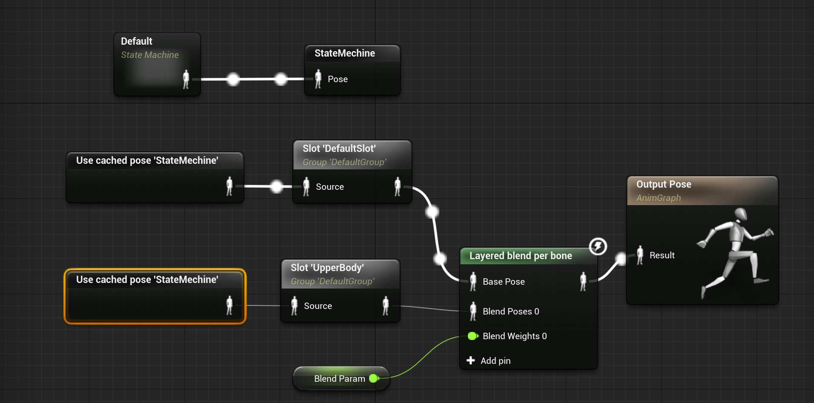

> 通过BlendParam变量控制是否要添加融合（例如边走便换弹）

可以通过动画蓝图控制单块骨骼的运动

#### 注意

PlayMontage节点一定要连上兼容的SkeletalMeshComponent，否则不报错也不播放。

Montage是程序控制的动画，MontageNotify也是程序响应。如果是脚步声这类的Notify，则是AnimNotify，它们在动画蓝图中响应。

## 4.AI

很多游戏引擎采用“行为树”来控制NPC的行为。如果你学过真·人工智能，那你可以把行为树当作手工设值的决策树。尽管深度神经网络能轻松把这些普通的机器学习算法打成渣渣，但考虑到性能，暂时没办法也没必要在游戏中使用真正的Ai，只需要给NPC一堆IF-Else就够了（如果真的在游戏中使用AlphaGo那样的Ai，游戏流程也没办法控制了。）

在UE4 使用AI的流程：①创建行为树、黑板；②创建并指定NPC的AIController；③NPC添加AI Perception组件，添加视觉并设置检测中立单位；④玩家添加AI Perception Simuli组件，勾选自动注册为源并注册到视觉；⑤创建寻路体积；⑥若为Paragon角色，勾选Character Movement的Use Acceleration as Paths。

> 在UE4中可以运行游戏之后点击`'`然后点击小数字键盘的4进入AI感知Debug模式。

### (1)行为树

通常行为树被AIController运行，用以决定NPC的行为，每个行为（例如散步、追逐玩家）被称为Task，且都是这颗树的一个叶子节点，而在这些叶子中切换的依据一个是行为树中的顺序：从上到下，从左到右；另一个是某些变量（例如是否看见玩家、玩家的位置），行为树要获得这些变量，不能通过GetPlayerCharacter或者GetActorLocation的方式直接获得，而只能从“黑板”中获得，如果“黑板”中没有它所需要的Key，行为树就无法决策。

就好像在饭店吃饭的时候，我们不会直接到厨房指挥厨师做什么菜，通常是这样的：

①饭店准备好一份菜谱（黑板）

②厨师准备好每道菜怎么做（行为树）

③顾客来了，点餐（发生OnTargetPerceptionUpdate事件），服务员把点好的菜单送到厨师那里（更新黑板中的值），厨师做菜（行为树执行Task）

### (2)BehaviorTreeTask

BehaviorTreeTask是行为树上的叶子节点，即行为树的决策结果，当决策树执行BehaviorTreeTask时会触发其ReceiveExecuteAI事件。

创建BehaviorTreeTask其实就是实现这个事件，**在事件完成之后要FinishExecute**，否则行为树会卡在这个节点。

### (3)BehaviorTreeDecorator

### (4)BehaviorTreeService

****

### (5)答疑

##### ①要实现AI有几种文件？

三种：Blackboard、BehaviorTree、BehaviorTreeTask

##### ②是谁更新Blackboard的值供行为树决策？

AIController。准确的说是AICharacter调用AIController中的函数间接更改Blackboard的值，因为AIPerception是AICharacter的，而运行BehaviorTree的只能是AIController。

##### ③行为树具体是怎么决策的？

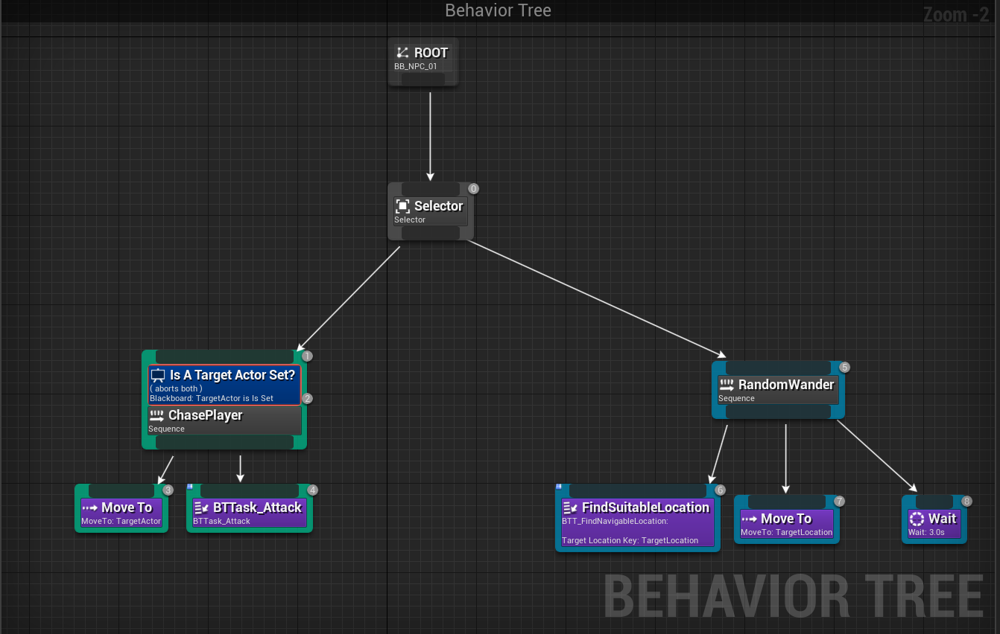

以追逐玩家为例，当AI看见了Player，触发AIPerception的`OnTargetPerceptionUpdate`事件，该AI获取其AIController并调用`UpdateTargetActorKey`，触发了行为树中`ChasePlayer`上Decorator的`OnResultChange`事件，让其终止所有Task并转入`ChasePlayer`。

##### ④如果多个行为树引用一个黑板，黑板的值是同步的吗？

默认不是同步的，每个行为树拥有一个黑板的副本，例如有一个NPC的HP为50，另一个为100。但也可以勾选instance sync让黑板的值同步。

⑤MoveTo只有移动到玩家身边？能不能足够靠近就停下？

##### ⑥AI Perception如何Debug？

运行时，按下引号键(')，就会出现AI的Debug信息，包含

1.  AI
2. Behavior Tree
3. EQS
4. Perception

四个大的分类，可以通过小键盘上的1234键来显示和关闭相应的选项。

## 5.音效

### (1)静态音效

##### ①SoundWave和SoundCue

相当于Texture和Material的关系，前者相当于导入的素材，后者是前者编辑、组合得到的资源。

##### ②背景音效：

将SoundWave拖动到场景中便可以创建音效Actor。

开启允许空间化和衰减，但空间化选项中不启用空间化。这里可以使用Attenuation资源，也可以勾选OverrideAttenuation手动设置衰减的形状、内外半径。

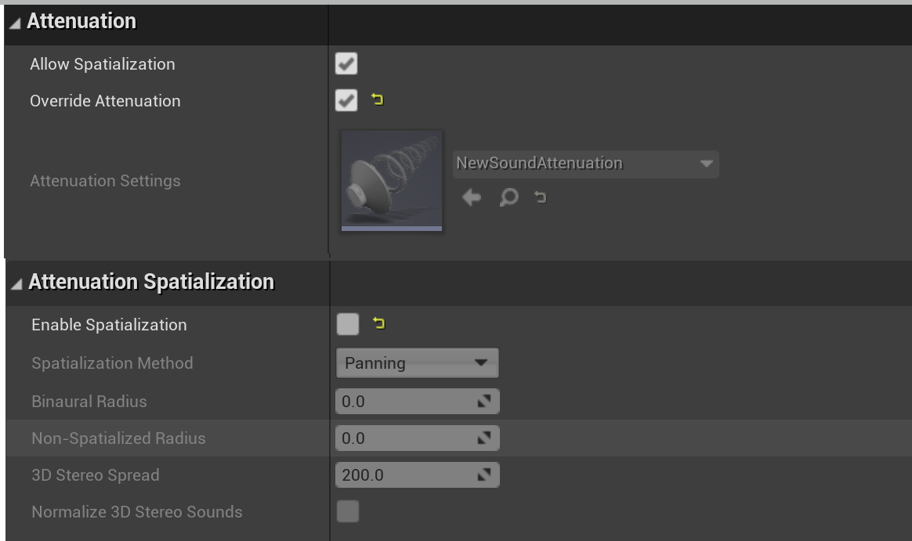

> 若这里不勾选AllowSpatialization，则声音不会衰减；若这里勾选EnableSpatialization，则环境音效也会分左右声道，很违和。

③

音效默认是Restart，即每次进入声音范围内都会重新播放音效，在某些情况下很违和，例如火把的火焰、乐队的声音，这时可以开启虚拟音效，让声音继续播放。这个选项会较消耗性能，因为引擎会检查玩家是否进入了范围，这个检查的频率是可以设置的。

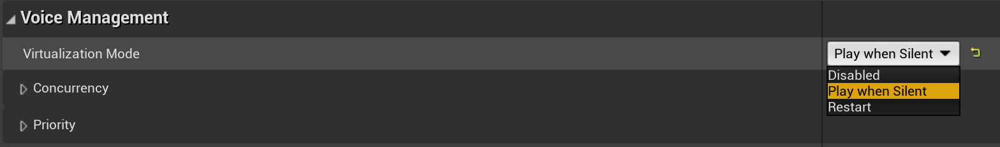

### (2)动态音效

在播放的动画资源中设置动画通知，在动画蓝图中播放相应的音效。

##### ①脚步声

思路是收到脚着地的动画通知时进行射线检测，判断角色在什么物体上来播放对应的脚步声（和粒子特效，如飞溅的土、水花）。

AnimNotify_Footstep→LineTraceByChannel（Start：ActorLocation，End：ActorLocation.Z-200）

## 6.物理追踪

物理追踪有光线投射、盒体追踪、胶囊体追踪和球体追踪。

你可以把它们当作一次性的BoxCollision。**物理追踪返回HitResult，但不会阻碍物体。**

> UE4中普通的BoxCollision的Overlap事件不能返回HitResult，也就不能得知碰撞的位置；Hit事件虽然可以返回碰撞的位置，但发生Hit事件的两个物体必须相互阻挡。因此在伤害判定时两者都有所缺陷——Overlap不能产生火花位置不能分部位伤害，Hit不能让武器穿透对方。

### (1)盒体触发器

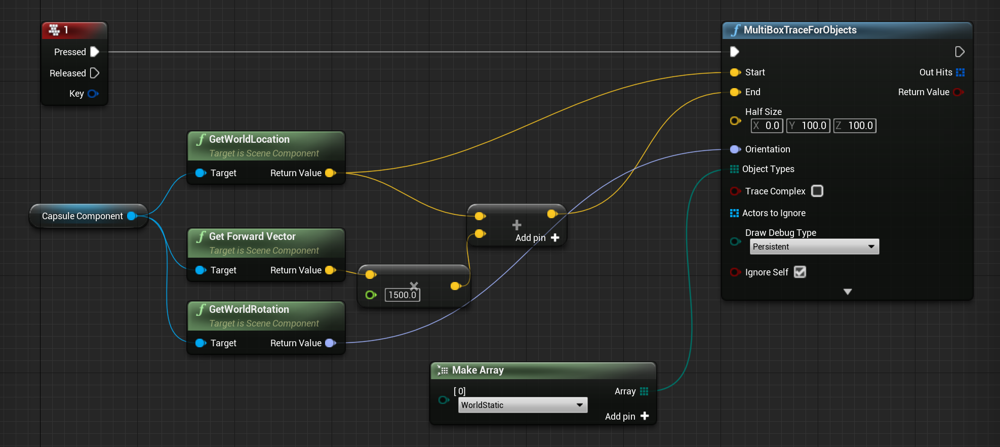

HalfSize控制每个盒体的大小，在路径旋转时盒子的范围与X、Y、Z都有关，其中Z应该由武器长度决定。

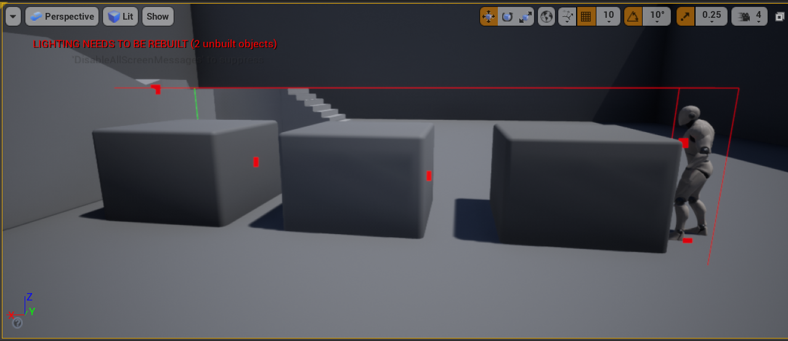

##### 注：ForObject：检测区域内所有物体；ForChannel：检测区域内第一个阻挡的物体和之前不会阻挡的物体（例如子弹飞过草丛击中目标）

### (2)视觉通道（TraceChannels）和物理通道（ObjectChannels）

**所谓的"通道"，就是"种类"。**从大可分为可移动物体、背景，从小可分为人物、车辆、武器。

UE4 C++的通道是硬编码，自定义视觉通道序号从3开始（系统自带2个，Visibility和Camera），自定义物理通道序号从7开始，系统自带6个，分别为

ObjectTypeQuery1：WorldStatic

ObjectTypeQuery2：WorldDynamic

ObjectTypeQuery3：Pawn

ObjectTypeQuery4：PhysicsBody

ObjectTypeQuery5：Vehicle

ObjectTypeQuery6：Destrucible

每个物体都属于一个种类，同时需要设定它是否能与别的种类发生碰撞、重叠、无视等（可使用Preset简化）。

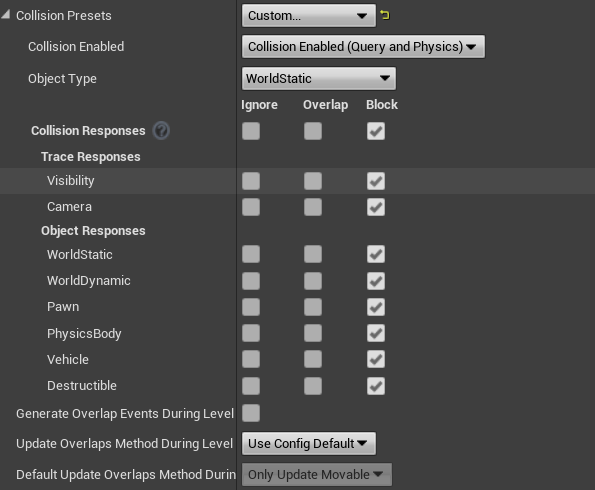

##### 注意，碰撞响应是相互的

例如，种类A的物体a和种类B的物体b发生碰撞，则a设定了阻碍种类B，b设置了阻碍种类A。

> 在UE4中，我们不会设置物体a对物体b的阻碍/重叠/无视。

## 7.编辑器蓝图

前面介绍的都是对游戏编程，编辑器蓝图是对编辑器编程，让其自动完成批量任务

### (1)在编辑器中调用蓝图

勾选蓝图类事件的`Call In Editor`

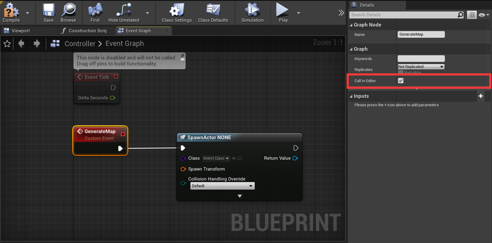

使用

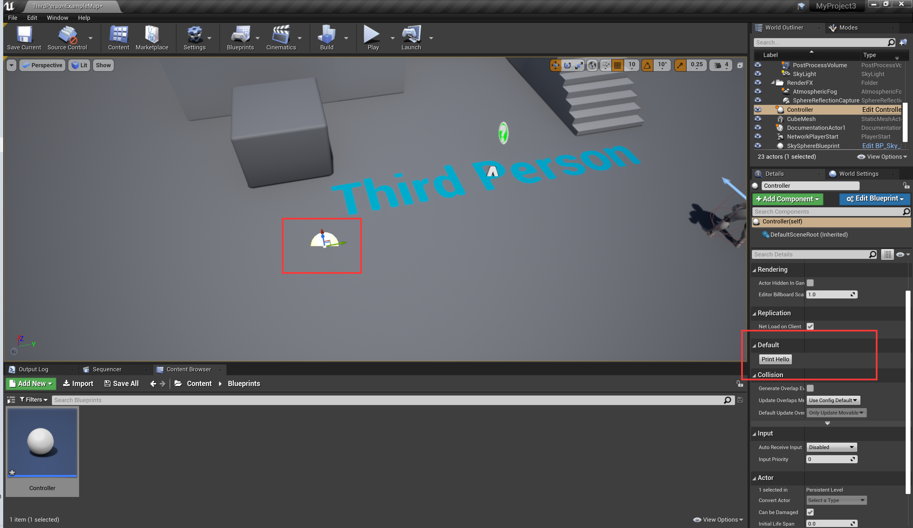

> UE4中的事件其实就是非阻塞的函数调用。

### (2)脚本化操作

决定是在 **内容浏览器** 中选择的资产上，还是在 **关卡视口** 或 **世界大纲视图** 中选择的Actor上执行脚本化操作。

- 若要在资产上执行脚本化操作，选择 **AssetActionUtility** 作为父类，然后按 **选择（Select）**。
- 若要在Actor上执行脚本化操作，选择 **ActorActionUtility** 作为父类，然后按 **选择（Select）**。

##### 注

（1）对于在该蓝图类中定义的函数，其会自动勾选“Call In Editor”，事件则不会。

（2）重写该蓝图类的`GetSupportedClass`和`Run`可以实现判断是否为脚本对象和运行脚本效果。

（3）编辑器工具窗体

UMG。应先打开Editor Scripting Utilities插件。

### (3)自定义工具控件

在 **内容浏览器（Content Browser）** 中单击右键，选择 **编辑器工具（Editor Utilities）> 编辑器控件（Editor Widget），右键单击该 **编辑器工具控件资源（Editor Utility Widget Asset）**，并选择 **运行（Run）** 以打开一个显示编辑器工具的编辑器选项卡。该选项卡只能与关卡编辑器选项卡一起停靠。一旦您运行了编辑器工具控件，它就会出现在关卡编辑器的窗口（Windows）下拉框中的编辑器工具控件（Editor Utility Widgets）类别下。

前面介绍了虚幻4中的重要概念，但做一款游戏还缺许多细节，接下来该坐下来慢慢梳理常用的Actor和Component了。 

### (4)插件

### (5)注意事项

适用于虚幻编辑器的蓝图应该在场景设计时使用，而不应该在游戏运行后起作用。

## 8.物理破碎

UE4的新破碎系统称为Chaos，老的是Nvidia的APEX（新版本须在插件→物理中手动开启）

### (1)APEX

右键StaticMesh可以创建破坏体。进入破碎体编辑界面设置参数后选择FractureMesh。

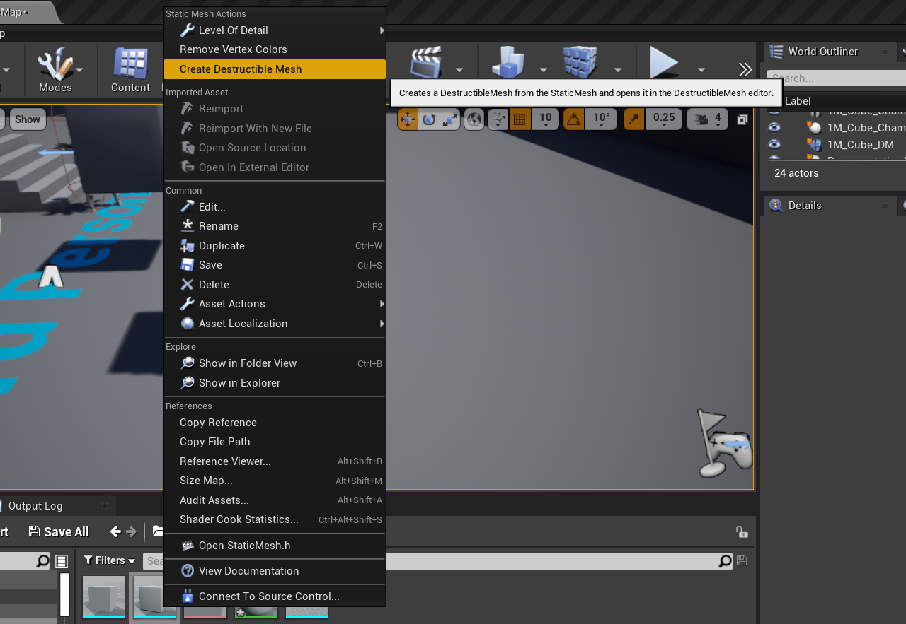

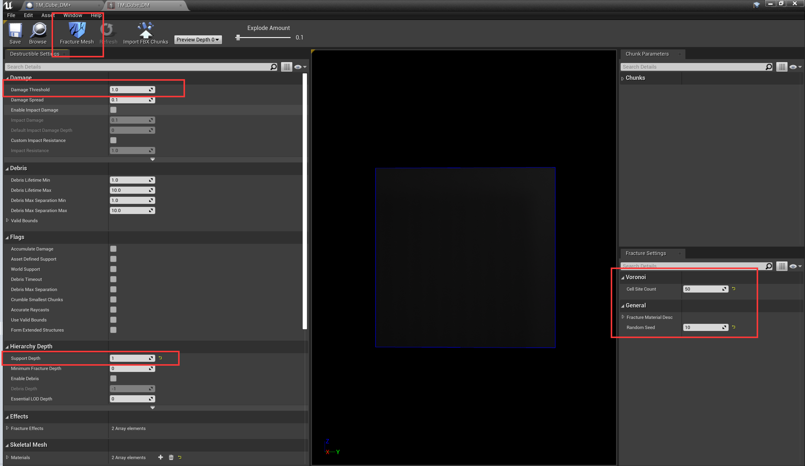

### (2)Chaos

目前似乎还不完善，对显卡要求偏高。

### (3)其他思路

骨骼网格体播放破碎动画。也就是将程序负责的破坏变为美工负责的破坏。

## 9.Niagara粒子系统

Niagara是UE4新推出的粒子系统，用以替代级联，特点是可编程。

### (1)概念

Niagara的一个特效是一个NiagaraSystem，一个System中有多个发射器。例如一个开火特效，有火焰、烟雾两个不同的发射器。

EmitterUpdate和ParticleUpdate不同，前者是发射器的更新，通常是产生一些新的粒子（SpawnRate）；后者是粒子本身的更新。

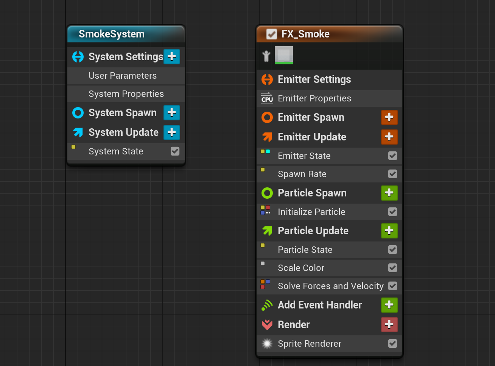

从Niagara发射器的编辑器也可看出粒子的生命周期，从EmitterUpdate产生一些新的粒子开始，它们经过Initialize、每一帧的Update、每一帧结算力和速度、每一帧的Render。在ParticleUpdate中可以添加粒子受到的力（如旋度噪点力）、调整其生命周期中的颜色。需要注意的是物理性的改变需要放在SolvForcesAndVelocity前。

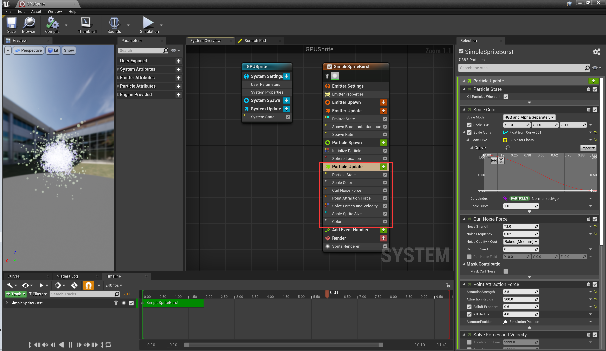

### (2)参数的随机化

通常使用UniformRangedFloat并制定最大最小值。

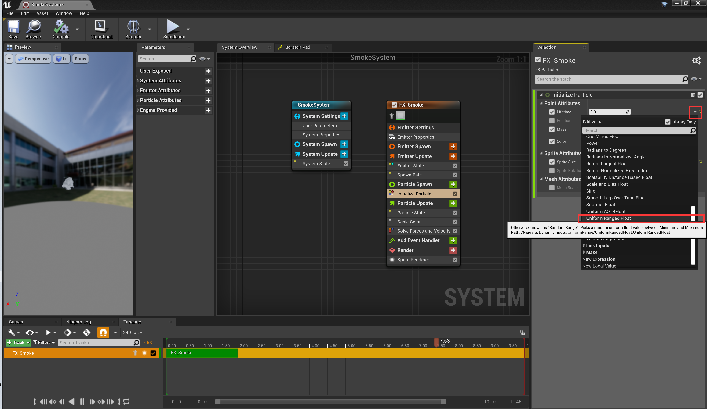

对2D的数据需要多套一层Vector2D From Float

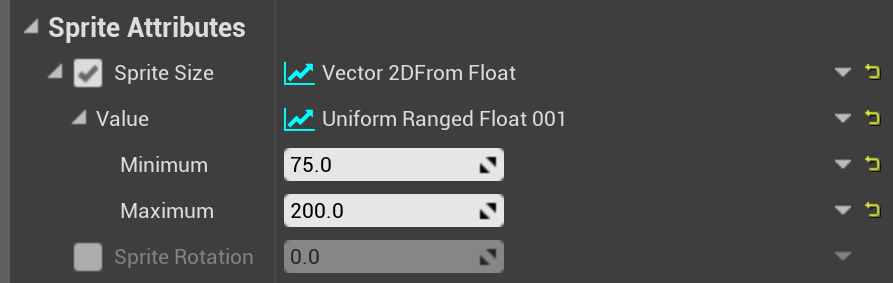

### (3)使用GPU渲染

在发射器选项中选择GPU，并设定FixedBounds（因为是在GPU上运算，不知道粒子的范围）

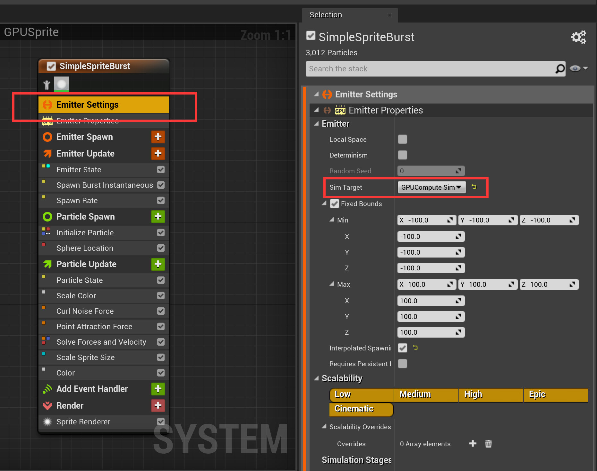

## 10.其他

### (1)相机抖动

相机抖动可以用于增加打击感和画面张力。

创建CameraShake资源，使用UGamePlayStatics::GetPlayerCameraManage.PlayCameraShake播放。

1. 新建一个camera shacke
   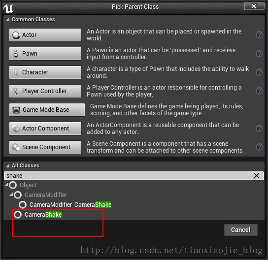
2. 设置配置
   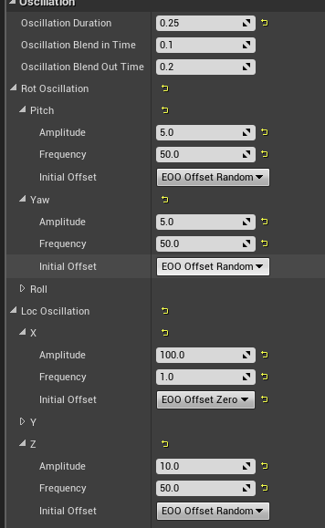
   这里的配置是可以改变的，通过调整幅度可进行抖动频率大小的改变
3. 调用
   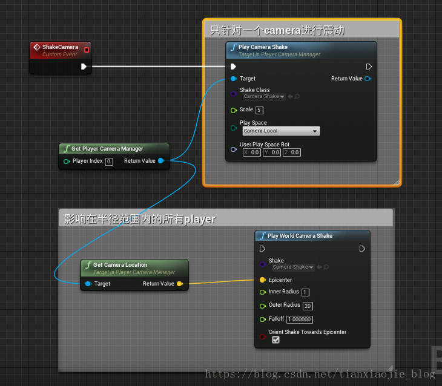

### (2)外景

一个平板放图片，取消勾选CastShadow。

### (3)帧冻结

帧冻结用于增强打击感

##### +SCompoundWidget的Construct并不是继承的，也没有用到多态，只是一个约定的函数