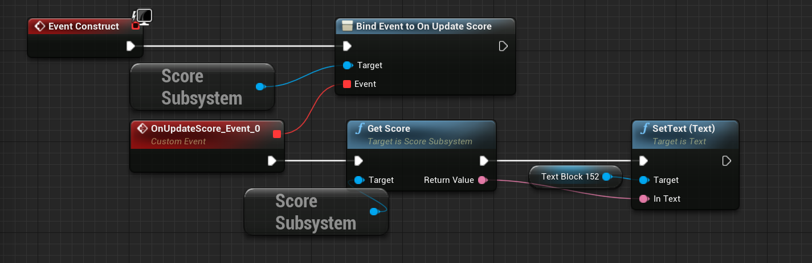
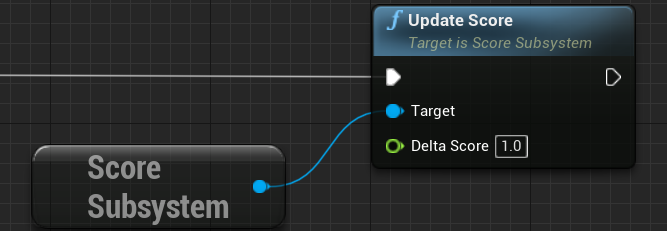
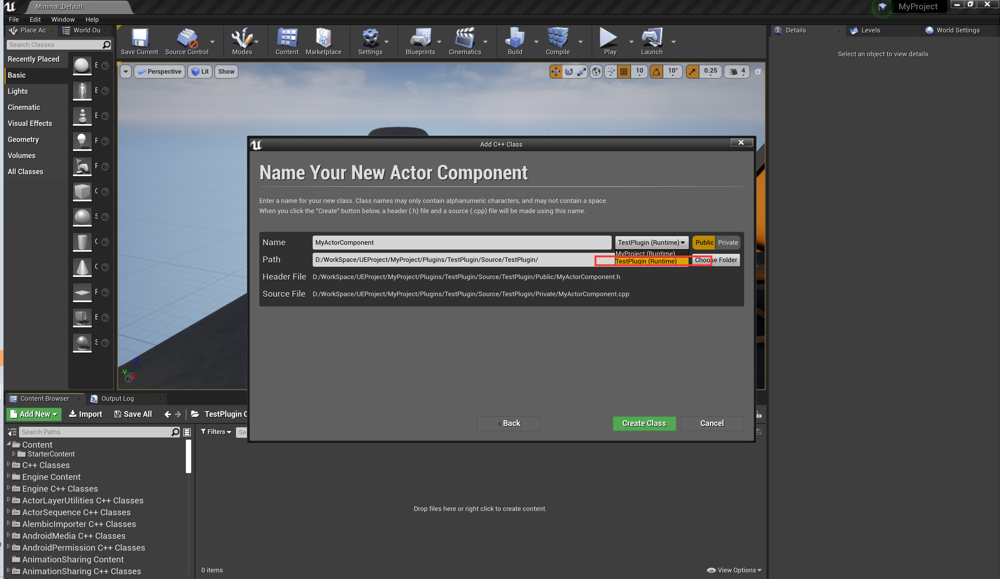
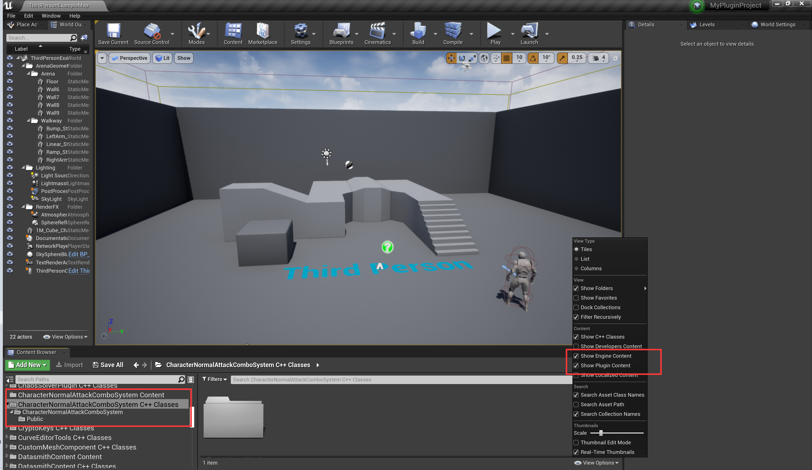
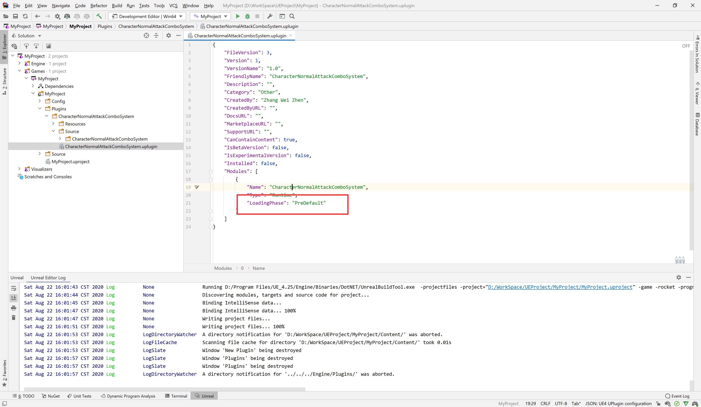
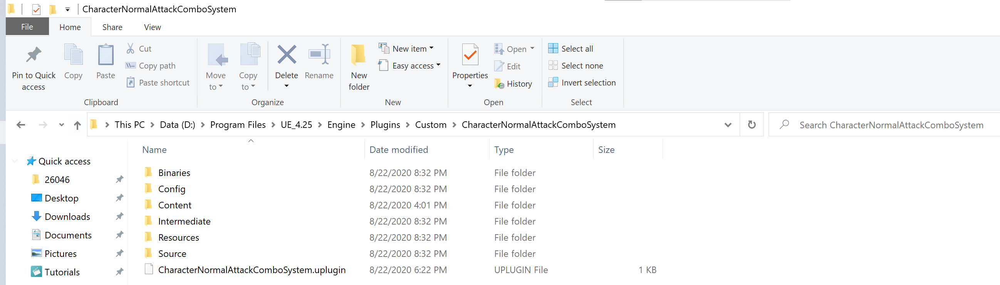
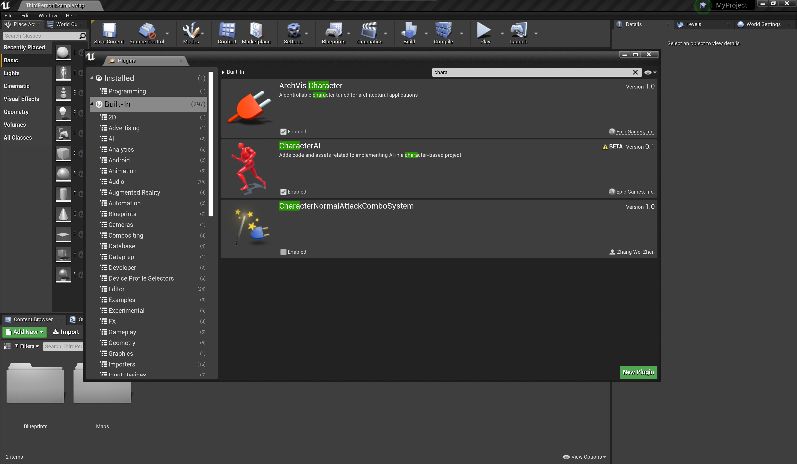

# UE4 C++

[TOC]

UE4的C++是经过大幅魔改的，完全可以叫做U++，U++和C++的关系类似Object-C与C语言和Swift与Java，都是在特定使用场景下的产物，如果你不是躺在舒适圈里就不想动了，这其实称不上是缺点。

> ue中C++的命名方式与《GoogleC++风格指南》中的标准大不相同。类的命名大致可以分为F开头（Framework），U开头（继承自UObject），A开头（继承自AActor）。

## 一.入门

### 1.Actor、ActorComponent、SceneComponent

##### ①Actor

放置在关卡中的一个实体（道具）。

##### ②ActorComponent

依附于Actor，赋予Actor某种功能。

> 使用Component而不是直接在Actor中添加功能是为了代码复用。

##### ③SceneComponent

带有GetComponentTransform方法的特殊Component。

> 其实就是一个有一个成员变量记录了位置、旋转、缩放的类。Actor至少有一个SceneComponent（因为它要放到场景中)。

### 2.Transform

Transform是一个记录位置、旋转、缩放的结构体，是放置在场景中的Actor最基本的属性。需要注意的是，UE4中的旋转并不是使用的四元数，而是Roll，Pitch，Yaw，可使用`USceneComponent->GetComponentRotation().Vector()`方法得到其指向前方的向量，也可使用Actor的方法`GetActorForwardVector()`和`GetActorRightActor()`。

### 3.答疑

①`meta = (AllowPrivateAccess = "true")`有什么用?

不写的话蓝图不能访问C++中的私有变量。

> C++和Java不同，类成员默认都是private，struct默认都是public。

②BeginPlay和构造函数有什么区别？

构造函数是编译之后就执行了，BeginPlay是游戏开始（生成物体）执行。

③为什么要使用TEXT宏而不是像标准C++那样直接使用双括号生成？

数据类型不同，TEXT宏返回值是`TCHAR*`（TCHAR在内存中占两个字节），而""的是`char*`（char在内存中占一个字节）

④调用ConstructObject方法时参数Outer是什么？是不是C#中的out？

不是，Outer是父对象。

⑤什么时候使用指针？什么时候使用引用？什么时候使用对象？

UStruct使用对象，UObject使用指针，特别地，集合类声明为对象

```C++
TArray<AActor*> ActorsToIgnore;

class A{
    UCameraComponent* FollowCamera;
    TArray<FHitResult> HitResults;
}


```

> 这种规范主要来源于虚幻垃圾回收机制的不完备。

⑥*_API有什么用？

对于一些需要被模块外部访问的函数和类，需要通过 `*_API` 的宏标记出来，没有以该API暴露的类即便引入了其所在模块也会会在链接时报错无法解析的外部符号。每个被暴露在外的单项都会带来编译时间的额外消耗，因此请务必仅暴露出必须暴露的接口。如果外部只需要访问一个类中的某个函数，那么比起暴露整个类而言，仅暴露出这个函数能够节省出相当可观的编译时间。

### 4.Rider For Unreal

##### ①快捷键

Alt+O：切换头文件/源文件

Ctrl+B：转到实现/声明

Ctrl+Shift+Backspace：返回上一次编辑的地方

### 5.虚幻工程的编译

#### (1)关于头文件的建议

①每个头文件应在第一行包含`#include "CoreMinimal.h"`，该头文件中定义了TArray等引擎基础内容。

②*.generated.h只能作为最后一个被包含的头文件，否则会报错

#### (2)UnrealBuildTool(UBT)

虚幻中的编译单位是：源码→模块→项目。

##### ①项目编译配置信息

每个项目下有个`.Target.cs`，指定项目编译的目标（游戏，仅客户端，仅服务器端）

```C#
using UnrealBuildTool;
using System.Collections.Generic;

public class MyProjectTarget : TargetRules
{
   public MyProjectTarget(TargetInfo Target) : base(Target)
   {
      Type = TargetType.Game;
      DefaultBuildSettings = BuildSettingsVersion.V2;
      ExtraModuleNames.Add("MyProject");
   }
}
```

##### ②模块编译配置信息

每个模块通常是项目目录下的一个文件夹，其中有一个`.build.cs`。

> 这里和Python的包非常相似，Python中的包是一个含有\_\_init\_\_.py文件的文件夹。

最常用的是`PublicDependencyModuleNames`，这里包含本模块依赖的模块。通常需要加`UMG`和`"AIModule"`。

`PublicIncludePaths`：默认`Public`和`Classes`文件夹，当别人依赖本模块的时候暴露的内容。

```C#
using UnrealBuildTool;

public class TestPlugin : ModuleRules
{
    public TestPlugin(ReadOnlyTargetRules Target) : base(Target)
    {
        PCHUsage = ModuleRules.PCHUsageMode.UseExplicitOrSharedPCHs;
        PublicDependencyModuleNames.AddRange(
            new string[]
            {
                "Core",
                "TestPluginLibrary",
                "Projects"
                // ... add other public dependencies that you statically link with here ...
            }
        );
        PrivateDependencyModuleNames.AddRange(
            new string[]
            {
                // ... add private dependencies that you statically link with here ...	
            }
        );
    }
}
```

对于第三方模块则需配置`PublicAdditionalLibraries`，`PublicDelayLoadDLLs`，`RuntimeDependencies`

```C#
using System.IO;
using UnrealBuildTool;

public class TestPluginLibrary : ModuleRules
{
   public TestPluginLibrary(ReadOnlyTargetRules Target) : base(Target)
   {
      Type = ModuleType.External;

      if (Target.Platform == UnrealTargetPlatform.Win64)
      {
         // Add the import library
         PublicAdditionalLibraries.Add(Path.Combine(ModuleDirectory, "x64", "Release", "ExampleLibrary.lib"));

         // Delay-load the DLL, so we can load it from the right place first
         PublicDelayLoadDLLs.Add("ExampleLibrary.dll");

         // Ensure that the DLL is staged along with the executable
         RuntimeDependencies.Add("$(PluginDir)/Binaries/ThirdParty/TestPluginLibrary/Win64/ExampleLibrary.dll");
        }
        else if (Target.Platform == UnrealTargetPlatform.Mac)
        {
            PublicDelayLoadDLLs.Add(Path.Combine(ModuleDirectory, "Mac", "Release", "libExampleLibrary.dylib"));
            RuntimeDependencies.Add("$(PluginDir)/Source/ThirdParty/TestPluginLibrary/Mac/Release/libExampleLibrary.dylib");
        }
   }
}
```

## 二. 常用ActorComponent

ActorComponent是能在项目间复用的代码，UE4提供的游戏道具Actor如静态网格体、骨骼网格体、粒子系统等，实际上包含功能并不是Actor，而是它们带的ActorComponent。对Unity那样的纯组件开发的游戏引擎而言，一个物体是什么仅取决于它有哪些组件，有光源组件就是光源，有摄像机组件就是摄像机，而GameObject本身只是一个空壳。UE4学习了这一思想，不过在UE4里其实可以在Actor里写代码（而不像Unity中那样连代码都是一个Script组件），而ActorComponent中则写那些项目无关的通用功能代码。

### 1.StaticMeshComponent

##### ①简介

最常见的ActorComponent之一，用于渲染无骨骼模型。

##### ②重要属性和方法

StaticMesh：该组件渲染的UStaticMesh*资源。

### 2.USkeletalMeshComponent

最常见的ActorComponent之一，用于渲染骨骼模型，播放骨骼动画。

##### ③重要属性和方法

SkeletalMesh：该组件渲染的USkeletalMesh资源

GetAnimInstance：用于播放骨骼动画的AnimInstance

### 3.USceneCaptureComponent2D

##### ①简介

用于在场景中采集图片，可结合RenderTarget和材质用于制造复杂美术效果（如在雪中的脚印、水波）

### 4.ActorSequence

##### ①简介

用于单个Actor的动画，实际上就是编辑Actor的时间线任务，相比SetTimerByEvent其是可视化时间轴编辑。

注意：该组件并不是引擎组件，而是在插件里，使用时需引入模块ActorSequence。

③重要属性和方法

OpenInTab（Editor）：打开编辑该Sequence的标签页

GetSequencePlayer()->Play()：播放该Sequencer

## 三.U++与C++区别

### 1.创建对象

在构造函数中创建组件使用CreateDefaultSubobject，使用此方法生成的组件在编辑器中可见；其他情况使用NewObject，需要参数时可以使用标准C++的new；生成Actor需要使用UWorld::SpawnActor；可通过GetMutableDefault获得一个CDO，UE4反射系统用它存储有关类的默认值的信息，该对象是天然单例。

### 2.加载项目资源

加载非蓝图类：在构造函数中使用ConstructorHelpers::FObjectFinder，其他情况使用LoadObject。

加载蓝图类：LoadClass。

TSoftObjectPtr包含FSoftObjectPath（通过ToSoftObjectPath获得）和TWeakObjectPtr（若资源已加载，通过Get()获得）；TSoftClassPtr包含FSoftClassPath和TWeakClassPtr。

### 3.接口

C98并没有接口的概念，要做到与Java中接口相同的“实现接口”功能，需要声明类中的方法全部为纯虚函数。

UE4中声明接口类与声明普通的虚幻类相似，但仍有两个主要区别。首先，接口类使用UINTERFACE宏而不是UCLASS宏，且直接从"UInterface"而不是"UObject"继承。

```
UINTERFACE([specifier, specifier, ...], [meta(key=value, key=value, ...)])
class UClassName : public UInterface
{
    GENERATED_BODY()
};
```

> UClass不能是抽象类

### 4.函数参数

通常我们按常引用传递输入参数，指针传递输出参数，但由于设计缺陷，UE中不应出现容器的指针（或者说，UE4中只能用UObject*），因此传TArray应使用使用引用。

### 5.日志

使用宏UE_LOG

```
UE_LOG(LogTemp,Warning,TEXT("AnimNotify：%s未处理，已跳过"),*NotifyName);
```

### 6.模块

##### (1)创建模块

一个模块是一个文件夹，其中至少有两个文件：

①一个提供给UBT的描述文件`<模块名>.build.cs`（类似于pom.xml）

②一个含有`IMPLEMENT_MODULE( ModuleImplClass, ModuleName ) /IMPLEMENT_GAME_MODULE( ModuleImplClass, ModuleName ) `或`IMPLEMENT_PRIMARY_GAME_MODULE( ModuleImplClass, ModuleName, GameName )`宏的.h/.cpp文件（UBT通过这里注册的ModuleName索引一个模块，且运行模块的初始化方法）

且需要在Source同级的清单文件`<项目名>.uproject`或`<插件名>.uplugin`中进行配置，如下：

```json
"Modules": [
   {
      "Name": "TestPlugin",
      "Type": "Runtime",
      "LoadingPhase": "Default"
   }
]
```

>至少一个模块需要使用`IMPLEMENT_PRIMARY_GAME_MODULE`宏指明为游戏模块，其会多注册一个全局变量游戏名。

PrivateIncludePaths中的路径和PublicIncludePaths（自动发现）的路径一样，在使用时不需要全路径，而可以使用相对PrivateIncludePaths和PublicIncludePaths中路径的相对路径。

##### (2)引入模块

引入模块有两种方法：

①导入模块：包含指定模块Public目录下的头文件、取消Public之前的路径前缀，并链接（常用）

在`<模块名>.build.cs`中的PublicDependencyModuleNames或PrivateDependencyModuleNames添加模块名。使用PublicDependencyModuleNames将有传递性，引入此模块将同时引入此模块的PublicDependency，而PrivateDependencyModuleNames反之。

```c++
PublicDependencyModuleNames.AddRange(new string[] { "Core", "CoreUObject", "Engine", "InputCore", "HeadMountedDisplay","UMG" });
PrivateDependencyModuleNames.AddRange(new string[]{"Slate","SlateCore","UnrealEd"});
```

例如需使用Plugins/TestPlugin/Source/TestPlugin/Public/TestActor.h中定义的类ATestActor，需在`<模块名>.build.cs`中的PublicDependencyModuleNames或PrivateDependencyModuleNames数组中添加字符串"TestPlugin"，代码如下：

```C#
PrivateDependencyModuleNames.AddRange(new string[]{"TestPlugin"});
```

之后可以引入该模块中的头文件，路径从Plugins/TestPlugin/Source/TestPlugin/Public后开始，如下：

```c++
#include "TestActor.h"
```

②仅包含头文件：仅包含头文件但不链接，不出发

在`<模块名>.build.cs`中的PublicIncludePathModuleNames/PrivateIncludePathModuleNames添加模块名。

作用一：可能适用于某些仅含头文件的模块库，例如Boost？但测试发现即便是仅头文件如果在UClass中使用依然会报无法解析外部链接错误。

作用二：用于动态加载，配合DynamicallyLoadedModuleNames和 FModuleManager::LoadModuleChecked动态加载模块。

③对第三方库

```c#
public class Temp : ModuleRules
{
	public Temp(ReadOnlyTargetRules Target) : base(Target)
	{
		PCHUsage = PCHUsageMode.UseExplicitOrSharedPCHs;

		PublicDependencyModuleNames.AddRange(new string[] { "Core", "CoreUObject", "Engine", "InputCore", "HeadMountedDisplay" });

		bUseRTTI = true;
		bEnforceIWYU = false;

		PublicIncludePaths.Add("Temp/include");
		PublicIncludePaths.Add("Temp/include/torch/csrc/api/include");
		
		/*供链接器使用的.lib*/
		PublicAdditionalLibraries.Add(Path.Combine(ModuleDirectory, "lib", "torch.lib"));
		PublicAdditionalLibraries.Add(Path.Combine(ModuleDirectory, "lib", "torch_cpu.lib"));
		PublicAdditionalLibraries.Add(Path.Combine(ModuleDirectory, "lib", "c10.lib"));
		
		/*操作系统搜索dll时按命名（路径非必须）*/
		PublicDelayLoadDLLs.Add( "torch.dll");
		PublicDelayLoadDLLs.Add( "torch_cpu.dll");
		PublicDelayLoadDLLs.Add( "c10.dll");
		
		/*要求UBT将指定的.dll复制到.exe所在目录*/
		RuntimeDependencies.Add("$(TargetOutputDir)/torch.dll", Path.Combine(ModuleDirectory, "lib/torch.dll"));
		RuntimeDependencies.Add("$(TargetOutputDir)/torch_cpu.dll", Path.Combine(ModuleDirectory, "lib/torch_cpu.dll"));
		RuntimeDependencies.Add("$(TargetOutputDir)/c10.dll", Path.Combine(ModuleDirectory, "lib/c10.dll"));
	}
}
```


##### (3)开放宏

对TestPlugin模块，加入`PublicDependencyModuleNames`或`PrivateDependencyModuleNames`后可以引入其Public下任意头文件，但并不是这些头文件中声明的其中所有类、全局变量都可以使用，只有那些类名、全局变量名前有`TESTPLUGIN_API`宏修饰的类、全局变量可以被外部使用，不以该宏修饰的类即便引入了头文件也会在链接时报错“无法解析的外部符号”。

### 7.反射系统

反射是现代编程语言一个基本能力，但C++没有，因此UE、QT都是自行实现的反射系统。

每个UObject都有一个UClass*类型描述成员变量，可以通过GetClass获得，

UE4类默认对象主要功能是存储类对象的默认状态和持有默认变量的状态，例如在蓝图中设置类的默认值，它是由UE管理的天生的单例（但可能被销毁和创建）

### 8.动态链接

当需要使用第三方库时，通常选择以插件的形式，在插件中加载.dll。

C++有依赖的.cpp源文件编译需要三个东西：

①头文件（.h）：提供函数的声明，给程序员和编译器看的（编译器只需要函数的参数和返回值就可以判断调用是否合法，即便对应的函数没有实现也是在链接器中报错）；

②.lib文件：静态链接中含函数体，动态链接中提供函数名与函数体所在的.dll中的位置对应关系，给链接器看的；

③.dll文件：函数体，这里的函数没有声明只有实现，连函数名都只有一个序号，序号与函数名的对应关系在.lib文件中。.dll不参与链接，但是运行的时候需要能够找到（.exe和.dll的依赖在其导入表中）。

对头文件而言，如果放在Source/\<ProjectName\>/Public下不需要做什么，UBT会递归扫描此文件夹，其中的所有层级路径都被自动加入PublicIncludePaths中，其中的头文件取消路径前缀（对依赖它的模块使用其中的头文件同样不需要前缀）；如果放在Source/\<ProjectName\>/Private，即便是本项目也无法不带路径前缀地使用其中的头文件，需要将其加入PrivateIncludePaths中。

动态链接分隐式和显示，隐式是指引入头文件，在链接时引入.lib，运行时由操作系统根据名称在默认路径中搜索并加载需要的dll；显式是指通过LoadLibrary加载.dll，调用GetProcAddress获得需要使用的函数的指针，因为C++是面向对象的（而不是像C那样由函数组织），尽管也可以获得构造函数的函数指针来调用并创建对象，但仍然不推荐在C++中显示动态链接dll。

>即便是动态链接.dll，在Windows下也必须静态链接一个.lib，但这个.lib只是一个符号表。而静态链接的.lib里是有实现的。

不过，因为操作系统加载dll是按名称的，有可能同名造成混淆，因此在UE4可以显示调用FPlatformProcess::GetDllHandle()按路径加载dll，这样操作系统在加载时发现已经加载了同名的dll，便不会在硬盘上搜索重写加载，引起可能的混淆错误。

如果不考虑同名混淆的问题，那么只需在PublicAdditionalLibraries数组中加入需要的.lib（注意不是.dll）全路径，并加入RuntimeDependencies确保.dll参与打包并复制到.exe所在文件夹即可，如下：

```c#
PublicAdditionalLibraries.Add(Path.Combine(ModuleDirectory, "x64", "Release", "ExampleLibrary.lib"));
RuntimeDependencies.Add("$(TargetOutputDir)/ExampleLibrary.dll","$(PluginDir)/Binaries/ThirdParty/TestPluginLibrary/Win64/ExampleLibrary.dll");
```

这样不需要手动加载dll。

UE4的例子中给出的方式是手动加载dll确保不会加载同名的混淆dll，这样需要将.dll加入PublicDelayLoadDLLs中，在代码里手动加载。当然静态链接需要.lib所以要将PublicAdditionalLibraries数组中加入需要的.lib全路径，以及加入RuntimeDependencies确保.dll参与打包。因为这样的加载并不是由系统搜索，所以也不需要将.dll复制到.exe所在的文件夹，如下：

*.build.cs：

```c#
PublicAdditionalLibraries.Add(Path.Combine(ModuleDirectory, "x64", "Release", "ExampleLibrary.lib"));
PublicDelayLoadDLLs.Add("ExampleLibrary.dll");
RuntimeDependencies.Add("$(PluginDir)/Binaries/ThirdParty/TestPluginLibrary/Win64/ExampleLibrary.dll");
```

在C++中触发指定位置加载.dll，之后需要加载此.dll时操作系统会直接与这里手动加载的同名dll关联：

```c++
void FTestPluginModule::StartupModule()
{
	FString BaseDir = IPluginManager::Get().FindPlugin("TestPlugin")->GetBaseDir();

	FString LibraryPath;
#if PLATFORM_WINDOWS
	LibraryPath = FPaths::Combine(*BaseDir, TEXT("Binaries/ThirdParty/TestPluginLibrary/Win64/ExampleLibrary.dll"));
#elif PLATFORM_MAC
    LibraryPath = FPaths::Combine(*BaseDir, TEXT("Source/ThirdParty/TestPluginLibrary/Mac/Release/libExampleLibrary.dylib"));
#endif // PLATFORM_WINDOWS

	ExampleLibraryHandle = !LibraryPath.IsEmpty() ? FPlatformProcess::GetDllHandle(*LibraryPath) : nullptr;
}

void FTestPluginModule::ShutdownModule()
{
	FPlatformProcess::FreeDllHandle(ExampleLibraryHandle);
	ExampleLibraryHandle = nullptr;
}
```

普通的C++项目可能打包之后只有一个文件夹，然后里面是.exe和需要的dll，但UE4打包之后目录结构相对复杂。

### 9.图片

无论C++或Python，图片都可以看作一个简单的像素数组，但在UE4因为需要LOD，因此Texture资源实际上要求长宽都是2的整数倍，这样引擎可以自动生成更低像素的小图片。如原图4096\*4096（Mipmap[0]），引擎会生成2048\*2048、1024\*1024、512\*512……16\*16等各个大小的贴图，它们被称为MipMap。当物体较远时使用较低分辨率的图片，较近时使用较高分辨率的图片。

> Mipmaps这个词和这种技术来自于计算机图形学。


## 四.委托

### 1.静态委托

委托是函数式编程的产物，即将函数当作变量传递，以在不同条件下调用不同的函数。原理是函数指针。

使用委托三部曲：

1. 定义委托变量（CreateUObject创建委托变量）

2. 绑定函数到委托

3. 调用委托（相当于调用函数）

```C++
//1.定义委托
DECLARE_DELEGATE(LogNoParameter);

LogNoParameter SimpleLogDelegrate;

//2.定义符合委托格式的函数并绑定到委托，BindUObject：绑定继承UOject的类的成员函数到该委托;BindLambda：绑定Lambda表达式到该委托;BindStatic：绑定到类的静态函数；BindRaw绑定到不继承UObject的类上的方法。
void PrintHello(){GEngine->AddOnScreenDebugMessage(-1, 5, FColor::Yellow,TEXT("Hello!"));}
SimpleLogDelegrate.BindUObject(this,&AMyProject2Character::PrintHello);
SimpleLogDelegrate.BindLambda([](){GEngine->AddOnScreenDebugMessage(-1, 5, FColor::Yellow,TEXT("你好！"));});

//3.调用委托绑定的所有函数。ExecuteIfBound返回Bool是否绑定到对象。
SimpleLogDelegrate.ExecuteIfBound();
```

对于临时使用的单播委托（例如异步加载，Delay）而言，可以使用CreateLambda方法创建委托对象。

```
FTimerHandle TimerHandle;
GetWorldTimerManager().SetTimer(TimerHandle,FTestDelegate::CreateLambda([&]()
{
	//延时2秒后的操作
}),2,false);
```

若要绑定多个函数，需使用多播委托，步骤相同，改为使用DECLARE_MULTICAST_DELEGATE、AddUObject、Broadcast；

>Broadcast是不会报错的，即便并未绑定任何函数。如果UE因为代理崩溃，那是因为代理绑定的函数出错（报错在代理上）。

### 2.动态委托

动态委托可以与蓝图交互，普通的委托可以直接使用事件的红色方块产生，有返回的委托可以使用Create Event方法（事件是不能有返回值的）。

```C++
DECLARE_DYNAMIC_MULTICAST_DELEGATE(FTestDynamicDelegate);

UPROPERTY(BlueprintAssignable,BlueprintCallable,Category="Test")
FTestDynamicDelegate Test;

this->Test.AddDynamic(this,&ATestActor::Func_PrintLog);

void ATestActor::Func_PrintLog(){GEngine->AddOnScreenDebugMessage(-1, 5, FColor::Yellow,TEXT("Hello!"));}
```

> 如果绑定出错，看看函数声明是否和委托声明一致（委托指定了函数的参数形式）

### 3.注

①动态委托和静态委托都可以绑定函数名，也都可以绑定函数指针

②委托要在蓝图中调用，需要`BlueprintCallable`

③委托的目的是解耦

例如怪物死后要更新玩家的经验值、产生粒子特效等、打败BOSS加载成功界面等，不使用委托的话需要一个个的调用，麻烦而且耦合程度非常高；如果使用委托只需要让HUD、其他Actor绑定特定Pawn的委托，特定时机执行一个多播委托即可。

### 4.静态委托和动态委托的不同

①在动态多播委托可以声明为`BlueprintAssignable`，而静态委托不可以

即C++要与蓝图交互必须使用动态多播委托。

②动态委托绑定的是函数名，不能绑定Lambda表达式，而静态委托可以

动态多播委托的AddDynamic是一个宏，取函数指针的函数名。

### 5.系统委托

FCoreUObjectDelegates定义了一些静态系统委托，如FCoreUObjectDelegates::PreLoadMap、FCoreUObjectDelegates::PostLoadMapWithWorld。

对需要Tick的UObject（例如Subsystem），可以使用下面代码：

```
FTicker::GetCoreTicker().AddTicker(FTickerDelegate::CreateLambda([&](float DeltaSeconds)->bool
{
	......
}));
```

## 五.多线程

并发向来是比较麻烦的事情，不过如果没有并发游戏根本没法玩，播放动画就不能更新UI也不能响应按键，NPC在决策的时候玩家就动不了。

简单的多线程只需要继承FRunnable接口并使用`FRunnableThread::Create(FRunnable,ThreadName)`创建线程。

> 这种方式和Java里的实现Runnable接口重写Run方法然后Thread.Start一毛一样。

例子：当执行比较复杂的计算时（下面用递归版本的计算斐波那契数列为例），如果不开启一个线程，整个画面都会卡住：

> 斐波那契数列的递归版本是指数复杂度($O(2^n)$，而动态规划版本是线性复杂度$O(n)$，算是算法威力的一个模范例子。

(1)RunnableTest.h&RunnableTest.cpp

.h

```
#pragma once

#include "CoreMinimal.h"

class UECPPLEARNING_API RunnableTest:public FRunnable
{
public:

	virtual uint32 Run() override;
	
	int fib(int n){return n>1?fib(n-1)+fib(n-2):n;}
}
```

.cpp

```C++
#include "RunnableTest.h"

uint32 RunnableTest::Run()
{
    GEngine->AddOnScreenDebugMessage(-1, 5, FColor::Yellow, FString::FromInt(fib(41)));
    return 0;
}
```

(2)TestActor.h&TestActor.cpp

.h

```C++
UFUNCTION(BlueprintCallable)
void NewThreadCalculateTask(int N);
```

.cpp

```C++
void ATestActor::NewThreadCalculateTask(int N)
{
   FRunnable* Runnable = new RunnableTest();
   FRunnableThread* RunnableThread = FRunnableThread::Create(Runnable, TEXT("LaLaLaDeMaXiYa!"));
}
```

> 这里获得了一个RunnableThread指针，可以查看和控制启动的线程，方法有`GetThreadID()`、`GetThreadName()`、`WaitForCompletion()`（会阻塞当前进程）、`Kill(bool bShouldWait)`

注：主线程之外的线程不能做的事情：

1.Spawn / Modify/ delete UObjects or AActors
2.使用定时器 TimerManager
3.使用任何绘制接口，例如 DrawDebugLine

## 六.宏

### 1.说明符

格式

```C++
UCLASS（）
class MYPROJECT_API UMyCollectableActorWidget : public UUserWidget
{
    GENERATED_BODY()
        
    UPROPERTY(VisibleAnywhere, BlueprintReadOnly, Category = Camera, meta = (AllowPrivateAccess = "true"))
	class USpringArmComponent* CameraBoom;
};

UINTERFACE(MinimalAPI,BlueprintType)
class UInteractInterface : public UInterface
{
	GENERATED_BODY()
        
    UFUNCTION(BlueprintImplementableEvent,BlueprintCallable)
	void Interact(AActor* From,AActor* To);
};

```

说明符类似Java中的注解，在虚幻4中是写给反射系统看的宏。

所谓反射，即程序自检的能力。游戏引擎在开发时不可能知道用户会使用哪些类、类中有哪些方法，但游戏引擎必须有能使用它们的能力，这就需要反射。

打个比方，假如用户开发了一个游戏，总共有10个文件，游戏引擎需要扫描文件夹知道有哪些文件，把它们编辑成dll然后调用，这就是一种反射；或者放在场景中的物体修改了其属性——大小、颜色，需要修改对应内存中的对象的值，这也是一种反射。

> 目前标准C++直至C++20都没有反射的能力（尽管早就有提案）

#### (1)UCLASS/UINTERFACE

UCLASS修饰继承UObject的虚幻4反射系统应该处理的类，UINTERFACE修饰继承UInterface的虚幻4反射系统应该处理的。

按公开等级排序

##### ①BlueprintType

可作为编辑器参数

##### ②Blueprintable

可作为编辑器参数并被蓝图扩展

> 继承自Actor、Character、UserWidget、Controller的类因其父类加过了，也会继承过来不用手动加（但加也不会报错）。
>
> UINTERFACE需要手动加BlueprintType或Blueprintable。

##### ③DefaultToInstanced

其对象指针默认为Instanced。对UTexture2D*而言，不应该是Instanced（而应该是共享的），对UActorComponent而言，应该是Instanced的（每个Actor都有各自的Instance）。

#### (2)UPROPERTY

UPROPERTY修饰虚幻4反射系统应该处理的类的属性（Field）

Visible\*是控制编辑器是否可以在细节面板看到对应属性的，Edit\*是控制编辑器是否可以在细节面板可以修改对应属性的。显然Edit的前提是Visible，它们不应该同时出现。

按对编辑器的访问控制等级：

##### ①VisibleDefaultsOnly

该属性仅可在蓝图编辑界面可见，拖入场景后在细节面板不可见，且都无法被编辑。

##### ②VisibleInstanceOnly

该属性在蓝图编辑界面不可见，拖入场景种在细节面板可见，且都无法被编辑。

##### ③VisibleAnywhere

该属性在蓝图编辑界面可见，且拖入场景后在细节面板可见，且都无法被编辑。

##### ④EditDefaultsOnly

该属性在蓝图编辑界面可修改，拖入场景种在细节面板不可修改。

##### ⑤EditInstanceOnly

该属性在蓝图编辑界面不可修改，拖入场景种在细节面板可修改。

##### ⑥EditAnywhere

该属性在蓝图编辑界面可修改，拖入场景种在细节面板可修改。

##### 元说明符

1. meta = (AllowPrivateAccess = "true")：蓝图中是否可查看该私有变量
2. meta=(BindWidget)：用于继承UserWidget的类，绑定蓝图中同名控件（避免手动初始化）。
3. ShowOnlyInnerProperties：摊开结构体。用于UObject中的结构体成员变量，显示结构体中的所有属性，就像它们是该UObject对象的成员一样。

#### (3)UFUNCTION

UPROPERTY修饰虚幻4反射系统应该处理的类的方法（Method）。若仅在C++中使用且不需要使用UE4的反射系统（如委托），则不用加UPROPERTY。

按其功能

1. ##### BlueprintCallable：可被蓝图调用

2. ##### ①BlueprintImplementable，该函数在C++中声明，蓝图中实现

   ##### ②EventBlueprintNativeEvent，该函数在C++中声明并提供_implement默认实现，若在蓝图中实现则将其覆盖

注：BlueprintCallable和BlueprintImplementable独立，在蓝图中实现不一定能在蓝图中调用；

## 七.编程子系统

编程子系统用于提供系统服务来解耦

### 1.引言

游戏角色打怪升级没有什么问题，但是想一想，游戏暂停菜单，以及更新各种UI应该由谁负责？——应该由"外部系统"负责。

> 对于游戏的主菜单，由于主菜单是一个单独的关卡，可以由关卡蓝图负责。

Subsystem有五种，分别关联UE4引擎中的五个部分，其生命周期由引擎管理，它是一个全局的对象，可以在场景中的Actor蓝图中直接获得。

> 在UE4.22以前，我们需要继承并替换GameInstance等组件。

| 引擎              | 子系统                     | 用途       |
| ----------------- | -------------------------- | ---------- |
| GEngine           | UEngineSubsystem           | 插件的加载 |
| GEditor           | UEditorSubsystem           | 扩展编辑器 |
| **UGameInstance** | **UGameInstanceSubsystem** | **UI**     |
| UWorld            | UWorldSubsystem            |            |
| APlayer           | ULocalPlayerSubsystem      |            |

### 2.分数子系统

这个分数可以是FPS的得分也可以是RPG的金钱数，以前即便使用委托，也需要绑定怪物死亡的委托到玩家身上，仍然是耦合。现在可以借助这个子系统做中介解耦。

##### ①ScoreSubSystem.h

```
#pragma once

#include "CoreMinimal.h"
#include "Subsystems/GameInstanceSubsystem.h"
#include "UISubsystem.generated.h"

/**
 * 
 */
UCLASS()
class RESOURCEVIEW_API UScoreSubsystem : public UGameInstanceSubsystem
{
   GENERATED_BODY()
   
   float Score;

public:
   UFUNCTION(BlueprintCallable)
   void UpdateScore(float DeltaScore)
   {
      this->Score += DeltaScore;
      UpdateUI.Broadcast();
   }

   UFUNCTION(BlueprintCallable)
   float GetScore()
   {
      return this->Score;
   }

   DECLARE_DYNAMIC_MULTICAST_DELEGATE(FUpdateScore);
   UPROPERTY(BlueprintAssignable)
   FUpdateUI UpdateScore;

   virtual void Initialize(FSubsystemCollectionBase& Collection) override;
};
```

##### ②在蓝图中访问

GameInstanceSubsystem在任何Actor中都可以直接访问。

(1)HUD



(2)场景中的任意Actor




## 八.插件开发

插件可完成项目间代码的复用。

### 1.新建插件

在启用插件的面板右下角点击NewPlugin创建并在当前项目启用新插件。新插件在引擎安装目录/项目目录下的Plugin文件夹下（取决与是否勾选Is Engine

 Plugin）。


### 2.编辑插件

选择从空插件开始（不选择模板“创建链接”按钮是灰色的），在VS/RiderForUE4中编辑源文件。

##### ①新建源文件

注意这里不能直接修改源文件的路径到插件内，而是要修改图中所示位置。



##### ②插件目录结构

在UE4中开启展示插件内容中可以看到，插件分为Content和C++ Classes两个文件夹。



这两个分别是插件下的两个文件夹，还有一个插件配置文件，对于编辑器插件需要将LoadingPhase修改为PreDefault。



##### ③安装插件到引擎

将插件复制到引擎安装目录的Plugin文件夹下即可在其他项目中启用该插件。如`D:\Program Files\UE_4.25\Engine\Plugins`。





## 九.C++与蓝图交互

### 1.向蓝图暴露节点

使用UFUNCTION(BlueprintCallable)可向蓝图暴露可执行节点，根据不同的需求，生成的节点也不同

1. 纯函数：①使用标识符BlueprintPure；②声明函数为const（不修改类成员）
2. 多返回值：使用引用类型的变量`int32& OutputInteger`

### 2.属性修改事件

当在编辑器中修改某属性时会调用该类的PostEditChangeProperty回调方法，可在该方法中触发刷新属性。

```
virtual void PostEditChangeProperty(FPropertyChangedEvent& PropertyChangedEvent) override;
```

```
void AARPGNonPlayerCharacter::PostEditChangeProperty(FPropertyChangedEvent& PropertyChangedEvent)
{
   FName PropertyName = PropertyChangedEvent.Property != nullptr ? PropertyChangedEvent.GetPropertyName():NAME_None;
   if (PropertyName == GET_MEMBER_NAME_CHECKED(AARPGNonPlayerCharacter,CharacterName))
   {
      OnCharacterNameSet.Broadcast(CharacterName);
   }

   Super::PostEditChangeProperty(PropertyChangedEvent);
}
```

该方法的声明和实现都必须包裹于#if WITH_EDITOR宏中0 。


### 3.资源引用

UE中编辑器设置的资源有两种：硬引用和软引用，两者的区别是硬引用会引起资源的自动加载，而软引用不会。对软引用而言，需要使用的时候需要LoadObject。

设置硬引用的方式是声明UPROPERTY()为一个指针，如`UTexture2D* BarFillTexture`；声明软引用的方式是声明UPROPERTY()为TSoftObjectPtr。

### 4.多执行引脚

```
UENUM()
enum class EChoice:uint8
{
    ChoiceA,
    ChoiceB
};
```

```
UFUNCTION(BlueprintCallable,Category="ARPGBASIC",meta=(ExpandEnumAsExecs="Choice"))
static void RandomChoice(float ChanceA,EChoice& Choice);
```

效果


> 使用引用传递的参数将会称为输出引脚。

### 5.异步节点

异步节点是一个继承UBlueprintAsyncActionBase的类（不是方法），该类中定义的委托作为输出引脚，唯一一个BlueprintInternalUseOnly的static方法。GetWorld()获得的是空，需要系统传入WorldContext="WorldContextObject"。

```
UCLASS()
class UShowPromptWidgetBlueprintNode : public UBlueprintAsyncActionBase
{
    GENERATED_BODY()
    TSubclassOf<UARPGPromptWidget> PromptWidgetClass;

public:
    DECLARE_DYNAMIC_MULTICAST_DELEGATE(FMakeDecisionEvent);

    UPROPERTY(BlueprintAssignable)
    FMakeDecisionEvent Yes;

    UPROPERTY(BlueprintAssignable)
    FMakeDecisionEvent No;


    UFUNCTION(BlueprintCallable,Category="ARPGWidgetsLab",meta=(BlueprintInternalUseOnly="true",WorldContext=
        "WorldContextObject"))
    static UShowPromptWidgetBlueprintNode* ShowPromptWidget(const UObject* WorldContextObject,FText PromptText);

    void CreatePromptWidget(const UWorld* World, FText PromptMessage);
};
```

> 该静态函数的返回值必须为此UClass对象。

之后需要在静态方法ShowPromptWidget中使用NewObject创建一个UShowPromptWidgetBlueprintNode对象然后调用成员方法。

### 6.世界上下文

在蓝图中无法通过GetWorld获得世界上下文，但是可以使用元数据说明符WorldContext指定一个const UObject* 类型的参数（蓝图会将调用者传入），并通过GEngine的GetWorldFromContextObjectChecked获得世界上下文。

```C++
UWorld* World = GEngine->GetWorldFromContextObjectChecked(WorldContextObject);
```

```C++
UFUNCTION(BlueprintCallable,BlueprintPure,Category="ARPGGameInstanceSubsystem",meta=(WorldContext=WorldContextObject))
static AARPGMainCharacter* GetMainCharacter(const UObject* WorldContextObject) ;
```

### 7.委托

当函数为动态单播委托时，表现为一个红色方块，可以连接到一个函数。此动态委托只能以值传递。


### 8.条件隐藏引脚

##### ①按bool值隐藏

Info in this thread is out of date. You can use fairly complex boolean expressions in EditCondition as of UE 4.23; E.g.

Code:

```
UPROPERTY(EditAnywhere, meta=(
    EditCondition="SomeEnumProperty == EMyEnum::Foo && !bBoolProperty || SomeIntProperty < 3"))
```

Integer and float comparisons work (equality, greater/less-than) as does enum equality. You can combine with && and ||. The only major flaw I've found is it doesn't seem to be able to handle parentheses in the expression, and bad expressions may compile, but fail at runtime (either crashing or just always evaluating to true).

You can also *hide* properties using the EditCondition as of 4.24! Just add the EditConditionHides meta tag:

Code:

```

UPROPERTY(EditAnywhere, meta=(EditCondition="bBoolProperty", EditConditionHides))
```

##### ②按Category隐藏

使用类说明符HideCategries

```c++
UCLASS(Blueprintable,HideCategries=(ARPGSingleMontageAction))
```

### 杂项

##### 元数据说明符

元数据说明符来控制其与引擎和编辑器各方面的相处方式，它有两种添加方式，

1. `UCLASS`、`UENUM`、`UINTERFACE`、`USTRUCT`、`UFUNCTION` 或 `UPROPERTY` 宏

   ```c++
   UPROPERTY(VisibleAnywhere, BlueprintReadOnly, Category = Camera, meta = (AllowPrivateAccess = "true"))
   class USpringArmComponent* CameraBoom;
   ```

   VisibleAnywhere：该组件能在编辑器界面查看和编辑；

   BlueprintReadOnly：蓝图可读但不可修改该组件的指针指向；

   ClassGroup=(Custom), meta=(BlueprintSpawnableComponent) ：组件能在编辑器中添加

   HideCategories=(Category, Category, ...)：隐藏某类别属性（通常用于隐藏父类设置）

   

   组件有两类：继承SceneComponent的，在分割线上面，继承Actor Component的在分割线下面。

2. 添加元数据说明符到列举值，可将 `UMETA` 标签添加到值本身。如果存在用于分隔的逗号，则要添加到逗号之前

   ```C++
   UENUM(BlueprintType) 
   enum class AbilityInput : uint8
   {
       UseAbility1 UMETA(DisplayName = "Use Spell 1"), 
       UseAbility2 UMETA(DisplayName = "Use Spell 2"), 
       UseAbility3 UMETA(DisplayName = "Use Spell 3"),
       UseAbility4 UMETA(DisplayName = "Use Spell 4"),
       WeaponAbility UMETA(DisplayName = "Use Weapon")
   }
   ```

3. 编辑器可编辑

   在蓝图中，对于运行时（游戏开始之后）才确定的设置，放在beginplay中，对于在编辑器界面能看到的设置，放在构造函数里。

## 十. 资源管理

资源分主资源和次资源，AssetManager只能管理主资源，次资源随着主资源的加载而加载。

对于已经放进场景中的Actor，其是对象并不是资源（资源是不能运行时更改的），当然也不存在随着加载而加载这种说法，而是自动序列化和反序列化。UE4中的序列化是将一个Package（一般包含一个与包名同名的对象，一个Package也可能包含多个对象，通过.访问）保存为一个文件。例如通过Copy Reference可以查看一个资源对应对象的路径，形如Blueprint'/Game/ThirdPersonCPP/Blueprints/ThirdPersonCharacter.ThirdPersonCharacter'。其中类名'Blueprint'可有可无，在路径规整化时LoadObject中被忽略。                                                                                                                                                                     

Object可以通过设置Outer来指定父对象，索引方法为父对象:子对象，API为GetObjectsWithOuter

### 1.资源路径

对一个对象GetClass获得其UClass后，有多个名称：

1. **GetPathName**

   形如/Game/ParagonRampage/Characters/Heroes/Rampage/RampagePlayerCharacter.RampagePlayerCharacter_C

   `TSoftObjectPtr.LoadSynchronous`资源加载的路径就是它，因为调用这个方法的UClass可能为NULL而导致崩溃，可以使用GetFullNameSafe(object->GetClass())。

2. GetName

   形如RampagePlayerCharacter_C

3. GetFullName

   形如BlueprintGeneratedClass /Game/ParagonRampage/Characters/Heroes/Rampage/RampagePlayerCharacter.RampagePlayerCharacter_C

当使用TSoftObjectPtr、TSoftClassPtr类型变量赋值时，其不仅指向哪个对象，自己还会保存那个对象的路径（PathName）。

### 2. UPrimaryDataAsset

UPrimaryDataAsset是一种配置的简单方式，加载之后它的行为如同被放入当前场景中的Actor，引用的资源会自动加载（而加载一个普通资源如蓝图类，只要不生成在当前场景中，其引用的各种资源如网格并不会自动加载）。它自动实现GetPrimaryAssetId方法并为Blueprintable，如果有一个子类叫`Forest`，它相应的primary asset id就是`FortZoneTheme:Forest`。

```C++
#pragma once

#include "CoreMinimal.h"
#include "Engine/DataAsset.h"

#include "CharacterConfigDataAsset.generated.h"

UCLASS()
class UCharacterConfigDataAsset : public UPrimaryDataAsset
{
   GENERATED_BODY()

public:
   UPROPERTY(EditAnywhere,BlueprintReadWrite,Category="CharacterConfigDataAsset")
   FText DisplayName;
};
```

之后在内容浏览器中可以添加DataAsset并指定DataAssetClass为CharacterConfigDataAsset。需要注意的是，项目浏览器中的Data Asset并不是蓝图类而是实例，如果Cast是看不到的。

### 3. 加载资源

1. 同步加载` LoadObject<>(nullptr,TChar* path)`
2. 异步加载

### 4. 资源注册子系统

资源注册子系统以及依赖它的对象库可用于在编辑项目中检索资源，但其不能用于游戏模式中。

使用 Asset Registry，代码如下：

```C++
FAssetRegistryModule& AssetRegistryModule = FModuleManager::LoadModuleChecked<FAssetRegistryModule>("AssetRegistry");

TArray<FAssetData> AssetDatas;
AssetRegistryModule.Get().GetAssetsByClass(FName(UDataTable::StaticClass()->GetName()),AssetDatas);
```

`AssetRegistryModule`不能使用普通变量而要使用引用，否则会引起错误。

`FAssetData` 对象容纳有关资源的信息，这些信息在资源被加载前就可以确定。`FAssetData` 对象具有一个名称为 `GetAsset()` 的函数，它将返回 `FAssetData` 表示的 `UObject*` 。如果需要，它将加载资源然后返回它。它底层调用的仍然是`LoadObject<>(FAssetData.ObjectPath)` ；

### 5. 自定义资源

要创建自定义资源，其需要继承自UObject，且需创建UFactory工厂指定SupportedClass为该资源，并重写FactoryCreateNew（新建）或FactoryCreateFile（从拖拽的磁盘文件创建）方法返回一个适当初始化的资源对象。因为UFactory本身也是UObject在UE反射系统中可见，所以编辑器能自动发现它们，不需要手动注册。

##### ①定义UTextAsset资源

定义如下：

```c++
UCLASS()
class UTextAsset : public UObject /*资源需继承自UObject（提供序列化功能）*/
{
   GENERATED_BODY()

   UPROPERTY(EditAnywhere,BlueprintReadOnly,Category="TextAsset",meta=(AllowPrivateAccess))
   FText Text;


public:
   virtual FText GetText()
   {
      return Text;
   }

   virtual void SetText(const FText& NewText)
   {
      this->Text = NewText;
   }
};
```

##### ②定义新建资源工厂

代码如下：

```C++
#include "Factories/Factory.h"
……

UCLASS()
class UTextAssetFactoryNew : public UFactory
{
	GENERATED_BODY()

public:

	explicit UTextAssetFactoryNew(const FObjectInitializer& ObjectInitializer)
		: UFactory(ObjectInitializer)
	{
		SupportedClass = UTextAsset::StaticClass();
		bCreateNew = true; /*当此Flag为true时指定此Factory为从头新建，否则为拖拽*/
		bEditAfterNew = true;
	}

protected:
	/*当在内容浏览器中新建SupportedClass指定的资源时调用该函数*/
	virtual UObject* FactoryCreateNew(UClass* InClass, UObject* InParent, FName InName, EObjectFlags Flags,
	                                  UObject* Context, FFeedbackContext* Warn) override
	{
		return NewObject<UTextAsset>(InParent, InClass, InName, Flags);
	};
	virtual bool ShouldShowInNewMenu() const override { return true; };
};
```

##### ③定义从拖拽的文件创建资源工厂

代码如下：

```C++
# include "Misc/FileHelper.h"
……

UCLASS()
class TEST_API UTextAssetFactory : public UFactory
{
	GENERATED_BODY()

public:


	explicit UTextAssetFactory(const FObjectInitializer& ObjectInitializer)
		: UFactory(ObjectInitializer)
	{
		Formats.Add(FString(TEXT("txt;")) + NSLOCTEXT("UTexttAssetFactory","FormatTxt","Text File").ToString());
		SupportedClass = UTextAsset::StaticClass();
		bCreateNew = false;
		bEditorImport = true;
	}

protected:
	virtual UObject* FactoryCreateFile(UClass* InClass, UObject* InParent, FName InName, EObjectFlags Flags, const FString& Filename, const TCHAR* Parms, FFeedbackContext* Warn, bool& bOutOperationCanceled) override
	{
		UTextAsset* TextAsset = nullptr;
		FString TextString;

		if (FFileHelper::LoadFileToString(TextString,*Filename))
		{
			TextAsset = NewObject<UTextAsset>(InParent,InClass,InName,Flags);
			TextAsset->SetText(FText::FromString(TextString));
		}
		return TextAsset;
	};
};

```

> 因为新建资源工厂和拖拽的文件创建资源工厂的区别在于构造函数中的Flag bCreateNew，因此无法使用一个工厂类重写FactoryCreateNew和FactoryCreateFile方法同时起到两个工厂的作用，这是有历史原因的。

##### ④引入依赖

*.build.cs需引入依赖模块"UnrealEd"。

##### ⑤自定义资源在内容浏览器中的外观和编辑操作

需创建一个继承自IAssetTypeActions或其子类FAssetTypeActions_Base的类，并将其通过IAssetTools::RegisterAssetTypeActions方法注册到虚幻编辑器中（因为它不是UObject，不会通过反射被自动发现），代码如下：

```c++
class FTextAssetAction : public FAssetTypeActions_Base
{
   virtual FText GetName() const override{return NSLOCTEXT("AssetTypeActions","AssetTypeActions_TextAsset","Text Asset");}
   virtual UClass* GetSupportedClass() const override { return UTextAsset::StaticClass(); };
   virtual uint32 GetCategories() override { return EAssetTypeCategories::Misc; };
   virtual FColor GetTypeColor() const override { return FColor::Blue; };
};
```

设置资源的可编辑操作则需要重载HasActions和GetActions，代码如下：

```C++
virtual bool HasActions(const TArray<UObject*>& InObjects) const override { return true; }

#define LOCTEXT_NAMESPACE "AssetTypeActions"
virtual void GetActions(const TArray<UObject*>& InObjects, FMenuBuilder& MenuBuilder) override
{
	FAssetTypeActions_Base::GetActions(InObjects, MenuBuilder);

	auto TextAssets = GetTypedWeakObjectPtrs<UTextAsset>(InObjects);

	MenuBuilder.AddMenuEntry(
		LOCTEXT("TextAsset_ReverseText", "Reverse Text"),
		LOCTEXT("TextAsset_ReverseTextToolTip", "Reverse the text stored in the selected text asset(s)."),
		FSlateIcon(),
		FUIAction(
			FExecuteAction::CreateLambda([=]{
				for (auto& TextAsset : TextAssets)
				{
					if (TextAsset.IsValid() && !TextAsset->Text.IsEmpty())
					{
						TextAsset->Text = FText::FromString(TextAsset->Text.ToString().Reverse());
						TextAsset->PostEditChange();
						TextAsset->MarkPackageDirty();
					}
				}
			}),
			FCanExecuteAction::CreateLambda([=] {
				for (auto& TextAsset : TextAssets)
				{
					if (TextAsset.IsValid() && !TextAsset->Text.IsEmpty())
					{
						return true;
					}
				}
				return false;
			})
		)
	);
}
#undef LOCTEXT_NAMESPACE
```


通过LoadModuleChecked查找或加载模块（若未加载），加载FAssetToolsModule模块后通过FModuleManager::Get()获得其维护的成员变量AssetToolsPtr，执行注册，代码如下：

```c++
void FTestPluginModule::StartupModule()
{
   // This code will execute after your module is loaded into memory; the exact timing is specified in the .uplugin file per-module

   IAssetTools& AssetTools = FModuleManager::LoadModuleChecked<FAssetToolsModule>("AssetTools").Get();
   AssetTools.RegisterAssetTypeActions(MakeShareable(new FTextAssetAction()));
}
```

## 十一.配置文件

继承UDeveloperSettings并使用UCLASS(Config=\<ConfigFileName\>)标记的类编译后，将会加入编辑器设置或项目设置中，该类附带Config说明符的UPROPERTY将会出现在设置界面。

ARPGBasicSettings.h

```c++
#pragma once

#pragma once

#include "CoreMinimal.h"
#include "Engine/DeveloperSettings.h"
#include "TestDeveloperSettings.generated.h"

UCLASS(Config=TestConfig)
class UTestDeveloperSettings : public UDeveloperSettings
{
	GENERATED_BODY()

	virtual FName GetContainerName() const override{return TEXT("Project");};/*只能为Project(项目设置）或Editor（编辑器设置）*/
	virtual FName GetCategoryName() const override { return TEXT("GetCategoryName"); }/*侧栏大标题*/
	virtual FName GetSectionName() const override { return TEXT("GetSectionName"); }/*不知道什么用*/
	virtual FText GetSectionText() const override { return FText::FromString(TEXT("GetSectionText")); }/*侧栏小标题*/
	virtual FText GetSectionDescription() const override { return FText::FromString(TEXT("GetSectionDescription")); }/*页面标题下灰色小字*/

public:
	UFUNCTION(BlueprintCallable,Category="TestDeveloperSettings")
	static UTestDeveloperSettings* Get() { return GetMutableDefault<UTestDeveloperSettings>(); }

    UPROPERTY(Config,EditAnywhere, Category = Custom)
	float CharacterDefaultHP;
    
	UPROPERTY(Config,EditAnywhere, Category = Appearance)
	TSubclassOf<ACharacter> DefaultEnemyClass;

	UPROPERTY(Config,EditAnywhere, Category = Appearance)
	TSoftObjectPtr<USoundBase> DefaultClickSoundEffect;
};

```

这里设置为Config的属性都会保存到ini中，但需要注意不能是指针。

效果下图所示：


GetCategoryName、GetSectionText（而非GetSectionName）、Category是三级的标签。


修改这里的设置会实时得写入对应的配置文件，例子为\Saved\Config\Windows\ARPGBasicSettings.ini。

这里普通的Actor也可以使用Config声明。但是需要使用SaveConfig和LoadConfig手动保存和加载。

## 十二.编程技巧

1.凡是重写UE4父类的虚函数都应该先在函数体中调用父类方法

2.尽量在头文件中使用前置声明，在源文件中引入头文件

这样可以避免循环引用。

```
class AGameItem;
enum class EBagEvent : unsigned char;
```

3.Case语句中不能直接定义变量，除非使用大括号指定作用域

```
case EBagEvent::AddNewItemToBag:
    {
        UGameItemWidget* GameItemWidget = Cast<UGameItemWidget>(UniformGridPanel_Bag->GetChildAt(BagItemsNum));
        GameItemWidget->SetupGameItemWidget(GameItem);
        GameItemWidget->SetVisibility(ESlateVisibility::Visible);
        BagItemsNum++;
        break;
    }
```

4.对非UObject可以使用模板

函数模板能够自动推导，因此可以简化开发。

5.在头文件中声明，在.cpp中实现

否则当头文件修改时将会引起引入该头文件的源文件都需重新编译。

6.在Lambda中通过引用使用类变量的值，使用拷贝使用局部变量的值

例如

```
AGameItem* AGameItem::BeTaken(AARPGCharacter* Character)
{
    //PromptFX->DestroyComponent();
    BoxCollision->DestroyComponent();
    IsInBag = true;
    GetWorldTimerManager().SetTimer(BeTakenAnimationTimerHandle, FTimerDelegate::CreateLambda([=]()
    {
        //访问Character
    }), 0.1, true);
    return this;
}
```

这里使用&传递Character将会在Lambda中出现空指针错误。

7.当需要删除TArray的元素时，使用下标索引并逆序遍历

删除一个元素会引起它后面的元素下标变化。代码如下：

```
for (int i = MoveRecords.Num()-1; i >=0; --i)
{
    MoveRecords.Remove(MoveRecords[i])
}
```

不能使用range-for，因为range-for的使用const迭代器，当删除元素时其失效。

8.使用返回局部静态变量的静态方法替代静态属性

C++静态属性在头文件中只能声明不能初始化，因为会出现并发问题（例如有两个线程同时初始化类，重复创建并覆盖了静态变量）。

9.如果需要继承一个类，注重看它的virtual方法，那些往往是回调；如果使用一个类，则virtual和普通方法都需要注意

10.代码优化会导致调试时看不到一些变量的值，有时需要手动关闭

**`#pragma optimize( "`** [ *优化-列表* ] **`",`** { **`on`** | **`off`** } **`)`用于开启或关闭指定项的优化。使用 **`optimize`** pragma 带有空字符串的 (**`""`**) 是一种特殊形式的指令：

使用 **`off`** 参数时，它将关闭所有优化 **`g`** **`s`** 、 **`t`** 和 **`y`** 。

使用 **`on`** 参数时，它会将优化重置为使用编译器选项指定的优化/O 。

```c++
#pragma optimize("",off)

//内容

#pragma optimize("",on)
```

11.UE4源码会用到一些预定义宏

```c++
__FILE__ 包含bai当前程序文件名的du字符串
__LINE__ 表示当前行zhi号的整数
__DATE__ 包含当前日期的字符串
__STDC__ 如果编译器遵循ANSI C标准，它就是个非零值
__TIME__ 包含当前时间的字符串
 __VA_ARGS__ 与...配合实现宏可变参数
```

例如输出当前源文件全路径代码如下：

```c++
printf("%s",__FILE__);
```

输出如下：

```
E:\WorkSpace\CPP\Temp\main.cpp
```

使用可变参数宏代码如下：

```
#define debug(...) printf(__VA_ARGS__)

int main() {
    debug("%s","Hello!");
    return 0;
}
```

## 十三.从源码编译UE

直接Clone Epic的仓库（无法Push），点击Setup.bat（支持断点续传）和GenerateProjectFiles.bat。4.25版本需要.Net Framework 4.6.2。


第一次打开编译成的UE会在39%卡很久（编译Shader）

## 部分API

蓝图：GetLocalBound,Clamp截断

C++：mesh->GetBoundingBox().GetSize().ToString()

float转FText：FText::AsNumber(1);

float转FString：SanitizeFloat(1.f);

随机数：`FMath::FRand()`（0-1）

格式化字符串FormatText

FName转字符串：ToString()

字符串转FName：构造函数

FString转TCHAR*

```C++
const TCHAR* GameItemClassPath = *ItemArchiveStruct.GameItemClassPath;
```

因为FString重载了*运算符返回底层TCHAR数组：

```C++
FORCEINLINE const TCHAR* operator*() const
{
	return Data.Num() ? Data.GetData() : TEXT("");
}
```
也可以使用UKismetTextLibrary中的各种转换函数

```C++
UKismetTextLibrary::UKismetTextLibrary::Conv_IntToText
```

## 十四.Slate

Slate是独立于ue4编辑器和渲染器的跨平台UI框架。除了用于构建GUI，它还处理键盘鼠标输出，支持按键绑定。Slate中的Widget不是UObject，自然也没有反射和垃圾回收的能力，需要使用智能指针来管理其生命周期。

### 1.入门

##### ①使用[]和+运算符声明Widget

Slate通过链式以一长串C++代码声明Widget。Widget之间不能直接嵌套，子Widget需要放在Slot中（SBorder则不需要，可能考虑到它只会有一个Slot，UE4重载了它的[]，可直接使用[]放置Widget）。SCompoundWidget的Slot唯一，通过ChildSlot（protected，因此限内部使用）访问，对SBorder、SBox或继承自SBorder的SDockTab、SButton，它们重载[]运算符让[]为向此Slot中添加Widget（实际上重载的[]在宏SLATE_DEFAULT_SLOT中，并且需要经过一次显示转发ChildSlot[InArgs._Content.Widget]）；可有多个Slot的Widget（即内部有一个添加Slots数组）添加Slot使用+运算符（创建对应容器的Slot对象可使用容器的::Slot()静态方法），在Slot中填充Widget使用[]运算符（给Slot的Widget指针赋值）。代码如下：

```c++
BEGIN_SLATE_FUNCTION_BUILD_OPTIMIZATION
#define LOCTEXT_NAMESPACE "SStandardSlateWidget"
void SStandardSlateWidget::Construct(const FArguments& InArgs)
{
	ChildSlot
	.VAlign(VAlign_Fill)
	.HAlign(HAlign_Fill)
	[
		SNew(SOverlay)
		+SOverlay::Slot()
		.VAlign(VAlign_Top)
		.HAlign(HAlign_Center)
		[
			SNew(STextBlock)
			.ShadowColorAndOpacity(FLinearColor::Black)
			.ColorAndOpacity(FLinearColor::Red)
			.ShadowOffset(FIntPoint(-1,1))
			.Font(FSlateFontInfo{"Roboto",16})
			.Text(LOCTEXT("HelloSlateText","Hello,Slate")) 
		]
	];
}
#undef LOCTEXT_NAMESPACE
END_SLATE_FUNCTION_BUILD_OPTIMIZATION

```

> SPannel并没有Slots这个成员，也没有重写+运算符，因此实际上+并不是用到多态，而是使用了一种比较丑陋的方法，约定SPannel的子类都使用宏SLATE_SUPPORTS_SLOT生成Slots属性和对应子类+运算符的代码。[]和+运算符的对象都是FArguments（该类由SLATE_BEGIN_ARGS和SLATE_END_ARGS()宏生成，它们各自有一个大括号，中间的内容是FArguments的声明），在Contruct函数中赋给形参供Widget初始化用。

①SOverlay是最简单的布局，它简单地堆叠所有地Slot，可以设置Slot的VAlign和HAlign，ViewPort就是一个SOverlay。如果需要设定子控件的绝对坐标，需使用SCanvas（但使用SCanvas需手动指定控件尺寸）。

②VAlign和HAlign的默认值是Fill，如果不指定.VAlign和.HAlign通常会填充整个屏幕

③通常布局中的控件的大小有两个因素，控件本身的ComputeDesiredSize()和由布局分配的尺寸。需要注意的是，只有没有子控件的控件根据自身计算DesiredSize（例如STextblock），而可以包含子控件的控件（如Pannel，SButton）它们占据的控件通常依据一个关于它们的子控件的DesiredSize的函数。对SHorizontalBox和SVerticalBox可以选择其中控件是Auto还是按系数Fill（即根据子控件大小还是按布局设置的规则填充）。

SlateWidget并不是UObject，但其依然不使用构造函数，而是使用宏定义初始化参数，定义参数的代码如下：

```c++
SLATE_BEGIN_ARGS(SStandardSlateWidget)
{}
SLATE_ARGUMENT(TWeakObjectPtr<AHUD>,OwnerHUDArg)
SLATE_END_ARGS()
```

使用SLATE_ARGUMENT会通过宏生成一个名为OwnerHUDArg的方法和一个名为_OwnerHUDArg的属性。

其原型如下：

```c++
#define SLATE_ARGUMENT( ArgType, ArgName ) \
		ArgType _##ArgName; \
		WidgetArgsType& ArgName( ArgType InArg ) \
		{ \
			_##ArgName = InArg; \
			return this->Me(); \
		}
```

即声明了一个类型为ArgType名为_ArgName变量（因为这里在SLATE_BEGIN_ARGS和SLATE_END_ARGS之间，因此这个声明是在FArguments中），和一个名为ArgName的Setter。

> 使用SLATE_ATTRIBUTE会添加TAttribute，TAttribute是数据的包装，可以通过Bind绑定到一个函数获取参数，每次Get会调用Bind获取当前值。（不知道有什么用，它并不是解决轮循还是事件驱动的问题）

创建该Widget时通过链式调用给该参数赋值，代码如下：

```c++
MyUIWidget = SNew(SStandardSlateWidget).OwnerHUDArg(this);
```

> SNew是一个宏，并不是一个函数，如果是函数的话调用OwnerHUDArg的是SNew生成的SStandardSlateWidget的对象，但是宏的话只是简单的文本替换，展开含操作符<<=，右边的调用作用在FArguments上。

在Construct函数中使用该参数的代码如下：

```c++
BEGIN_SLATE_FUNCTION_BUILD_OPTIMIZATION
#define LOCTEXT_NAMESPACE "SStandardSlateWidget"
void SStandardSlateWidget::Construct(const FArguments& InArgs)
{
	...
	OwnerHUD = InArgs._OwnerHUDArg;
}
#undef LOCTEXT_NAMESPACE
END_SLATE_FUNCTION_BUILD_OPTIMIZATION
```

##### ②将Widget添加到视口中

通过`UGameViewportClient::AddViewportWidgetContent(TSharedRef<SWidget> ViewportContent)`方法将Widget添加到Viewport中（代表屏幕，它实际上是一个SOverlay），UGameViewportClient可通过全局变量GEngine获得。

```
MyUIWidget = SNew(SStandardSlateWidget).OwnerHUDArg(this);
GEngine->GameViewport->AddViewportWidgetContent(SNew(SWeakWidget).PossiblyNullContent(MyUIWidget.ToSharedRef()));
```

> 此处使用SWeakWidget是为了在确保在编辑器中退出PIE后该窗口被销毁（否则可能因为编辑器的原因不能被垃圾回收而继续存在）。

##### ③依赖

*.build.cs需引入依赖模块"Slate","SlateCore"。

### 2.常用控件和布局

##### ①SButton

注意OnClicked的返回值是一个FReply对象且FReply的构造函数为私有，只能通过静态函数`FReply::Handled()`或`FReply::Unhandled()`获得FReply对象。

```
SNew(SButton).ContentPadding(1.f)
			 .Text(LOCTEXT("ResetButton","Reset"))
			 .OnClicked_Lambda([]()->FReply
			 {
			 	if (GEngine)
			 	{
			 		GEngine->AddOnScreenDebugMessage(-1, 5, FColor::Yellow,TEXT("点击了按钮"));
			 	}
			 	return FReply::Handled();
			 })
```

OnClicked使用可变参数支持向函数传参，代码如下

```c++
SNew(SButton).OnClicked_Lambda([](int number)
{
	GEngine->AddOnScreenDebugMessage(-1, 5, FColor::Yellow,FString::FromInt(number));
	return FReply::Handled();
},1)
```


##### ②SGridPanel

使用FillRow和FillColumn定义行和列，其中的元素默认填充。

```
SNew(SGridPanel)
.FillColumn(0, 0.3)
.FillColumn(1, 0.4)
.FillColumn(2, 0.3)
.FillRow(0, 0.3)
.FillRow(1, 0.4)
.FillRow(2, 0.3)
+ SGridPanel::Slot(1, 1)
[
SNew(SButton)
]
```

### 3.自定义Slate Style	

Slate Style是UE4的资源，它是继承于FSlateWidgetStyle的结构体，在UE4编辑器中创建时会同时创建一个继承于USlateWidgetStyleContainerBase的UObject用于保存此结构体对象指针。

代码如下：

```C++
USTRUCT()
struct TEST_API FTestSlateStyle : public FSlateWidgetStyle
{
	GENERATED_USTRUCT_BODY()

	FTestSlateStyle();
	virtual ~FTestSlateStyle();

	// FSlateWidgetStyle
	virtual void GetResources(TArray<const FSlateBrush*>& OutBrushes) const override;
	static const FName TypeName;
	virtual const FName GetTypeName() const override { return TEXT("FTestStyle"); };

	UPROPERTY(EditAnywhere, Category = Appearance)
	FButtonStyle DefaultButtonStyle;
 
	UPROPERTY(EditAnywhere, Category = Appearance)
	FTextBlockStyle DefaultTextStyle;

	static const FTestSlateStyle& GetDefault()
	{
		static FTestSlateStyle Default;
		/*设置FTestSlateStyle对象Default的默认属性*/
		
		return Default;
	};
};


/**
 */
UCLASS(hidecategories=Object, MinimalAPI)
class UTestSlateWidgetStyle : public USlateWidgetStyleContainerBase
{
	GENERATED_BODY()

public:
	/** The actual data describing the widget appearance. */
	UPROPERTY(Category=Appearance, EditAnywhere, meta=(ShowOnlyInnerProperties))
	FTestSlateStyle WidgetStyle;

	/*获得此容器保管的成员变量Style*/
	virtual const struct FSlateWidgetStyle* const GetStyle() const override
	{
		return static_cast<const struct FSlateWidgetStyle*>(&WidgetStyle);
	}
};

```

只要有USlateWidgetStyleContainerBase包装类，便可以在内容浏览器中新建Slate Style选择其包裹的FTestSlateStyle结构体，并创建对应的资源，如下图所示：


这看起来是因为FSlateWidgetStyle是一个结构体不能序列化，所以需要一个UObject包装，但实际上创建和编辑的资源也并不是继承的USlateWidgetStyleContainerBase那个UObject，而是USlateWidgetStyleAsset，此Asset含有一个USlateWidgetStyleContainerBase指针（且仅有这一个成员变量），原因是不能使用结构体的指针，所以需要保存一个包装的UObject指针。

### 4.动态控制

使用[]+声明式语法可以创建UI，之后像其他UI框架一样使用面向对象代码控制Widget，当然，这需要在声明过程中将创建的对象的保存到成员变量里。

①对Widget而言，可以使用SAssignNew，代码如下：

.h

```c++
TSharedPtr<SGridPanel> GridPanel; 
```

.cpp

```c++
SAssignNew(GridPanel,SGridPanel)
```

之后可以通过GridPanel指针访问GridPanel的属性。

②对Slot而言，需要使用Expose，代码如下：

.h

```c++
SGridPanel::FSlot* ButtonSlot;
```

.cpp

```c++
+ SGridPanel::Slot(1, 1).Expose(ButtonSlot)
[
	SNew(SButton)
]
```


## 十五.Socket通信

具体原理详见C++笔记/Socket通信。简要地说，一个Socket在Linux中是一个伪文件，操作的是一块内核缓冲区（读缓冲区+写缓冲区）。当传输数据时，先写入本机的写缓冲区，通过网络传输到对方的读缓冲区。即Socket操作被实现为文件读写，而写缓冲区和对方读缓冲区的数据传输是自动的 （只要写缓冲区有内容就会被发送）。

### 1.基本步骤

#### (1)连接服务器

##### ①解析ip字符串

使用静态函数`FIPv4Address::Parse`，代码如下：

```c++
FIPv4Address ip;
FIPv4Address::Parse(IPStr,ip);
```

②创建保存IP:Port的结构体

使用ISocketSubsystem.CreateInternetAddr()方法，代码如下：

```c++
TSharedPtr<FInternetAddr> addr = ISocketSubsystem::Get(PLATFORM_SOCKETSUBSYSTEM)->CreateInternetAddr();
addr->SetIp(ip.Value);
addr->SetPort(port);   
```

> CreateInternetAddr之前可以接收IP和端口作为参数返回包含指定数据的结构体，现在改为本身无参，但FInternetAddr的SetIp和SetPort有多个重载。

##### ③创建Socket

使用ISocketSubsystem.CreateSocket方法，代码如下：

```c++
FSocket* ClientSocket = ISocketSubsystem::Get()->CreateSocket("Stream",TEXT(""), false);
```

##### ④发起连接

使用FSocket.Connect(const FInternetAddr& Addr)方法（参数由②工厂方法产生），该函数将会阻塞直到连接完成或失败，代码如下：

```c++
ClientSocket->Connect(*addr)
```

#### (2)发送数据

使用FSocket.Send方法，该函数传输类型为字节流，即uint8[]的数据（在C语言中的实现为uint8*+长度）。

传输字符串时需要使用宏TCHAR_TO_UTF8将TCHAR（在虚幻4中实际上是UTF-16）转成UTF-8再强转为要求的数据类型uint8*（即uint8[]）代码如下：

```c++
ClientSocket->Send(reinterpret_cast<uint8*>(TCHAR_TO_UTF8(*Message)),FCString::Strlen(*Message),CurrentSentNum);
```

> 虽然`uint8`和`char`占用空间大小是相同的（都是1个字节，8bit，相当于Java中的数据类型Byte），但它们并没有父子级关系，因此不能使用static_cast或dynamic_cast，而要使用reinterpret_cast（用于没有关系的类型之间的转换）。不过，通过(uint8*)这样的C语言风格的类型转换也能够成功，C语言将数据类型一定程度上视为特定长度内存空间的别名，但面向对象的C++显然不是如此。

### (3)接收数据

调用FSocket.Recv方法从Socket读缓冲区读取对方发送的数据，读到的为字节流（uint8*）代码如下：

```C++
constexpr int BUFFER_SIZE = 4096;
uint8 DataBuffer[BUFFER_SIZE];/*定义用于接收数据的字节数组*/
int ActuallyReadDataSize;

Host->Recv(DataBuffer,BUFFER_SIZE,ActuallyReadDataSize);
FString Message = FString(ANSI_TO_TCHAR(reinterpret_cast<char*>(DataBuffer)));
```

​	