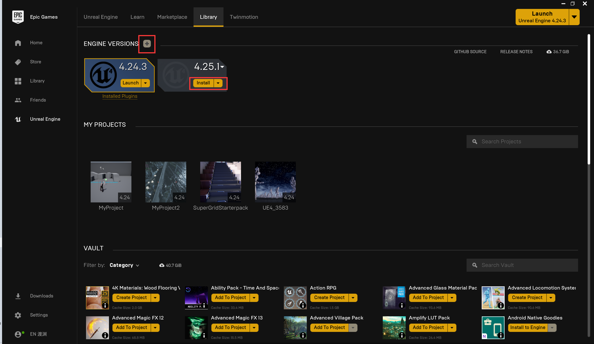
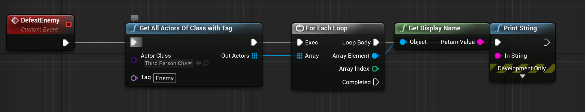

# UE4教程

[TOC]

## 一.入门

#### 1.安装

UE4官网下载EpicGameslauncher（需要注册）https://www.unrealengine.com/zh-CN/get-now安装后点击

#### 2.总体概述

##### ①UE中更接近程序员，在其设计中有许多面向对象的部分且不加以装饰

> 这点和Unity3d中不同，Unity3d将一切东西抽象为GameObject，一切功能抽象为Component。

##### ②UE中的概念从大到小依次为：Project→GameMode/GameState→Level/World→PlayerController/Player/Actor/HUD→ActorComponent

关卡设计是前三个层次，Actor是场景中放置的物体（包括玩家），含一个成员变量`USceneComponent* RootComponent;`，这个`RootComponent`含一个成员数组`TArray<USceneComponent*> AttachChildren;`，其中就是该Actor的其他Component。

将UE4看作一场足球比赛的话：

（1）GameMode：游戏的裁判，负责介绍规则和吹哨；

（2）GameState：记分牌

（3）PlayerController/AIController：教练，通过Possess接管球队，Unpossess放弃球队

（4）Pawn/Character：球员，通过Skeleton播放动画，通过CharacterMovementComponent移动

##### 注

（1）AGameMode是历史遗留产物，新版本为AGameModeBase

（2）Pawn/Character在角色死亡后会被销毁，但Controller不会。因此一个角色是一个Character，一个玩家是一个Controller。

（3）Camera虽然总是绑定在Character上，但其是PlayController指定的，如果需要切换视角，使用Controller的SetViewTargetWithBlend。摄像头的抖动可以通过CamaraShake实现，也可以通过摄像机动画实现。

（4）游戏的交互元素分HUD（头显）和UI（菜单），前者显示血条，通常不可交互，后者则可交互，但它们都是Widget，通过CreateWidget→AddToViewport使用。特别的，主菜单我们会新建一个Level专门显示UI。UI通过GetPlayerCharacter或GetPlayerController了解当前角色状态。

### 3.蓝图

蓝图是UE4的内嵌面向对象编程语言，比直接使用C++Bug更少，速度也更慢。“UE4的初学者即便已经熟悉了许多编程语言（如C/C++、Java、Python），也应该从先学蓝图再学C++。不要仅仅为了速度使用C++”。以上话来自UE4官方。

##### ①查找Actor

使用一个工具函数GetAllActor，可以使用withTag或ActorHasTag进行筛选。

> Tag是Actor的一个属性，是UE4里区分敌友的标志。

##### ②硬链接

##### ③使用数据表解耦

