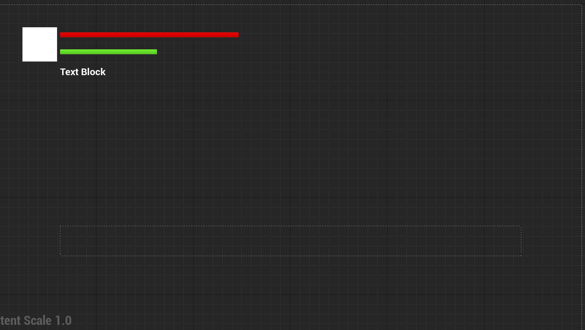
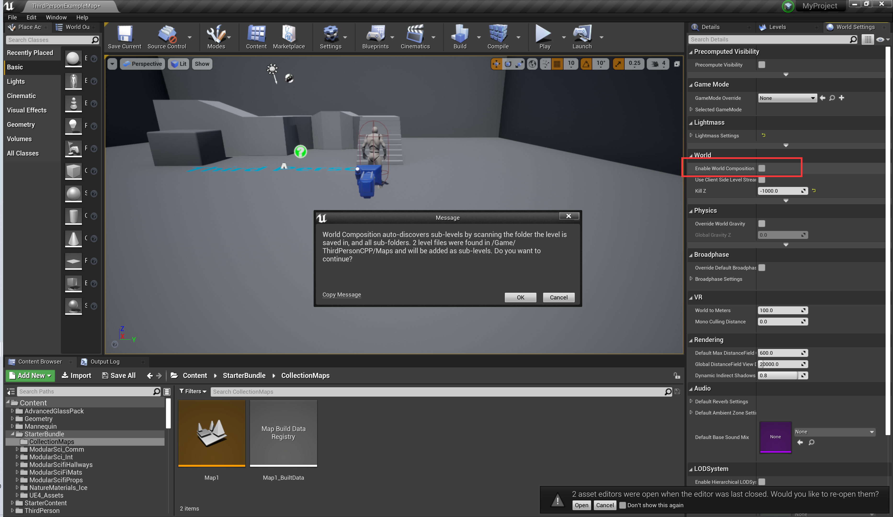
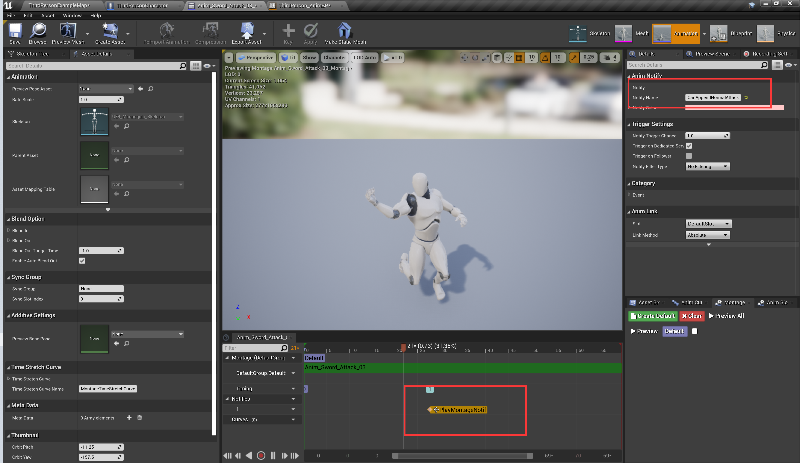
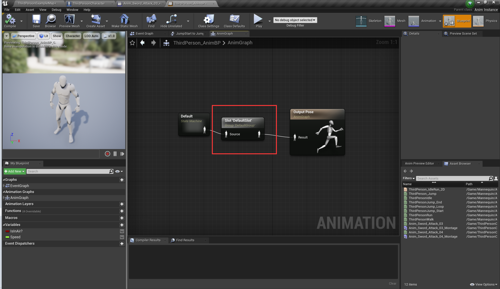
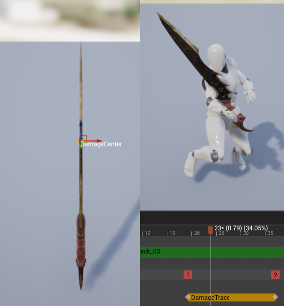
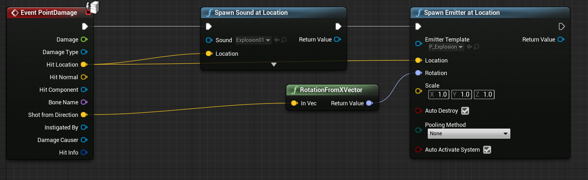
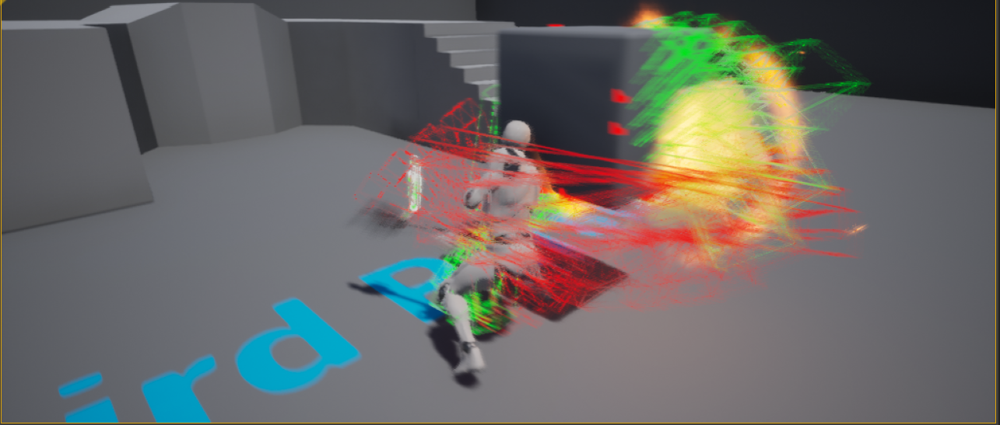
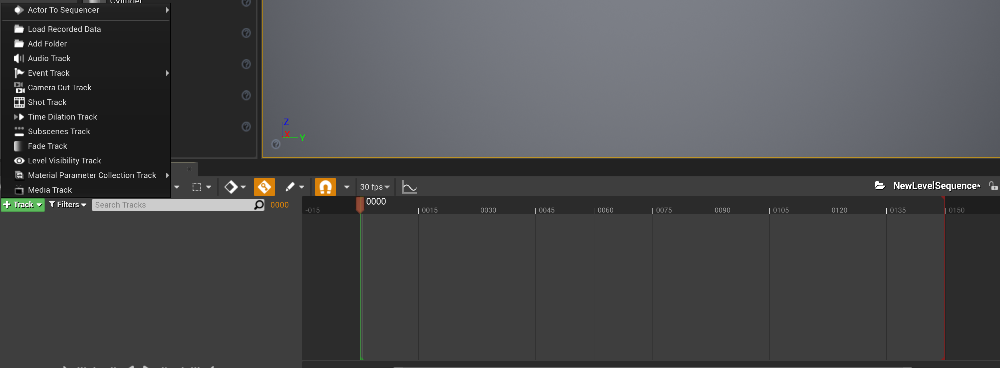

# UE4游戏框架

[TOC]

## 一.总论

UE4中的概念从大到小为：

Game->Level、the World、GameMode->PlayerController->PlayerCharacter->Component

Game：一个游戏

Level、the World：一个关卡，相当于一个赛场

GameMode：游戏规则，相当于裁判

PlayerController：相当于一个教练

PlayerCharacter：相当于球员

## 二.关卡设计

### 1.选定GameMode和游戏开始的地图

### 2.天空球

新建->新关卡->昼夜

属性：

①DirectionalLight：充当太阳光的平行光源

②ReflushMaterial&ColorsDeterminedBySunPosition：若勾选，则根据天空球的属性“DirectionalLight”绑定的平行光源的角度发生昼夜交替。

③其他：云的可见度、运动速度；星星的亮度；（未勾选ColorsDeterminedBySunPosition）太阳的高度、角度、颜色，云的颜色。

## 三.菜单

### 1.游戏开始菜单

##### (1)创建HUD

在资源目录右键选择WidgetBlueprint，重命名为MainMenuWidget，双击进入编辑界面。

左边为常用系统预定义控件，包括按钮、图片、文本框。在右上角可以切换标签栏：UI的编辑界面同样分为两部分：外观（设计）和逻辑（蓝图）。

拖动UI到适当位置（子UI同样是一个Widget蓝图类），添加它的点击事件。

使用`CreateWidget() `创建UI界面，并`AddToViewport() `的方式将其显示到屏幕上。

> 这里并不是AddToScreen，在UE4中Screen和Viewport是不同的，前者是0-1，后者是实际的分辨率（如1920*1080）.

当不需要的时候使用`RemoveFromParent() `方法将其从视野中移除。

对于UI存在时能不能控制角色，通过

```
SetInputModeGameandUI() 
SetInputModeGameOnly() 
SetInputModeGameOnly() 

SetShowMouseCursor() 
```

四个函数控制。

##### (2)常用控件

所谓的控件，就是指屏幕的一块区域。控件本质上没有区别，但Viewport是最大的区域，其他控件都是它的子控件；控件之前相互包含，实际上和Viewport包含Canvas一样。

更具体得说，并不是控件包含控件（父控件包含子控件），而是**控件包含“槽”（Slot）数组，而槽中包含着一个个子控件，槽本身定义子控件的位置**。如果要通过代码控制控件的位置，就需要得到其所在的槽（并转换为CanvasPanel、GridPanel等），设置其相应的属性（CanvasPanel中的position，GridPanel中的Row、Column）。

“普通控件”：

Button：能响应Click事件

Image：显示图片

Text：显示文字

Border：显示背景图片

“布局控件”

Canvas：绝对布局

Grid：网格布局（会拉伸控件以占满屏幕，子控件可以设置RowSpan和ColumnSpan）

UniformGrid：标准均分网格布局（只均分屏幕但不会拉伸控件，子控件不可以设置RowSpan和ColumnSpan）

##### (3)动态添加子控件

```
AddChildToCanvas
AddChildToGrid
AddChildToUniformGrid
```

##### (4)一些细节

- 在主菜单的时候我们不希望玩家能动能攻击，因此在世界设置（可能需要在Window中打开）设置其Pawn为默认的Character
- 菜单层级是通过`SetVisibility`实现的。
- 并不是一定要嵌套控件，直接添加到Viewport也可以。

### 2.玩家状态栏

设置一个组件，记录玩家和敌人的血量、体力、金币。当血量<0时触发OnCharacterDeath事件，在蓝图中绑定播放死亡动画并解绑控制器。如果是怪物，重写其Interact方法，玩家搜索尸体时将所有的金币给玩家。

(1)CharacterStateComponent.h&CharacterStateComponent.cpp

```C++
// Fill out your copyright notice in the Description page of Project Settings.

#pragma once

#include "CoreMinimal.h"
#include "Components/ActorComponent.h"
#include "CharacterStateComponent.generated.h"


UCLASS( ClassGroup=(Custom), meta=(BlueprintSpawnableComponent) )
class ARPGBASIC_API UCharacterStateComponent : public UActorComponent
{
    GENERATED_BODY()
private:

    UPROPERTY()
    int Level;

    UPROPERTY()
    float MaxHP;

    UPROPERTY()
    float CurrentHP;

    UPROPERTY()
    float CurrentSP;

    UPROPERTY()
    float MaxSP;

    UPROPERTY()
    float Coins;

    UPROPERTY()
    ACharacter* FirstHatred;
public:
    // Sets default values for this component's properties
    UCharacterStateComponent();

    DECLARE_DYNAMIC_MULTICAST_DELEGATE_OneParam(FUpdateCharacterLevel, int, CurrentLevel);

    UPROPERTY(BlueprintAssignable)
    FUpdateCharacterLevel OnUpdateCharacterLevel;


    int GetLevel() const
    {
        return Level;
    }

    void SetLevel(const int _Level)
    {
        this->Level = _Level;
        OnUpdateCharacterLevel.Broadcast(this->Level);
    }

    DECLARE_DYNAMIC_MULTICAST_DELEGATE_ThreeParams(FUpdateCharacterProperty, float, CurrentValue, float, TotalValue,
                                                   float, DeltaValue);

    UPROPERTY(BlueprintAssignable)
    FUpdateCharacterProperty OnUpdateCharacterMaxHP;

    UPROPERTY(BlueprintAssignable,Category="CharacterStateComponent")
    FUpdateCharacterProperty OnUpdateCharacterHP;

    UPROPERTY(BlueprintAssignable,Category="CharacterStateComponent")
    FUpdateCharacterProperty OnUpdateCharacterSP;

    UPROPERTY(BlueprintAssignable,Category="CharacterStateComponent")
    FUpdateCharacterProperty OnUpdateCharacterMaxSP;

    DECLARE_DYNAMIC_MULTICAST_DELEGATE_ThreeParams(FUpdateCharacterIntProperty, int, CurrentValue, int, TotalValue,
                                                   int, DeltaValue);

    UPROPERTY(BlueprintAssignable,Category="CharacterStateComponent")
    FUpdateCharacterIntProperty OnUpdateCharacterCoins;

    UFUNCTION(BlueprintCallable,Category="CharacterStateComponent")
    float GetMaxHP() const
    {
        return MaxHP;
    }

    UFUNCTION(BlueprintCallable,Category="CharacterStateComponent")
    void SetMaxHP(const float _MaxHP)
    {
        this->MaxHP = _MaxHP;
        OnUpdateCharacterMaxHP.Broadcast(MaxHP, 0, 0);
    }

    UFUNCTION(BlueprintCallable,Category="CharacterStateComponent")
    float GetCurrentHP() const
    {
        return CurrentHP;
    }

    UFUNCTION(BlueprintCallable,Category="CharacterStateComponent")
    void SetCurrentHP(const float _CurrentHP)
    {
        const float temp = this->CurrentHP;
        this->CurrentHP = _CurrentHP;
        OnUpdateCharacterHP.Broadcast(CurrentHP, MaxHP, CurrentHP - temp);
        if (this->CurrentHP <= 0)
        {
            OnCharacterDeath.Broadcast(FirstHatred);
        }
    }

    UFUNCTION(BlueprintCallable,Category="CharacterStateComponent")
    void UpdateCharacterHP(const float DeltaHP)
    {
        const float temp = this->CurrentHP;
        this->CurrentHP = FMath::Clamp(CurrentHP + DeltaHP, 0.f, MaxHP);
        OnUpdateCharacterHP.Broadcast(CurrentHP, MaxHP, CurrentHP - temp);
        if (this->CurrentHP <= 0)
        {
            OnCharacterDeath.Broadcast(FirstHatred);
        }
    }


    UFUNCTION(BlueprintCallable,Category="CharacterStateComponent")
    float GetCurrentSP() const
    {
        return CurrentSP;
    }

    UFUNCTION(BlueprintCallable,Category="CharacterStateComponent")
    void SetCurrentSP(const float _CurrentSP)
    {
        const float temp = this->CurrentSP;
        this->CurrentSP = _CurrentSP;
        OnUpdateCharacterSP.Broadcast(CurrentSP, MaxSP, CurrentSP - temp);
    }

    void UpdateCharacterSP(const float DeltaSP)
    {
        const float temp = this->CurrentSP;
        this->CurrentSP = FMath::Clamp(CurrentSP + DeltaSP, 0.f, MaxSP);
        OnUpdateCharacterSP.Broadcast(CurrentSP, MaxSP, CurrentSP - temp);
    }

    UFUNCTION(BlueprintCallable,Category="CharacterStateComponent")
    float GetMaxSP() const
    {
        return MaxSP;
    }

    UFUNCTION(BlueprintCallable,Category="CharacterStateComponent")
    void SetMaxSP(const float _MaxSP)
    {
        const float temp = this->MaxSP;
        this->MaxSP = _MaxSP;
        OnUpdateCharacterMaxSP.Broadcast(MaxSP, MaxSP, this->MaxSP - MaxSP);
    }

    UFUNCTION(BlueprintCallable,Category="CharacterStateComponent")
    int GetCoins() const
    {
        return Coins;
    }

    UFUNCTION(BlueprintCallable,Category="CharacterStateComponent")
    void SetCoins(const int _Coins)
    {
        const float temp = this->Coins;
        this->Coins = _Coins;
        OnUpdateCharacterCoins.Broadcast(Coins, Coins, Coins - temp);
    }

    void UpdateCharacterCoins(const float DeltaCoins)
    {
        const float temp = this->Coins;
        Coins += DeltaCoins;
        OnUpdateCharacterSP.Broadcast(Coins, Coins, Coins - temp);
    }

    UFUNCTION(BlueprintCallable,Category="CharacterStateComponent")
    void InitCharacterProperty(int _Level, float _MaxHP, float _HP, float _MaxSP, float SP, float _Coins)
    {
        this->Level = _Level;
        this->MaxHP = _MaxHP;
        this->CurrentHP = _HP;
        this->MaxSP = _MaxSP;
        this->CurrentSP = SP;
        this->Coins = _Coins;
    };

    UFUNCTION(BlueprintCallable,BlueprintImplementableEvent)
    void Interact(ACharacter* PlayerCharacter, APlayerController* PlayerController);

    DECLARE_DYNAMIC_MULTICAST_DELEGATE_OneParam(FCharacterDeathEvent, ACharacter*, Instigator);

    UPROPERTY(BlueprintAssignable)
    FCharacterDeathEvent OnCharacterDeath;


    ACharacter* GetFirstHatred() const
    {
        return FirstHatred;
    }

    void SetFirstHatred(ACharacter* const _FirstHatred)
    {
        this->FirstHatred = _FirstHatred;
    }

protected:
    // Called when the game starts
    virtual void BeginPlay() override;

public:
};

```

受到伤害的各种反馈（粒子特效、音效、受击动画）交给蓝图，然后由它调用C++中的`BeAttacked(Damage)`更新血量和角色UI。

(2)Character.cpp

```C++
void AMyProjectCharacter::BeAttacked(float Damage)
{
    HP = HP - Damage;
    DUpdateCharacterHP.Broadcast(MaxHP, HP);
}
```

(3)StateWidget.h

```C++
#pragma once

#include "CoreMinimal.h"
#include "MyProjectCharacter.h"
#include "Blueprint/UserWidget.h"
#include "Components/ProgressBar.h"
#include "Components/TextBlock.h"
#include "Components/UniformGridPanel.h"
#include "UObject/ObjectMacros.h"

#include "StateWidget.generated.h"

UCLASS()
class MYPROJECT_API UStateWidget : public UUserWidget
{
   GENERATED_BODY()

   UPROPERTY(EditAnywhere,BlueprintReadWrite,Category="Custom",meta=(AllowPrivateAccess="true",BindWidget))
   UProgressBar* HPBar;

   UPROPERTY(EditAnywhere,BlueprintReadWrite,Category="Custom",meta=(AllowPrivateAccess="true",BindWidget))
   UProgressBar* SPBar;

   UPROPERTY(EditAnywhere,BlueprintReadWrite,Category="Custom",meta=(AllowPrivateAccess="true",BindWidget))
   UTextBlock* Coins;
   
   UPROPERTY(EditAnywhere,BlueprintReadWrite,Category="Custom",meta=(AllowPrivateAccess="true")
   AMyProjectCharacter* MainCharacter;
   
   UFUNCTION()
   void UpdateHPBar(float TotalValue,float CurrentValue,float DeltaValue)
   {
      HPBar->SetPercent(CurrentValue/TotalValue);
   }

   UFUNCTION()
   void UpdateSPBar(float TotalValue,float CurrentValue,float DeltaValue)
   {
      SPBar->SetPercent(CurrentValue/TotalValue);
   }

   UFUNCTION()
   void UpdateCoins(float TotalValue,float CurrentValue,float DeltaValue)
   {
      Coins->SetText(FText::FromString(FString::FromInt(CurrentValue)));
   }
   
public:

   virtual bool Initialize() override
   {
      if (!Super::Initialize())  
      {  
         return false;  
      } 
      
      MainCharacter = Cast<AMyProjectCharacter>(GetOwningPlayerPawn());
      if (MainCharacter)
      {
         MainCharacter->UpdateCharacterHP.AddDynamic(this,&UStateWidget::UpdateHPBar);
         MainCharacter->UpdateCharacterSP.AddDynamic(this,&UStateWidget::UpdateSPBar);
         MainCharacter->UpdateCharacterCoins.AddDynamic(this,&UStateWidget::UpdateCoins);
         return true;
      }
      return false;
   };
};
```

(3)蓝图

创建Widget继承StateWidget，设计界面。


### 3.背包系统

思路：当Controller收到InteractAction时，调用Character的Interact函数进行盒型物理追踪，将检测到的CollectableActor对象加入背包。当使用道具时，调用道具的`BeUsed()`方法，该方法在蓝图中实现（因为具体的每一种道具是蓝图类）。

> 背包系统通过面向对象的方式可以非常简单，让每个游戏道具记住自己出现的位置、在背包中的位置（这里直接保存了其Widget）。

(1)AGameItem.h&AGameItem.cpp

.h

```C++
// Fill out your copyright notice in the Description page of Project Settings.

#pragma once

#include "CoreMinimal.h"
#include "Components/BoxComponent.h"
#include "GameFramework/Actor.h"
#include "GameItem.generated.h"

UCLASS()
class MYPROJECT_API AGameItem : public AActor
{
	GENERATED_BODY()
	
public:	
	// Sets default values for this actor's properties
	AGameItem();

protected:
	// Called when the game starts or when spawned
	virtual void BeginPlay() override;

public:
	UPROPERTY(EditAnywhere,BlueprintReadWrite,Category="Custom")
	FName ItemName;
	
	UPROPERTY(EditAnywhere,BlueprintReadWrite,Category="Custom")
	UTexture2D* ItemIcon;

	UPROPERTY(EditAnywhere,BlueprintReadWrite,Category="Custom")
	int Number=1;

	UPROPERTY(EditAnywhere,BlueprintReadWrite,Category="Custom")
	FText Note;

	UPROPERTY(EditAnywhere,BlueprintReadWrite,Category="Custom")
	FText Description;

	UPROPERTY(VisibleAnywhere,BlueprintReadWrite,Category="Custom")
	UBoxComponent* BoxCollision;

	UPROPERTY(VisibleAnywhere,BlueprintReadWrite,Category="Custom")
	UParticleSystemComponent* PromptFX;

	UFUNCTION(BlueprintCallable)
	AGameItem* BeTaken();

	UFUNCTION(BlueprintCallable,BlueprintImplementableEvent)
	void BeUsed(ACharacter* User);
};

```

.cpp

```C++
// Fill out your copyright notice in the Description page of Project Settings.


#include "GameItem.h"

#include "Components/BoxComponent.h"
#include "Particles/ParticleSystemComponent.h"

// Sets default values
AGameItem::AGameItem()
{
	BoxCollision = CreateDefaultSubobject<UBoxComponent>(TEXT("BoxCollision"));
	RootComponent = BoxCollision;

	PromptFX = CreateDefaultSubobject<UParticleSystemComponent>(TEXT("PromptFX"));
	PromptFX->SetupAttachment(RootComponent);
}

// Called when the game starts or when spawned
void AGameItem::BeginPlay()
{
	Super::BeginPlay();
	if (!PromptFX->Template || ItemIcon)
	{
		GEngine->AddOnScreenDebugMessage(-1, 5, FColor::Yellow, TEXT("道具未指定美术资源"));
	}
}

AGameItem* AGameItem::BeTaken()
{
	PromptFX->DestroyComponent();
	BoxCollision->DestroyComponent();
	return this;
}

```

(2)PlayerController.h&PlayerController.cpp

```C++
#pragma once

#include "CoreMinimal.h"
#include "MyPlayerController.generated.h"

UCLASS()
class MYPROJECT_API AMyPlayerController : public APlayerController
{
	GENERATED_BODY()


protected:
	virtual void SetupInputComponent() override;


	virtual void OnPossess(APawn* aPawn) override;
	virtual void TryToAttack();
	void Interact();

	UPROPERTY()
	class AMyProjectCharacter* MainCharacter;

public:
	UPROPERTY()
	TArray<class AMyCollectableActor*> BagCollectableItems;

	UFUNCTION(BlueprintCallable)
	void AddCollectableActorToBag(AMyCollectableActor* CollectableActor);
    
    DECLARE_DYNAMIC_MULTICAST_DELEGATE(FDUpdateBagGrid);

	UPROPERTY(BlueprintAssignable,Category="Bag")
	FDUpdateBagGrid DUpdateBagGrid;

	UFUNCTION(BlueprintCallable)
	TArray<class AMyCollectableActor*> GetAllItemsInBag(){return BagCollectableItems;};

	UPROPERTY(EditAnywhere,BlueprintReadWrite,Category="Custom",meta=(AllowPrivateAccess="true"))
	int CurrentSelectedItemIndex;
	
	UFUNCTION(BlueprintCallable)
	void TryToUseItem();
};

```

```C++
#include "MyPlayerController.h"
#include "MyProjectCharacter.h"
#include "GameFramework/PlayerController.h"

void AMyPlayerController::SetupInputComponent()
{
    Super::SetupInputComponent();

    InputComponent->BindAction("Attack",IE_Pressed,this,&AMyPlayerController::TryToAttack);
    InputComponent->BindAction("Interact",IE_Pressed,this,&AMyPlayerController::Interact);
}

void AMyPlayerController::OnPossess(APawn* aPawn)
{
    Super::OnPossess(aPawn);
    
    MainCharacter = Cast<AMyProjectCharacter>(aPawn);
    MainCharacter->MainCharacterPlayerController = this;
}

void AMyPlayerController::TryToAttack()
{
    if (MainCharacter)
    {
        MainCharacter->TryToAttack();
    }
}

void AMyPlayerController::Interact()
{
    
    if (MainCharacter)
    {
        MainCharacter->Interact();
    }
}

void AMyPlayerController::AddCollectableActorToBag(AMyCollectableActor* CollectableActor)
{
    BagCollectableItems.Add(CollectableActor);
}

void AMyPlayerController::TryToUseItem()
{
    if (CurrentSelectedItemIndex < 0 || BagCollectableItems.Num()==0)
    {
        return;
    }
    AMyCollectableActor* ItemToUse = BagCollectableItems[CurrentSelectedItemIndex];
    if (ItemToUse && ItemToUse->Number>0)
    {
        ItemToUse->Number--;
        ItemToUse->Use(MainCharacter);
    }else
    {
        return;
    }
    if (ItemToUse->Number <= 0)
    {
        BagCollectableItems.Remove(ItemToUse);
    }
    DUpdateBagGrid.Broadcast();
}


```

(3)MyProjectCharacter.h &MyProjectCharacter.cpp

.h

```C++
	......    
	UFUNCTION(BlueprintCallable)
    void Interact();

    UPROPERTY()
    AMyPlayerController* MainCharacterPlayerController;
	......
```

.cpp

```C++
void AMyProjectCharacter::Interact()
{
    TArray<AActor*> ActorsToIgnore;
    ActorsToIgnore.Emplace(this);
    TArray<FHitResult> HitResults;
    TArray<TEnumAsByte<	EObjectTypeQuery> > ObjectTypes;
    ObjectTypes.Emplace(EObjectTypeQuery::ObjectTypeQuery2);//ObjectTypeQuery2:WorldDynamic
    
    UKismetSystemLibrary::BoxTraceMultiForObjects(GetWorld(), GetActorLocation(),
                                        GetActorForwardVector() * 100 + GetActorLocation(),
                                        FVector(100, 100, 100), GetActorRotation(), ObjectTypes,
                                        false, ActorsToIgnore,
                                        EDrawDebugTrace::ForDuration, HitResults, true);

    for (auto HitResult : HitResults)
    {
        AActor* OtherActor = HitResult.GetActor();
        if (AMyCollectableActor* CollectableActor = Cast<AMyCollectableActor>(OtherActor))
        {
            AMyCollectableActor* MyCollectableActor = CollectableActor->BeToken();
            MainCharacterPlayerController->AddCollectableActorToBag(MyCollectableActor);
        }
    }

}
```

(4)MyCollectableActorWidget.h&MyCollectableActorWidget.cpp

.h

```C++
#pragma once

#include "CoreMinimal.h"
#include "Blueprint/UserWidget.h"
#include "Components/Image.h"
#include "Components/TextBlock.h"
#include "UObject/ObjectMacros.h"


#include "MyCollectableActorWidget.generated.h"

UCLASS()
class MYPROJECT_API UMyCollectableActorWidget : public UUserWidget
{
	GENERATED_BODY()

	UPROPERTY(EditAnywhere,BlueprintReadWrite,meta=(BindWidget,AllowPrivateAccess))
	UImage* Icon;

	UPROPERTY(EditAnywhere,BlueprintReadWrite,meta=(BindWidget,AllowPrivateAccess))
	UTextBlock* Number;

	UPROPERTY(EditAnywhere,BlueprintReadWrite,meta=(BindWidget,AllowPrivateAccess))
	UTextBlock* Note;

public:

	UImage* GetIcon() const{return Icon;}

	UTextBlock* GetNumber() const{return Number;}

	UTextBlock* GetNote() const{return Note;}
};

```

.cpp

```C++
#include "MyCollectableActorWidget.h"
```

(5)MyStateWidget.h&MyStateWidget.cpp

.h

```
#pragma once

#include "CoreMinimal.h"
#include "MyCollectableActorWidget.h"
#include "MyProjectCharacter.h"
#include "Blueprint/UserWidget.h"
#include "Components/ProgressBar.h"
#include "Components/TextBlock.h"
#include "Components/UniformGridPanel.h"
#include "UObject/ObjectMacros.h"

#include "MyStateWidget.generated.h"

UCLASS()
class MYPROJECT_API UMyStateWidget : public UUserWidget
{
	GENERATED_BODY()


	UPROPERTY(EditAnywhere,BlueprintReadWrite,Category="Custom",meta=(AllowPrivateAccess="true",BindWidget))
	UProgressBar* HPBar;

	UPROPERTY(EditAnywhere,BlueprintReadWrite,Category="Custom",meta=(AllowPrivateAccess="true",BindWidget))
	UProgressBar* SPBar;

	UPROPERTY(EditAnywhere,BlueprintReadWrite,Category="Custom",meta=(AllowPrivateAccess="true",BindWidget))
	UTextBlock* Coins;

	UPROPERTY(EditAnywhere,BlueprintReadWrite,Category="Custom",meta=(AllowPrivateAccess="true",BindWidget))
	UUniformGridPanel* BagGrid;

	UPROPERTY(EditAnywhere,BlueprintReadWrite,Category="Custom",meta=(AllowPrivateAccess="true"))
	TSubclassOf<UMyCollectableActorWidget> CollectableSingleWidgetClassPtr;
	
	UPROPERTY(EditAnywhere,BlueprintReadWrite,Category="Custom",meta=(AllowPrivateAccess="true"))
	AMyProjectCharacter* MainCharacter;

	UPROPERTY(EditAnywhere,BlueprintReadWrite,Category="Custom",meta=(AllowPrivateAccess="true"))
	AMyPlayerController* MainCharacterController;


public:
	virtual bool Initialize() override;
	
	UFUNCTION(BlueprintCallable)
	void UpdateHPBar (float TotalValue,float CurrentValue);

	UFUNCTION(BlueprintCallable)
	void UpdateSPBar (float TotalValue,float CurrentValue);

	UFUNCTION(BlueprintCallable)
	void UpdateCoins (float TotalValue,float CurrentValue);

	UFUNCTION(BlueprintCallable)
	void UpdateBagGrid();
};

```

.cpp

```C++
// Fill out your copyright notice in the Description page of Project Settings.


#include "MyStateWidget.h"
#include "MyCollectableActor.h"
#include "MyCollectableActorWidget.h"
#include "MyProjectCharacter.h"

bool UMyStateWidget::Initialize()
{
    if (!Super::Initialize())
    {
        return false;
    }

    MainCharacter = Cast<AMyProjectCharacter>(GetOwningPlayerPawn());
    MainCharacterController = Cast<AMyPlayerController>(GetOwningPlayer());
    if (MainCharacter != nullptr && MainCharacterController !=nullptr)
    {
        MainCharacter->DUpdateCharacterHP.AddDynamic(this, &UMyStateWidget::UpdateHPBar);
        MainCharacter->DUpdateCharacterSP.AddDynamic(this, &UMyStateWidget::UpdateSPBar);
        MainCharacter->DUpdateCharacterCoins.AddDynamic(this, &UMyStateWidget::UpdateCoins);

        MainCharacterController->DUpdateBagGrid.AddDynamic(this,&UMyStateWidget::UpdateBagGrid);
    }
    return false;
}

void UMyStateWidget::UpdateHPBar(float TotalValue, float CurrentValue)
{
    HPBar->SetPercent(CurrentValue / TotalValue);
}

void UMyStateWidget::UpdateSPBar(float TotalValue, float CurrentValue)
{
    SPBar->SetPercent(CurrentValue / TotalValue);
}

void UMyStateWidget::UpdateCoins(float TotalValue, float CurrentValue)
{
    Coins->SetText(FText::FromString(FString::FromInt(CurrentValue)));
}

void UMyStateWidget::UpdateBagGrid()
{
    BagGrid->ClearChildren();
    if (!MainCharacterController||!CollectableSingleWidgetClassPtr)
    {
        GEngine->AddOnScreenDebugMessage(-1, 5, FColor::Yellow, TEXT("未指定SingleWidgetClass"));
        return;
    }
    int index = 0;
    for (AMyCollectableActor* CollectableActor : MainCharacterController->GetAllItemsInBag())
    {
        auto CollectableActorWidget = Cast<UMyCollectableActorWidget>(CreateWidget(MainCharacterController,CollectableSingleWidgetClassPtr));    
        CollectableActor->ShowingWidget = CollectableActorWidget;
        CollectableActorWidget->GetIcon()->SetBrushFromTexture(CollectableActor->Icon);
        CollectableActorWidget->GetNumber()->SetText(FText::FromString(FString::FromInt(CollectableActor->Number)));
        CollectableActorWidget->GetNote()->SetText(CollectableActor->Note);
        BagGrid->AddChildToUniformGrid(CollectableActorWidget,0,index++);
    }
}
```

(6)蓝图

BP_StateWidget




(7)build.cs

```C#
PublicDependencyModuleNames.AddRange(new string[] { "Core", "CoreUObject", "Engine", "InputCore", "HeadMountedDisplay" ,"UMG"});
PrivateDependencyModuleNames.AddRange(new string[] { "Slate", "SlateCore" });
```

## 四.关卡流送

#### 1.加载关卡

非常简单，调用使用一个阻塞的静态方法

OpenLevel(String LevelName) 

即可

#### 2.异步加载

你当然可以使用OpenLevel来加载关卡，但这个方法是阻塞的，如果要实现边加载边播放动画或者无缝切换地图（地图之间相连），就需要在玩家使用方法

`LoadStreamLevel() `加载，`UnloadStreamLevel() `方法卸载。

**使用步骤**

①建立地图1，地图2

②Window->Levels->Add and existing level（会将其他地图直接加到当前地图上，需要进行移动）

**并不是只有必须动态加载关卡（例如地图太大一次加载非常卡顿）的时候才使用LoadStreamLevel，完全可以把它当做高级的OpenLevel，只是多了在Levels界面通过添加子地图的方式逐步得构建地图。**

此外Loading页面也可以通过关卡流送简单实现。


这里如果不勾选Make Visible After Load，对于默认不显示的子关卡就不会显示。

3.世界场景构成

世界场景构成（World Composition）是为了简化大型场景的管理。当在WorldSetttings中打开Enable World Composition时，永久关卡会扫描当前文件夹和子文件夹将找到的所有关卡自动加入。显然，这些关卡需要指定偏移信息。



## 2.连招系统

### 在C++中实现逻辑，在蓝图中设置美术资源

##### ①C++

（1）Character.h

```C++
UPROPERTY(BlueprintReadWrite,Category="Attack")
int NormalAttackComboIndex = 0;

UPROPERTY(BlueprintReadWrite,Category="Attack")
bool IsRigid = false;

UPROPERTY(EditAnywhere,BlueprintReadWrite,Category="Attack")
TArray<UAnimMontage*> NormalAttackMontages;

UPROPERTY()
UUPlayMontageCallbackProxy* MontagePlayer;

UPROPERTY()
FTimerHandle TimerHandle;

UFUNCTION(BlueprintCallable)
void TryToAttack()
{
    if (!IsRigid)
    {
        IsRigid = true;
        MontagePlayer = UUPlayMontageCallbackProxy::CreateProxyObjectForPlayMontage(this->GetMesh(),NormalAttackMontages[NormalAttackComboIndex]);
        MontagePlayer->OnCompleted.AddDynamic(this,&AMyProject3Character::ResetNormalAttack);
        MontagePlayer->OnNotifyBegin.AddDynamic(this,&AMyProject3Character::CanAppendAttack);
        MontagePlayer->OnInterrupted.AddDynamic(this,&AMyProject3Character::AttackBeInterrupted);
    }
}

UFUNCTION(BlueprintCallable)
void CanAppendAttack(FName NotifyName){//若有多个MontageNotify可在这里判断
    this->IsRigid = false;
    this->NormalAttackComboIndex = (this->NormalAttackComboIndex + 1) % NormalAttackMontages.Num();
};

UFUNCTION(BlueprintCallable)
void ResetNormalAttack(FName NotifyName){
    this->IsRigid = false;
    this->NormalAttackComboIndex = 0;
};

UFUNCTION(BlueprintCallable)
void ResumeFromAttackBeInterrupted()
{
    this->IsRigid = false;
    this->NormalAttackComboIndex = 0;
}

UFUNCTION(BlueprintCallable)
void AttackBeInterrupted(FName NotifyName)
{
    GetWorldTimerManager().SetTimer(TimerHandle,this,&AMyProject3Character::ResumeFromAttackBeInterrupted,2.f,false);
}
```

这里需要一个辅助类UUPlayMontageCallbackProxy播放Montage并触发事件。

（2）PlayMontageCallbackProxy.h&PlayMontageCallbackProxy.cpp

```C++
// Copyright Epic Games, Inc. All Rights Reserved.
#pragma once

#include "CoreMinimal.h"
#include "UObject/ObjectMacros.h"
#include "UObject/Object.h"
#include "UObject/ScriptMacros.h"
#include "Animation/AnimInstance.h"
#include "PlayMontageCallbackProxy.generated.h"

DECLARE_DYNAMIC_MULTICAST_DELEGATE_OneParam(FOnMontagePlayDelegate, FName, NotifyName);

UCLASS(MinimalAPI)
class UUPlayMontageCallbackProxy : public UObject
{
   GENERATED_UCLASS_BODY()

   // Called when Montage finished playing and wasn't interrupted
   UPROPERTY(BlueprintAssignable)
   FOnMontagePlayDelegate OnCompleted;

   // Called when Montage starts blending out and is not interrupted
   UPROPERTY(BlueprintAssignable)
   FOnMontagePlayDelegate OnBlendOut;

   // Called when Montage has been interrupted (or failed to play)
   UPROPERTY(BlueprintAssignable)
   FOnMontagePlayDelegate OnInterrupted;

   UPROPERTY(BlueprintAssignable)
   FOnMontagePlayDelegate OnNotifyBegin;

   UPROPERTY(BlueprintAssignable)
   FOnMontagePlayDelegate OnNotifyEnd;

   // Called to perform the query internally
   UFUNCTION(BlueprintCallable, meta = (BlueprintInternalUseOnly = "true"))
   static UUPlayMontageCallbackProxy* CreateProxyObjectForPlayMontage(
      class USkeletalMeshComponent* InSkeletalMeshComponent, 
      class UAnimMontage* MontageToPlay, 
      float PlayRate = 1.f, 
      float StartingPosition = 0.f, 
      FName StartingSection = NAME_None);

public:
   //~ Begin UObject Interface
   virtual void BeginDestroy() override;
   //~ End UObject Interface

protected:
   UFUNCTION()
   void OnMontageBlendingOut(UAnimMontage* Montage, bool bInterrupted);

   UFUNCTION()
   void OnMontageEnded(UAnimMontage* Montage, bool bInterrupted);

   UFUNCTION()
   void OnNotifyBeginReceived(FName NotifyName, const FBranchingPointNotifyPayload& BranchingPointNotifyPayload);

   UFUNCTION()
   void OnNotifyEndReceived(FName NotifyName, const FBranchingPointNotifyPayload& BranchingPointNotifyPayload);

private:
   TWeakObjectPtr<UAnimInstance> AnimInstancePtr;
   int32 MontageInstanceID;
   uint32 bInterruptedCalledBeforeBlendingOut : 1;

   bool IsNotifyValid(FName NotifyName, const FBranchingPointNotifyPayload& BranchingPointNotifyPayload) const;
   void UnbindDelegates();

   FOnMontageBlendingOutStarted BlendingOutDelegate;
   FOnMontageEnded MontageEndedDelegate;

   void PlayMontage(
      class USkeletalMeshComponent* InSkeletalMeshComponent,
      class UAnimMontage* MontageToPlay,
      float PlayRate = 1.f,
      float StartingPosition = 0.f,
      FName StartingSection = NAME_None);
};
```

```C++
// Copyright Epic Games, Inc. All Rights Reserved.

#include "PlayMontageCallbackProxy.h"

//////////////////////////////////////////////////////////////////////////
// UUPlayMontageCallbackProxy

UUPlayMontageCallbackProxy::UUPlayMontageCallbackProxy(const FObjectInitializer& ObjectInitializer)
   : Super(ObjectInitializer)
   , MontageInstanceID(INDEX_NONE)
   , bInterruptedCalledBeforeBlendingOut(false)
{
}

UUPlayMontageCallbackProxy* UUPlayMontageCallbackProxy::CreateProxyObjectForPlayMontage(
   class USkeletalMeshComponent* InSkeletalMeshComponent,
   class UAnimMontage* MontageToPlay,
   float PlayRate,
   float StartingPosition,
   FName StartingSection)
{
   UUPlayMontageCallbackProxy* Proxy = NewObject<UUPlayMontageCallbackProxy>();
   Proxy->SetFlags(RF_StrongRefOnFrame);
   Proxy->PlayMontage(InSkeletalMeshComponent, MontageToPlay, PlayRate, StartingPosition, StartingSection);
   return Proxy;
}


void UUPlayMontageCallbackProxy::PlayMontage(class USkeletalMeshComponent* InSkeletalMeshComponent, 
   class UAnimMontage* MontageToPlay, 
   float PlayRate, 
   float StartingPosition, 
   FName StartingSection)
{
   bool bPlayedSuccessfully = false;
   if (InSkeletalMeshComponent)
   {
      if (UAnimInstance* AnimInstance = InSkeletalMeshComponent->GetAnimInstance())
      {
         const float MontageLength = AnimInstance->Montage_Play(MontageToPlay, PlayRate, EMontagePlayReturnType::MontageLength, StartingPosition);
         bPlayedSuccessfully = (MontageLength > 0.f);

         if (bPlayedSuccessfully)
         {
            AnimInstancePtr = AnimInstance;
            if (FAnimMontageInstance* MontageInstance = AnimInstance->GetActiveInstanceForMontage(MontageToPlay))
            {
               MontageInstanceID = MontageInstance->GetInstanceID();
            }

            if (StartingSection != NAME_None)
            {
               AnimInstance->Montage_JumpToSection(StartingSection, MontageToPlay);
            }

            BlendingOutDelegate.BindUObject(this, &UUPlayMontageCallbackProxy::OnMontageBlendingOut);
            AnimInstance->Montage_SetBlendingOutDelegate(BlendingOutDelegate, MontageToPlay);

            MontageEndedDelegate.BindUObject(this, &UUPlayMontageCallbackProxy::OnMontageEnded);
            AnimInstance->Montage_SetEndDelegate(MontageEndedDelegate, MontageToPlay);

            AnimInstance->OnPlayMontageNotifyBegin.AddDynamic(this, &UUPlayMontageCallbackProxy::OnNotifyBeginReceived);
            AnimInstance->OnPlayMontageNotifyEnd.AddDynamic(this, &UUPlayMontageCallbackProxy::OnNotifyEndReceived);
         }
      }
   }

   if (!bPlayedSuccessfully)
   {
      OnInterrupted.Broadcast(NAME_None);
   }
}

bool UUPlayMontageCallbackProxy::IsNotifyValid(FName NotifyName, const FBranchingPointNotifyPayload& BranchingPointNotifyPayload) const
{
   return ((MontageInstanceID != INDEX_NONE) && (BranchingPointNotifyPayload.MontageInstanceID == MontageInstanceID));
}


void UUPlayMontageCallbackProxy::OnNotifyBeginReceived(FName NotifyName, const FBranchingPointNotifyPayload& BranchingPointNotifyPayload)
{
   if (IsNotifyValid(NotifyName, BranchingPointNotifyPayload))
   {
      OnNotifyBegin.Broadcast(NotifyName);
   }
}


void UUPlayMontageCallbackProxy::OnNotifyEndReceived(FName NotifyName, const FBranchingPointNotifyPayload& BranchingPointNotifyPayload)
{
   if (IsNotifyValid(NotifyName, BranchingPointNotifyPayload))
   {
      OnNotifyEnd.Broadcast(NotifyName);
   }
}


void UUPlayMontageCallbackProxy::OnMontageBlendingOut(UAnimMontage* Montage, bool bInterrupted)
{
   if (bInterrupted)
   {
      OnInterrupted.Broadcast(NAME_None);
      bInterruptedCalledBeforeBlendingOut = true;
   }
   else
   {
      OnBlendOut.Broadcast(NAME_None);
   }
}

void UUPlayMontageCallbackProxy::OnMontageEnded(UAnimMontage* Montage, bool bInterrupted)
{
   if (!bInterrupted)
   {
      OnCompleted.Broadcast(NAME_None);
   }
   else if (!bInterruptedCalledBeforeBlendingOut)
   {
      OnInterrupted.Broadcast(NAME_None);
   }

   UnbindDelegates();
}

void UUPlayMontageCallbackProxy::UnbindDelegates()
{
   if (UAnimInstance* AnimInstance = AnimInstancePtr.Get())
   {
      AnimInstance->OnPlayMontageNotifyBegin.RemoveDynamic(this, &UUPlayMontageCallbackProxy::OnNotifyBeginReceived);
      AnimInstance->OnPlayMontageNotifyEnd.RemoveDynamic(this, &UUPlayMontageCallbackProxy::OnNotifyEndReceived);
   }
}

void UUPlayMontageCallbackProxy::BeginDestroy()
{
   UnbindDelegates();

   Super::BeginDestroy();
}
```

(3)Controller.h

重写OnPossess获得控制的主角，绑定攻击键。	

```C++
#pragma once

#include "CoreMinimal.h"
#include "MyProjectCharacter.h"
#include "GameFramework/PlayerController.h"
#include "MyPlayerController.generated.h"

UCLASS()
class MYPROJECT_API AMyPlayerController : public APlayerController
{
   GENERATED_BODY()


protected:
   virtual void SetupInputComponent() override;


   virtual void OnPossess(APawn* aPawn) override;
   virtual void TryToAttack();

   UPROPERTY()
   AMyProjectCharacter* MainCharacter;
};
```

(4)Controller.cpp

```C++
#include "MyPlayerController.h"

#include "MyProjectCharacter.h"

void AMyPlayerController::SetupInputComponent()
{
    Super::SetupInputComponent();

    InputComponent->BindAction("Attack",IE_Pressed,this,&AMyPlayerController::TryToAttack);
}

void AMyPlayerController::OnPossess(APawn* aPawn)
{
    MainCharacter = Cast<AMyProjectCharacter>(aPawn);
}

void AMyPlayerController::TryToAttack()
{
    if (MainCharacter)
    {
        TryToAttack();
    }
}
```

##### ②BP_Character

指定美术资源NormalAttackMontages和触发条件。


##### ③AnimMontage

设定MontageNotify



##### ④动画蓝图

经过DefaultSlot槽（否则不会播放Montage）



(2)


## 伤害结算

游戏中的伤害结算有三种常见形式：伤害盒子、射线检测、碰撞检测。

### (1)基于EventHit和OnComponentOverlap事件的碰撞检测

它的思路就是模拟现实中的情况，当角色发动攻击时，开启其武器上的盒体碰撞器，攻击结束时无效碰撞器，期间碰撞检测到的敌人受到伤害。

| 事件               | EventHit                                | OnComponentOverlap                           |
| ------------------ | --------------------------------------- | -------------------------------------------- |
| 条件               | Block对方且自己开启Generates Hit Events | Overlap对方且自己开启Generate Overlap Events |
| 是否可能响应多次？ | 是                                      | 是                                           |
| 是否汇报碰撞位置？ | 是                                      | 否                                           |

> 当其中一方为Character时，即便不开启Generates Hit Events、Generate Overlap Events这两个选项也同样会触发EventHit和OnComponentOverlap。

简单来说Hit事件的优点是能知道碰撞的具体位置，缺点是Hit的两个物体不能相互穿透；Overlap事件的优点是发生重叠的物体不会互相阻挡，缺点是不能知道发生重叠的具体位置。

此外它的另一个明显缺点实际上来自于目前物理引擎领域碰撞检测的缺点，就是受帧数影响。

> 考虑一辆车冲向一堵墙，车子不能通过，这通常不会出问题，但如果帧数过低（有些情况是外挂特地调低），前一帧车在墙前，后一帧车在墙后，物理引擎检测两帧都未发生碰撞，但车子穿墙了。

### (2)物理追踪

自定义AnimNotifyState，在武器骨骼上添加Socket，重写NotifyBegin、NotifyTick、NotifyEnd方法，然后在NotifyTick每两帧之间进行盒型碰撞检测（也可设置多个Socket进行射线检测，可以做到被武器不同部位击中伤害不同）。Socket的名称在使用时可以指定，当角色拥有多个武器或多段伤害时只需要使用两个State即可。

##### ①Character.h&Character.cpp

```C++
UPROPERTY(EditAnywhere, BlueprintReadWrite, Category = Camera, meta = (AllowPrivateAccess = "true"))
USkeletalMeshComponent* Weapon;
```

```
AMyProjectCharacter::AMyProjectCharacter()
{
	......
	Weapon = CreateDefaultSubobject<USkeletalMeshComponent>(TEXT("Weapon"));
	Weapon->SetupAttachment(GetMesh(),"Weapon");
	......
}
```

> 这里选择在C++中初始化，在蓝图中赋予武器模型；实际上也可以直接在蓝图中给Weapon赋值，但如果C++里不初始化、蓝图中又忘了指定就会空指针异常。

##### ②UMeleeDamageState.h

```C++
#pragma once

#include "CoreMinimal.h"

#include "CharacterStateComponent.h"
#include "Animation/AnimNotifies/AnimNotifyState.h"
#include "MeleeDamageState.generated.h"

/**
 * 
 */
UCLASS()
class ARPGBASIC_API UMeleeDamageState : public UAnimNotifyState
{
    GENERATED_BODY()

    TArray<FHitResult> HitResult;

    UPROPERTY()
    TArray<AActor*> HitActors;

    AController* EventInstigator;

    FVector LastLocation1;

    UPROPERTY()
    ACharacter* Player;
    FVector CurrentLocation1;
    FRotator CurrentRotation1;

    UPROPERTY()
    UCharacterStateComponent* StateComponent;

protected:
    UPROPERTY(EditAnywhere,BlueprintReadWrite,Category="ARPG Basic")
    TArray<TEnumAsByte<EObjectTypeQuery>> ObjectTypes;

    UPROPERTY(EditAnywhere,BlueprintReadWrite,Category="ARPG Basic")
    bool bDrawDebug;
    
public:

    UPROPERTY(EditAnywhere,Category="Custom")
    FName DamageCenterSocketName = "DamageCenter";

    UPROPERTY(EditAnywhere,Category="Custom")
    FVector DamageBoxHalfSizeInTrace = FVector(10, 10, 100);

    UPROPERTY(EditAnywhere,Category="Custom")
    USkeletalMeshComponent* Weapon;


    UPROPERTY(EditAnywhere,Category="Custom")
    float DamageValue = 10;

    UPROPERTY(EditAnywhere,Category="Custom")
    TSubclassOf<UDamageType> DamageTypeClass;

    UPROPERTY(EditAnywhere,Category="Custom")
    TArray<AActor*> ActorsToIgnore;

protected:
    virtual void NotifyBegin(USkeletalMeshComponent* MeshComp, UAnimSequenceBase* Animation,
                             float TotalDuration) override;
    virtual void NotifyTick(USkeletalMeshComponent* MeshComp, UAnimSequenceBase* Animation,
                            float FrameDeltaTime) override;
    virtual void NotifyEnd(USkeletalMeshComponent* MeshComp, UAnimSequenceBase* Animation) override;
};

```

##### ②UMeleeDamageState.cpp

```C++
// Fill out your copyright notice in the Description page of Project Settings.


#include "MeleeDamageState.h"

#include "CharacterStateComponent.h"
#include "Kismet/KismetSystemLibrary.h"
#include "GameFramework/Character.h"
#include "Kismet/GameplayStatics.h"

void UMeleeDamageState::NotifyBegin(USkeletalMeshComponent* MeshComp, UAnimSequenceBase* Animation, float TotalDuration)
{
    Player = Cast<ACharacter>(MeshComp->GetOwner());
    if (Player)
    {
        ActorsToIgnore = {MeshComp->GetOwner()};
        if (Weapon)
        {
            LastLocation1 = Weapon->GetSocketLocation(DamageCenterSocketName);
        }
        else
        {
            LastLocation1 = Player->GetMesh()->GetSocketLocation(DamageCenterSocketName);
        }
        StateComponent = Cast<UCharacterStateComponent>(
            Player->FindComponentByClass(UCharacterStateComponent::StaticClass()));
    }
    ObjectTypes.AddUnique(EObjectTypeQuery::ObjectTypeQuery3);

    HitActors.Empty();
}

void UMeleeDamageState::NotifyTick(USkeletalMeshComponent* MeshComp, UAnimSequenceBase* Animation, float FrameDeltaTime)
{
    Super::NotifyTick(MeshComp, Animation, FrameDeltaTime);
    if (Player)
    {
        if (Weapon)
        {
            CurrentLocation1 = Weapon->GetSocketLocation(DamageCenterSocketName);
            CurrentRotation1 = Weapon->GetSocketRotation(DamageCenterSocketName);
        }
        else
        {
            CurrentLocation1 = Player->GetMesh()->GetSocketLocation(DamageCenterSocketName);
            CurrentRotation1 = Player->GetMesh()->GetSocketRotation(DamageCenterSocketName);
        }


        DamageBoxHalfSizeInTrace = FVector(10, 10, 100);
        UKismetSystemLibrary::BoxTraceMultiForObjects(Player->GetWorld(), LastLocation1,
                                                      CurrentLocation1, DamageBoxHalfSizeInTrace,
                                                      CurrentRotation1, ObjectTypes,
                                                      false, ActorsToIgnore,
                                                      bDrawDebug ? EDrawDebugTrace::ForDuration : EDrawDebugTrace::None,
                                                      HitResult,
                                                      true);
        
        if (StateComponent)
        {
            DamageValue = StateComponent->Attack;
        }


        for (int i = 0; i < HitResult.Num(); i++)
        {
            AActor* HitActor = HitResult[i].GetActor();
            if (!HitActors.Contains(HitActor))
            {
                HitActors.Add(HitActor);
                UGameplayStatics::ApplyPointDamage(HitActor, DamageValue, HitResult[i].Location, HitResult[i],
                                                   EventInstigator,
                                                   Player, DamageTypeClass
                                                               ? DamageTypeClass
                                                               : StateComponent->MeleeDamageType);
                
            }
        }
        if (Weapon)
        {
            LastLocation1 = Weapon->GetSocketLocation(DamageCenterSocketName);
        }
        else
        {
            LastLocation1 = Player->GetMesh()->GetSocketLocation(DamageCenterSocketName);
        }
    }
}

void UMeleeDamageState::NotifyEnd(USkeletalMeshComponent* MeshComp, UAnimSequenceBase* Animation)
{
    Super::NotifyEnd(MeshComp, Animation);
}

```


##### ④Skeleton&AnimMontage



##### ⑤伤害反馈

重写对应Actor的EventPointDamage事件。



> 这里我们需要指定美术资源，蓝图比C++更合适。

##### ⑥效果



## 过场动画

UE4中的过场动画有两种：Sequencer（新）和Matinee（旧）。

Sequencer可以理解为一组记录游戏场景中的物体按关键帧移动的文件，可以相互嵌套。

#### 1.创建

AddNew→Animation→LevelSequence。

#### 2.使用

LevelSequence继承自Actor，可直接放置到场景中。

#### 3.常用属性

AutoPlay：是否在关卡开始时自动播放

DisableMovementInput&DisableLookAtInput：是否在播放过场动画时屏蔽输入	

#### 4.编辑界面



Track：包含所有Sequence控制的场景中的物体。

Sub-Track：记录物体变换的关键帧，因Actor不同而不同。

Folder：整理物理

#### 5.常用操作

##### (1)Track→ActorToSequence

添加场景中的物体到过场动画记录中（直接拖动世界大纲中的Actor到序列中也可以完成添加操作）

> Sequence只能控制场景中的物体，如果要做出“突然出现”或者“BOSS二阶段”的效果，只能把该物体移动到视野外，需要的时候让其直接出现。

##### (2)添加关键帧

①被添加到Track中的物体，其可以添加关键帧的属性会出现一个"+"的符号，点击即可在Sequencer的当前时间点添加关键帧。

②在Sub-Track中会显示能够记录关键帧的属性，直接在这里点击"+"添加关键帧也可以。

③当开启”自动键“的时候，手动添加过关键帧的属性在变换时会自动添加关键帧。

>属性编辑器（Property Editor）还具有过滤器，用于 **仅显示可键控属性（Show Only Keyable Properties）**（仅显示可键控到关卡序列的属性）或 **仅显示动画属性（Show Only Animated Properties）**（即已用键动画化的轨迹）。 

#### 6.电影摄像头

电影摄像机和普通摄像机相比多了LookAtTracking、镜头和焦点、孔径和焦距设置。

#### 7.导航模式

手动调整摄像机的位置是比较困难的，但是在CinematicViewport场景漫游时默认开启"Pilot"，即导航模式，摄像机会被自动调整到与视野的位置、旋转。

点击Sequencer中的解除/锁定摄像机按钮将退出/开启导航模式。


## 音乐和音效

### 1.脚步声

脚步声有两种常用的实现方式：①在动画中发出通知，在动画蓝图中接受通知并响应；②创建蓝图类继承AnimNofity并重写Received Notify方法，在此方法中进行射线检测判断角色脚下地面的物理材质并发出声音，也可同时SpawnEmmiter（Cascade）、SpawnSystem（Niagara）产生尘土和水花。

### 2.奖励音效

获得金币的声音（在王者刷小兵的快乐）


TODO：自定义招式

TODO：捏脸系统