# UE4教程


## 一.入门

#### 1.安装与总体概述

①官网：https://www.unrealengine.com/zh-CN/

一路下一步就可以，注意！！！路径一定不要有中文字符。

②总体概述：

UE中的概念从大到小依次为：Project→Level→World→Actor→Component

关卡设计是前三个层次，Actor是场景中放置的物体，含一个成员变量`USceneComponent* RootComponent;`，这个`RootComponent`含一个成员数组`TArray<USceneComponent*> AttachChildren;`，其中就是该Actor的其他Component。

#### 2.视图窗口

##### ①快捷键

End键：让物体落地（或下方最近的有物理碰撞的平面），避免手动设置导致穿模或悬空

F：聚焦

按住Alt：视野围绕物体/复制物体

ESC：退出

Shift+F1：鼠标脱离

##### ②步长

右上角的Snap决定了在视图窗口中改动物体transform属性时的最小步长。

#### 3.内容浏览器

使用Ctrl+C获取资源的绝对路径，以供脚本索引到该资源。

#### 3.模型与材质

模型是在3D max、Maya这样的软件中设计好的，材质是在游戏引擎中添加的，和Shader一起起作用。

> UE4中的材质是基于物理的，最重要的属性是基色（0-1）、金属性（0或1，一般不取中间值）、粗糙度。

##### ①材质编辑窗口快捷键

按住1/2/3/4/U并点击鼠标左键：出现对应的向量。

右键：呼出 新建表达式（New Expression） 菜单

##### ②MaterialInstance

Material需要进行编译，而MaterialInstance只会影响一个对象（反射？）。

这里Material和MaterialInstance的关系就像OOP中的类和对象。

可以看出UE更接近程序员，而Unity更接近游戏制作者。

##### ③法线贴图

法线贴图存储将物体表面的凹凸信息的一张图片。贴图中每点存储的是那个点的法线向量，在三维空间中是三个值，正好可以当做RBG存储在图片中。当然，法线的坐标每个维度都是[-1,1]，而RGB是[0,1]，因此需要进行一个变换。

$pixel=(normal + 1) / 2$

UE4引擎读取了法线贴图之后会进行反映射将法线贴图中归一化的数据还原回法线向量

$normal=pixel × 2 - 1$

> 通常法线贴图的第三个维度是全1，所以法线贴图看起来是一张以蓝色为底色的图片。

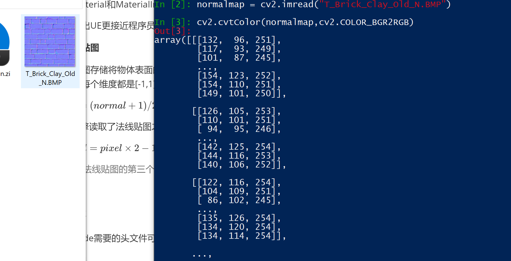

##### ④UV


#### 4.脚本

不include需要的头文件可能不会报错，但是不会提示方法。

#### 5.蓝图

怎么让UE4工程师们打起来？去群里吼一声，BP大法好！

蓝图分两种：关卡蓝图和Actor蓝图，通常的做法是在关卡蓝图里控制输入（Enable Input）；在Actor蓝图中封装函数、在关卡蓝图中添加对应actor的引用并调用封装的函数；需要有一个控制器蓝图，负责控制其他的模型蓝图（和Unity中的Empty Object一样，都是逻辑的载体，一般没有模型）。

##### ①Event Graph快捷键

| 快捷键     |                                                       |
| ---------- | ----------------------------------------------------- |
| 连接/断连  | 使用鼠标左键连接，Alt+左键断连，Ctrl+左键移动所有连线 |
| 复制节点   | Ctrl+W                                                |
| 注释       | 选中一块区域按C                                       |
| 分支       | Branch或按B点击添加                                   |
| 提升为变量 | 右键引脚选择                                          |
| 添加引用   | 将世界大纲中的物体拖到蓝图中                          |

##### ②常用API

| API                                                          | 描述                                                     |
| ------------------------------------------------------------ | -------------------------------------------------------- |
| Print String                                                 | 打印日志                                                 |
| AddActorLocalOffset                                          | 位移                                                     |
| EnableInput                                                  | 打开输入                                                 |
| getPlayerController                                          | 获得PlayerController                                     |
| SetGlobalTimeDilation                                        | 设置全局游戏速度（包括脚本中的计时，这里其实是时间膨胀） |
| DestroyActor/SetLifeSpan                                     | 销毁Actor                                                |
|  | 重启游戏                                                 |
| Get Class -> Resolve -> ToString                             | 获取一个蓝图类的路径                                     |
| MakeSoftClassPath -> ToSoftClassReference->load              | 从一个蓝图类路径字符串创建对象                           |
| FormatText                                                   | 使用{VariableName}占位符，会自动刷新引脚                 |
| Set Box Extent                                               | 设置box缩放前的尺寸                                      |
| BeginTrails                                                  | 播放拖尾效果                                             |

#### 6.GamePlay游戏模式

从大到小依次为GameMode→GameController→GamePlayer

需要创建自定义GameModes指定主角。

#### 7.角色动画

角色动画四要素：Skeleton、Mesh、Animation、EventGraph。

根动画——让PlayController的位移通过动画控制。	

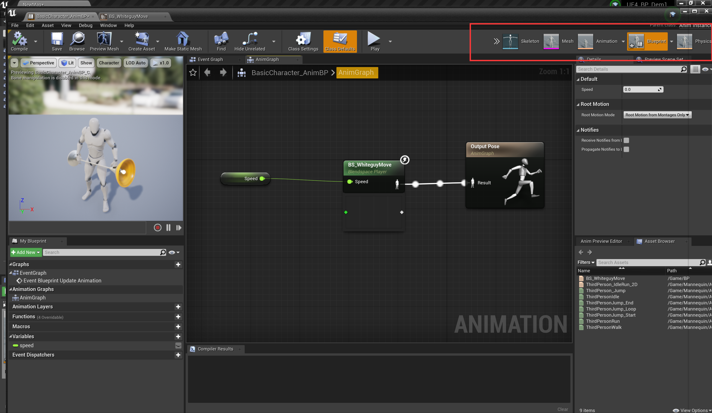

##### ①Skeleton

骨骼视图，但并不是在这里编辑骨骼，而是在适当的骨骼处添加”挂点“（Socket），用以放置武器等。

动画是事先画好的，数量有限，因此可视化编程，通过不同的条件到达不同的节点，节点播放特定的动画。

动画蓝图是Blueprint的一个子类，主要多了一个Anim Graph成员。UE中的动画蓝图是作为Mesh的一个成员使用的。

##### ②Mesh

通常是在3D Max、Maya等软件中做出来。分Static Mesh和Skeleton Mesh两种，取决于模型是否有骨骼。

而动画节点就是在Skeleton Mesh中设置的。

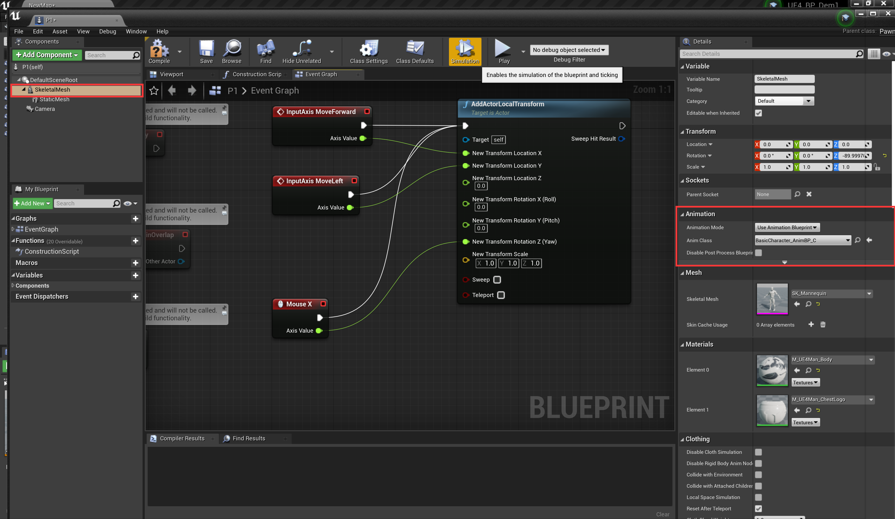

##### ③Animation

尽管UE4中的动画有数种实现方式，但都是在蓝图中使用各种动画资源，且均被当作一段普通动画（Animation Sequence，外部导入的最简单动画形式）。

可以选中需要的骨骼添加关键帧来实现简单的动画。

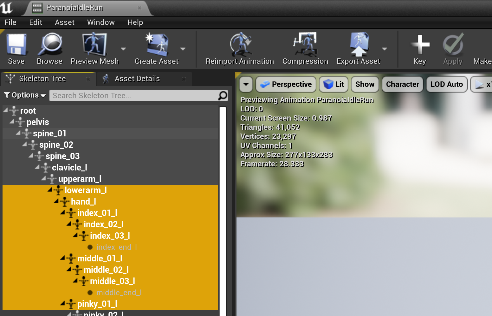

（1）BlendSpace

Blend是混合的意思，BlendSpace即混合不同的动作（如Idle和Run），通过一个参数（如速度）切换两种不同的状态。

## UI

Construct和PreContruct（前者在游戏中调用，后者在编辑器中就会调用）

##### (1)Canvas

UE中的UI和WPF一样是层级结构，拖拽就可以确立父子关系（比如在Button中拖一个TextBlock），各种布局也都有。

可以通过SizeBox控制子控件大小。


需要注意的是：

①Border是WPF中的Label而不是边界

②布局名为Panel而不是Layout

③复制控件需要指定父控件再粘贴

④点击右上角切换Design和Code/Graph（而WPF在左下角）和WPF一样，Design用于设计界面，Graph/Code用于添加事件处理函数。

⑤和WPF一样，项目中的资源会被自动包装成对象，供全局使用。

⑥UE使用类似Pr中关键帧的方式添加控件动画（例如打开和关闭）。在左下角添加并点击动画后，就可以返回控件列表，看到属性旁边都多了一个棱形，代表添加关键帧，移动时间轴并添加关键帧即可。需要注意的是如果想让布局隐藏后控件也隐藏，需要将控件的size都改为fill。

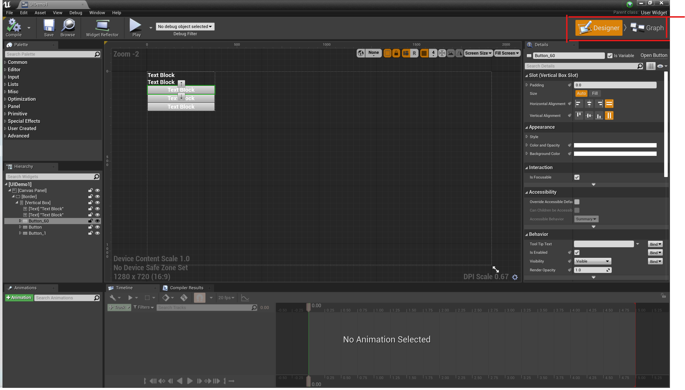

(2)HorizontalBox&VerticalBox

水平布局和垂直布局，选择Full和权重，可模拟相对布局。

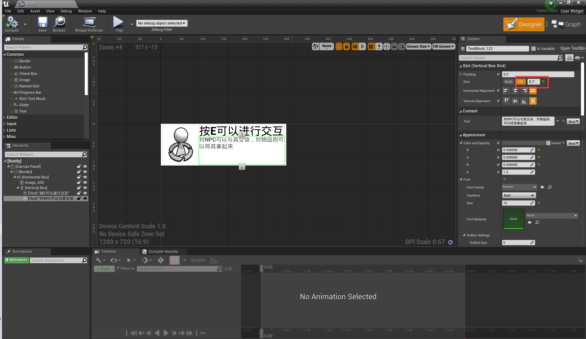

#### (3)控件的三种状态（Normal、Hovered、Pressed）,是否无视点击

如按钮：普通、悬停、按下。

ToolTipText：悬停显示内容

isEnabled：true（触发响应），false（灰化无法点击）

### (4)Visibility控件可见性：

Visibility：

visible（显示，触发响应），collapsed（隐藏，不占布局空间），

Hidden（隐藏，占布局空间），Not Hit-Testable（self & all childern）（自身以及子控件都触发不响应），Not Hit-Testable（self）（仅自身不触发响应）


#### (4)弹簧是Spacer（不太一样）

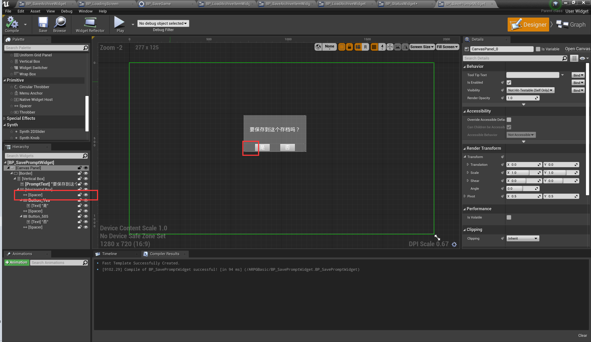

### (5)复制控件焦点在哪个控件复制出的控件就会成为它的子控件

不能直接Ctrl+C、Ctrl+V，而是Ctrl+C然后点击父控件Ctrl+V

### (6)UI模式GameOnly和GameAndUI

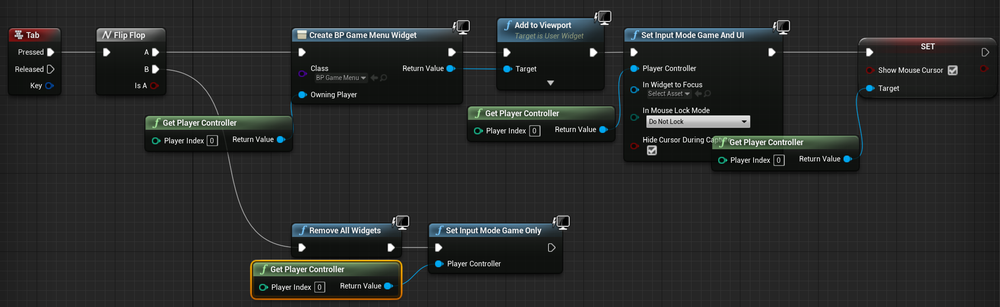

### (7)按钮中添加文字，设置背景图片

背景是一个属性，文字可以拖一个TextBlock当子控件

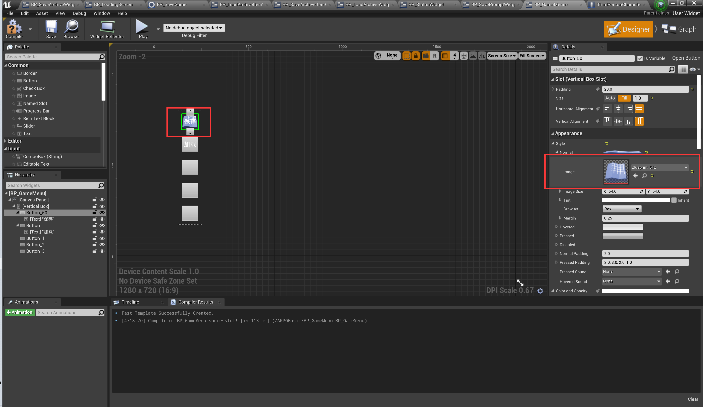

### (8)控件的几种位置属性

- Slot：用于控制控件的大体位置
  - Anchors：锚点，是分辨率变化时缩放控件的依据
  - Alignment：控件自身中心的位置，(0.5,0.5)是几何中心
- RenderTransform 


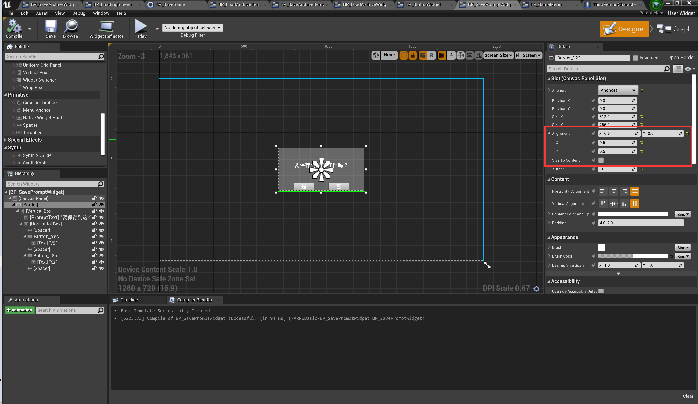

#### 9.AI

不设置nav mesh bounds volume，AI是不会动的。

#### 10.过场动画

Sequencer，将物体拖入Sequencer面板设置关键帧，（图中小加号）

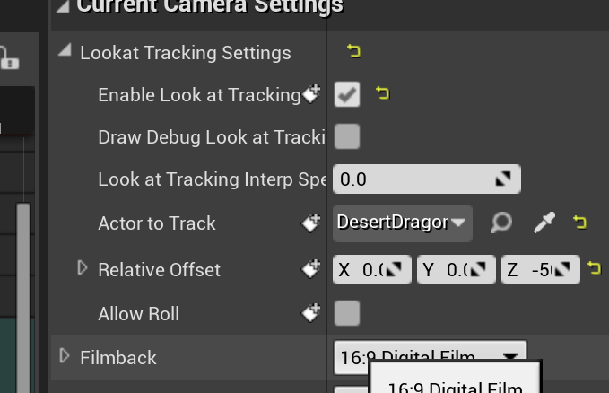


#### 10.工程目录结构

Content：资源

Config：项目设置

Source：源文件	

#### 11.打包和发布

File→Package Project

①达成Zip包方便移动和备份

②发布

先Play→Standalone（独立运行，可以使用`~`唤出控制台），能正常运行选择相应平台打包	

## 二.渲染

UE4默认就有不错的画面效果。

程序员控制的实际上是一个个3D模型和光源、摄像机，摆放好它们的位置，由虚幻引擎负责生成画面。

虽然这中间有许许多多的算法，但从大体上看流程是

内存中的模型（抽象数据结构）→一帧的所有像素点

#### 1.虚幻4中渲染流程

从具体的实现细节上看

##### （1）CPU

​	程序员摆好场景中的物体之后，先由CPU判断哪些物体不在视野之类，先将它们剔除，然后将调用图形接口将数据传给GPU绘制画面，这两个过程称为Culling和Draw Call。

##### （2）GPU

​	GPU光栅化后进行不透明物体的Depth-Buffer，那些被遮挡的像素就不计算了。

​	①顶点：每个点有一个base color（翻译成底色？）和一个法线向量（和光线向量计算让物体看上去有起伏）

​	②灯光：让物体有高光和阴影，产生立体感

​	③反射：物体彼此之间的倒影

​	最后处理透明物体，透明物体是没有Depth-Buffer的，否则它们后面的像素一开始就被剔除了。

##### （3）总结

​	①各种各样的算法（法线、灯光、反射以及最近的光线追踪）都是为了增加物体的真实感。

​	②就目前的趋势来看，我们越来越倾向于模拟真实的物理世界（而以前限于硬件的不足我们总是想用数学方法来“伪造”一种真实感）。

## 三.U++

虚幻4中使用的C++是高度定制化的（因为C++本身是一门古老、复杂、落后于时代的语言，大公司使用时一定会将其划出一个子集并规定内部规范，例如《Google C++风格指南》），称之为U++也不足为过。

C++可以访问所有API，且只能蓝图继承C++，不能C++继承蓝图。

#### 1.创建C++类

C++类会生成在C++ Classes中，通过导航创建后会自动打开VS，改动后需要按Ctrl+Shift+B进行编译。

#### 2.“反射”

**反射**指程序运行时的自检和修改行为，它的**本质是应用程序使用本应该只有编译器才能使用的元数据**。编译完成的二进制文件含有所有信息的语言，例如Java，编译成的字节码文件含有源文件所有有用信息，所以可以完成反射，也可以反编译。

但C++不同，C++编译之后关于源码的信息几乎都丢失了，所以直到C++20都还没有反射（尽管已经提上日程）。

但是作为框架而言，反射的能力是必须的，因为发布软件的时候你不能事先知道使用者添加的的代码内容，必须能通过某种办法获知，但是C++又不能反射，所以UE通过宏引入了静态反射，具体的做法是规定UE中的C++类都必须继承自UObject并使用“注解”`UCLASS()`，在编译的过程中生成对应的UClass，包含UObject的所有信息。

> C++中的静态指编译期行为，动态指运行时行为，静态反射在Java中是个伪命题，但是考虑反射的本质是使用元数据，那么UE的这种自检的宏就可以称作反射。

**注**:`#include "ClassName.generated.h"`必须是最后一个`#include`，否则会报错找不到"GENERATED_BODY"。

##### ①UPROPERTY

这个宏相当于Spring的@component，即将注解的属性交给UE管理。

（1）代码：

```C++
UPROPERTY(EditAnywhere, BlueprintReadWrite, Category="Damage")
int TotalDamage;
```

（2）效果

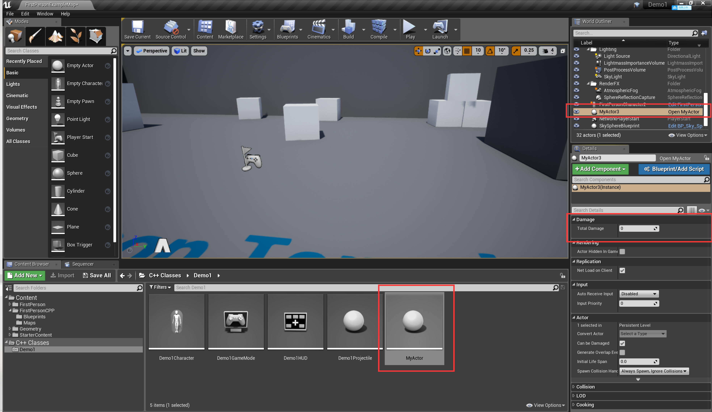

##### ②UFUNCTION()

同样相当于@RequestMapping，即将注解的方法在UE中注册。

（1）代码

```C++
UFUNCTION(BlueprintCallable, Category="Damage")
void CalculateValues();
```

（2）效果

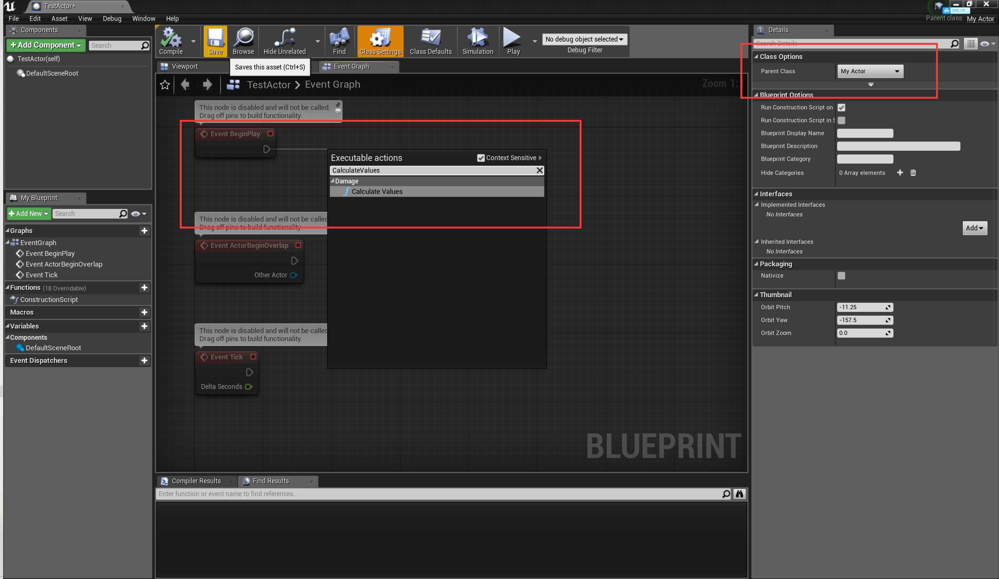

##### ③Event

UE事件机制。看起来和回调函数一摸一样。

（1）.h

```c++
UFUNCTION(BlueprintImplementableEvent, Category = "Damage")
void CalledFromCpp();
```

（2）.cpp

```c++
void AMyActor::Tick(float DeltaTime)
{	
	Super::Tick(DeltaTime);
	CalledFromCpp();
}
```

（3）蓝图

在蓝图中实现`CalledFromCpp`。

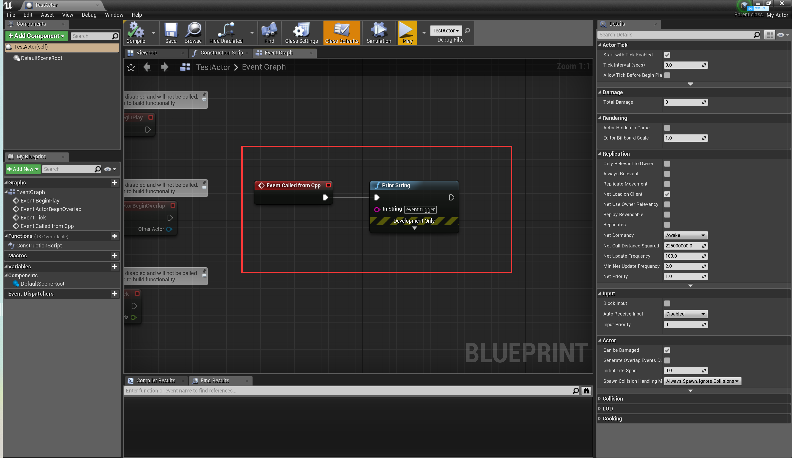

##### ④垃圾回收

UE和QT采用相同的方法行进行垃圾回收，继承自UObject的对象（主要是Component)若有“根集”（即一些不会被垃圾回收的对象，如the World）通往其的引用，则不会被垃圾回收。

1.Actor通常不会被垃圾回收，除非关卡关闭。需要销毁一个Actor需要调用其Destory方法。

2.Actor中的对象如果是动态分配的，需要在指针上加上`UPROPERTY()`，否则其指向的空间会被回收，变成悬空指针。

### 3.游戏模块

第三人称模板的目录结构如图：

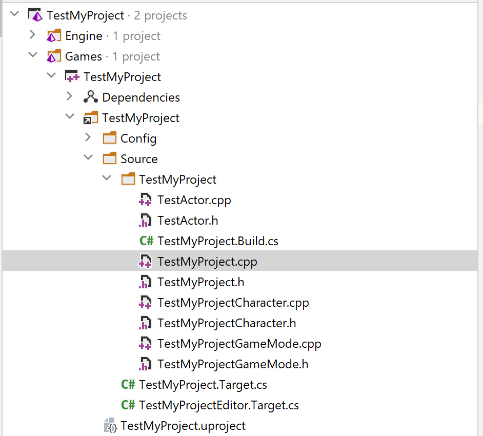


游戏模块至少要包含一个头文件 (`.h`)、一个 C++ 文件 (`.cpp`) 和一个编译文件 (`*.Build.cs`)。头文件必须位于模块目录的 `Public` 文件夹中，也就是 [GameName] \Source\ [ModuleName]\Public 目录。该文件包含了编译该模块中的类所需的所有头文件 - 包括模块自动生成的头文件。

至少要使用 `IMPLEMENT_PRIMARY_GAME_MODULE` 注册一个模块，模板中在`<ModuleName>.cpp`。其他模块可以使用另一个可选的 `IMPLEMENT_GAME_MODULE` 方法进行注册。请参照 [多个游戏性模块](https://docs.unrealengine.com/zh-CN/Programming/Modules/Gameplay/index.html#多个游戏性模块) 部分获得在一个游戏项目中使用多个游戏性模块的更多细节。

#### 踩坑

##### ①最大的坑

UE4采用C++作为GamePlay层，引发一系列问题，是万恶之源，大部分UE4的坑最终都源于C++。

##### ②未完成的类

原因：未引入相应的头文件，使用了前置声明。这个错误只在IDE中报，在UE4中编译不会报错。

> 不要使用前置声明，而是引入其头文件。——《Google C++ 风格指南》；但在UE4示例代码中前置声明非常常见，你可以选择按照Google的标准导入头文件，如果使用前置声明，要注意别写错了，前置写错IDE会报一个不怎么相关的错。	

解决：按住Ctrl点击类名，进入相应源码，查看其头文件名，使用定位工具显示其在项目中的位置，并引入。

如`FPSCameraComponent->SetupAttachment(GetCapsuleComponent());`报错，原因为未引入CapsuleComponent.h头文件，点击GetCapsuleComponent，进入CapsuleComponent.h头文件，点击`Select Open File`(导航快捷键Alt+F1,1)，然后使用`#include "Components/CapsuleComponent.h"`导入该头文件即可。

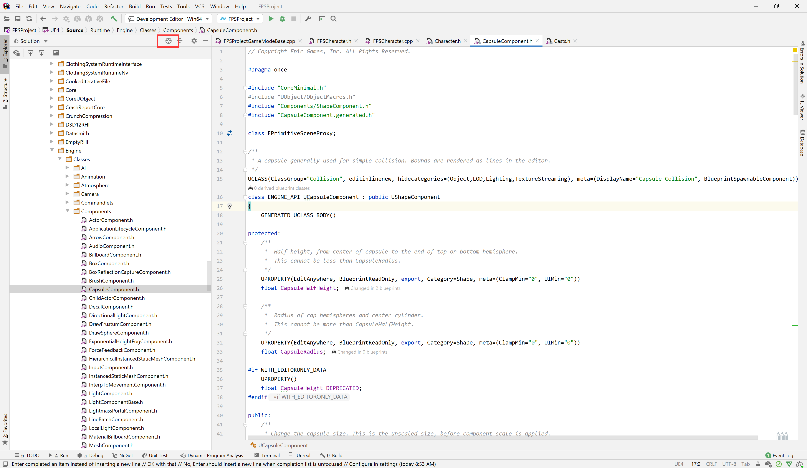

> 由于被当作前置声明而未引入头文件，会出现一些奇怪的报错，比如多态异常。

##### ③不能绑定Axis和Action

绑定Axis和Action其实是绑定代理，函数签名要与定义一致。例如

```c++
void TestCharacter::MoveForward(float Value) //√
void TestCharacter::MoveForward()			 //×
```

> 绑定Axis使用一个浮点类型、无返回值的函数，绑定Action使用一个无参无返回值的函数。

##### ④AI Controller的ControlledActor默认是NULL不是self

以前我们都是使用GetAIController获得NPC的控制器，但现在使用GetController同样可以获得控制器（不论是玩家还是NPC）。

##### ⑤看不到的UI动画

UI动画资源是没办法选的

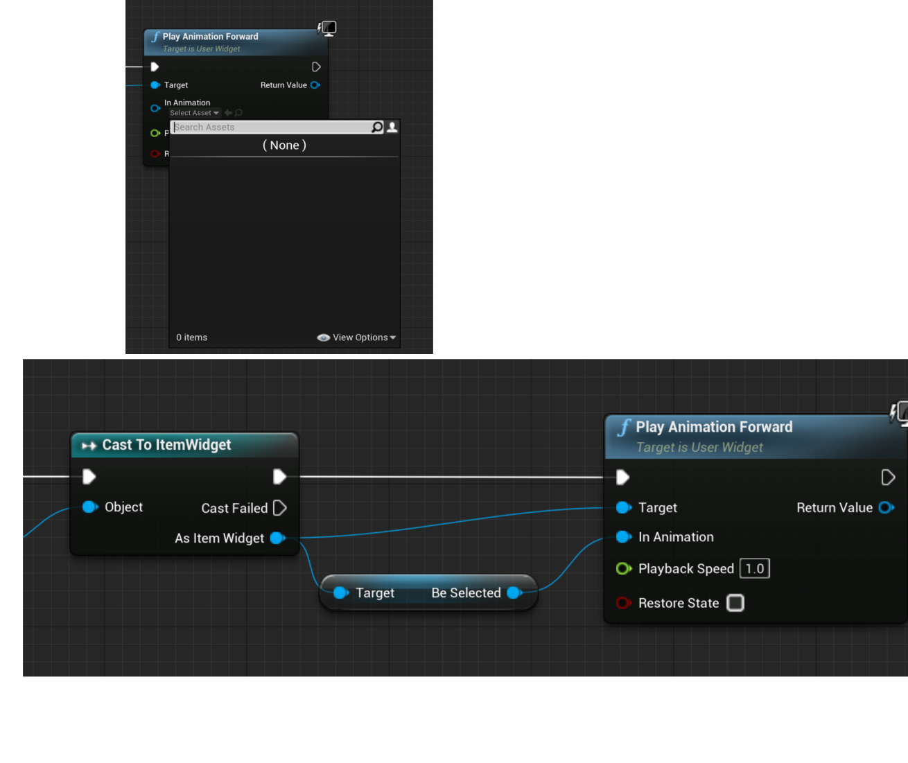

这说明UI动画并没有单独存储为一个文件，而是当作一个方法依附于Widget中。

##### ⑥Sequence不同引脚前后影响

Sequence只是简单地串联不同一脚，如果上一个引脚中断，后面的引脚都不会执行。

##### ⑦创建场景书签并没有提示

Ctrl+数字可以创建场景书签，快速切换在场景中的位置。创建书签的时候是没有提示的。如果不确定是否创建了书签，可以在视口选项中查看。

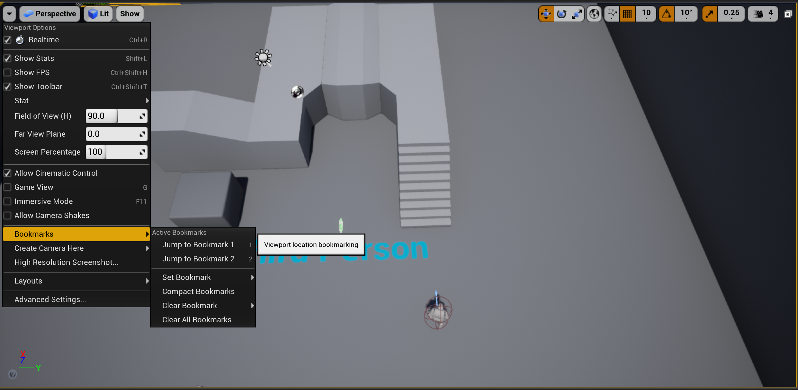

##### ⑧UE4继承的函数几乎都是virtual关键字修饰的

这就类似Java。在C++中多态不一定会调用子类重写的方法，如果父类的方法没有virtual关键字修饰，即便子类重写了，在多态时调用的也是父类的方法。

```C++
class A{
 public:
  void FuncWithoutVirtual(){printf("A");}
  virtual void FuncWithVirtual(){printf("A");}
};

class B: public A{
 public:
  void FuncWithoutVirtual(){printf("B\n");}

  void FuncWithVirtual() override {
	A::FuncWithVirtual();
    printf("B\n");
  }
};
int main(int argc, char **argv) {
  //多态
  A* b = new B();
  
  //父类方法未使用virtual修饰，调用父类方法
  b->FuncWithoutVirtual();
  
  //父类方法使用virtual修饰，调用子类方法
  b->FuncWithVirtual();
}
```

##### ⑨蓝图默认不会显示继承自C++的组件和变量

勾选 **我的蓝图（My Blueprint）** 选项卡底部的 **显示继承变量（Show inherited variables）** 复选框时， 将显示继承自父类的变量。

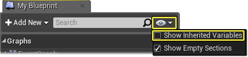


##### ⑩MontageNotify和AnimNotify不一样

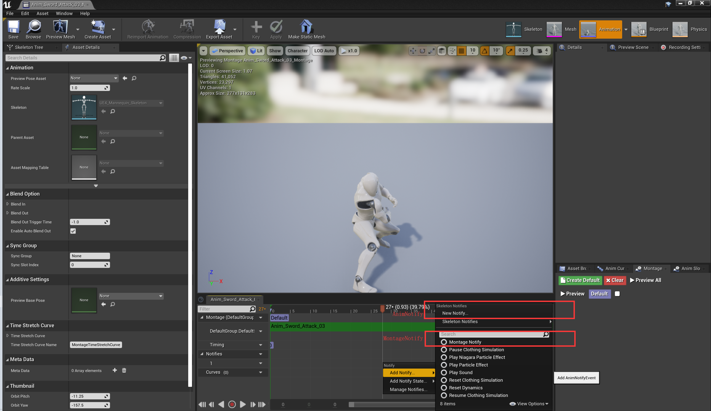

PlayMontage节点的Notify要是MontageNotify，普通的AnimNotify是不触发的。

##### +游戏暂停

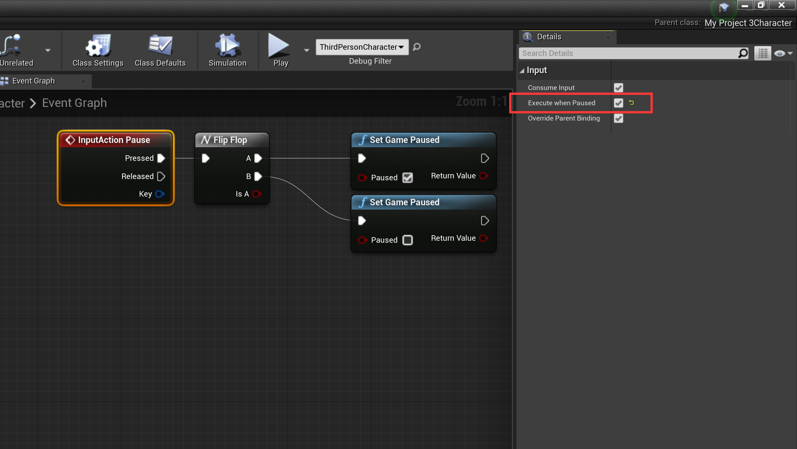

##### +调用父类方法

重写方法第一句，调用父类方法。

某些时候不调用父类方法会导致异常，有些时候会导致UE4整个崩溃。

##### +空指针

UE4中空指针异常并不是报NullPointer，而是AccessVolatile。

```
if (!Super::Initialize())  
{  
    return false;  
}  
```


**+在UE4中空指针异常会导致引擎Crash。**

##### +不能热更的Bug

有时需要编译两遍C++代码才会起作用，有时必须重启引擎才起作用。

##### +不报错但也不起作用的函数

如果函数不加UFunction修饰，就没有反射信息，也就没办法被当作委托调用。

##### +创建C++文件报错

之前写的代码中报错。

##### +报错：无法解析的外部符号

未引入相应的模块，如未引入**UMG**，**AIModule**：

```C++ 
unresolved external symbol "__declspec(dllimport) private: static class UClass * __cdecl UUserWidget::GetPrivateStaticClass(void)" (__imp_?GetPrivateStaticClass@UUserWidget@@CAPEAVUClass@@XZ) referenced in function "class UUserWidget * __
```

解决方法：在\<ProjectName\>.build.cs中添加"UMG"、"AIModule"等相应的模块名。

```
using UnrealBuildTool;

public class MyProject : ModuleRules
{
	public MyProject(ReadOnlyTargetRules Target) : base(Target)
	{
		PCHUsage = PCHUsageMode.UseExplicitOrSharedPCHs;

		PublicDependencyModuleNames.AddRange(new string[] { "Core", "CoreUObject", "Engine", "InputCore", "HeadMountedDisplay" ,"UMG"});
	}
}

```

##### 

##### +报错：UPROPERTY访问却是NULL（构造函数中设置了，游戏开始后却变为NULL）

看看场景中的物体是不是你认为的那个。例如Character。

##### +Circular dependency detected for filename

头文件循环编译。不要在头文件中包含头文件而是在.h中使用前置声明，在.cpp中引入头文件。

##### +蓝图里看不到声明的变量

C++类定义中变量默认是private的，当然看不到（蓝图中声明的变量默认是public的）

##### +报错：Unrecognized type 'void'

将ufunction写成了uproperty

##### +蓝图SetTimerForFunctionName

不是真的要新建一个函数，填一个CustomEvent的名字也可以。

##### +关卡加载必须Delay

Delay(0.1)也可以，否则其他事情都会停住。

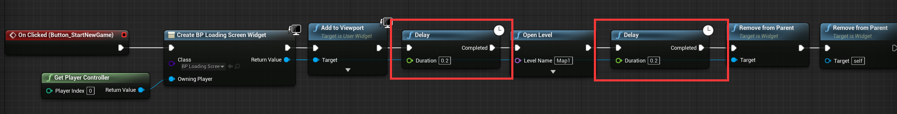

##### 

##### +Lambda表达式绑定错误

see reference to function template instantiation 'void TBaseDelegate<TTypeWrapper<void>,const FString &,const int32,bool>::BindLambda<UARPGGameInstanceSubsystem::SaveGame::<lambda_34f6108e9a326f5228499ccff3099421>,>(FunctorType &&)' being compiled

此为Lambda表达式的参数与委托不同导致。

##### +蓝图数组设置元素的API

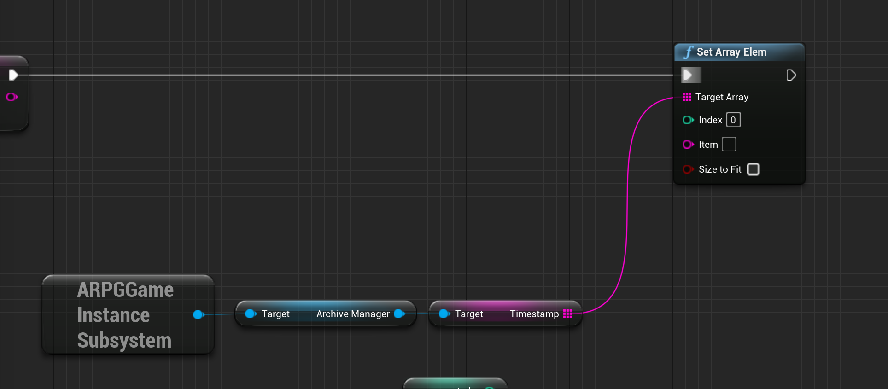

##### +Outer可以为Null

Outer不是引用，是指资源的所有者。

+LoadClass加载蓝图类必须加后缀_C

```C++
UClass* BP_NoticeItemWidgetClass = LoadClass<UMessageWidget>(nullptr,TEXT("Blueprint'/ARPGBasic/BP_NoticeItemWidget.BP_NoticeItemWidget_C'"));
```

##### +GameInstance、Subsystem与控件Initialize配合中的问题

引擎会在每次打开继承UserWidget蓝图类的编辑界面时运行Initialize方法，不进行各种空指针的判断容易空指针异常导致UE4编辑器崩溃。

```C++
if (GetGameInstance())
{
    GetGameInstance()->GetSubsystem<UARPGGameInstanceSubsystem>()->OnShowMessage.AddDynamic(
        this, &UStatusWidget::ShowMessage);
}
```

##### +GetTimerManage是UWorld的方法，GetWorldTimerManage是AActor的方法，UserWidget里不能直接使用

```C++
FTimerHandle TimerHandle;
FTimerDelegate TimerDelegate;
TimerDelegate.BindLambda([&]()
                         {
                             SizeBox_Notification->ClearChildren();
                         });
GetWorld()->GetTimerManager().SetTimer(TimerHandle,TimerDelegate,3,false);
```

##### +InputModeUIAndGame下鼠标需要按住才能移动视角，InputModeUIOnly下场景中的键盘事件会失效

##### +Character在Visibility通道是Ignore，在Camera才是Block

##### +Paragon角色使用AIMoveTo的时候动画无效，需要开启Use Acceleration

AIMoveTo默认是直接设置速度，而Paragon角色的动画蓝图是基于加速度的。


##### +ERROR: Platform Android is not a valid platform to build.

UE4会试图在所有平台上打包插件引起错误，须在\<plugin name\>.uplugin文件中添加支持的平台，名称如下：

Win32,Win64,HoloLens,Mac,XboxOne,PS4,IOS,Android,HTML5,Linux,LinuxAArch64,AllDesktop,TVOS,Switch,Lumin

示例.uplugin如下：

```
{
	"FileVersion": 3,
	"Version": 1,
	"VersionName": "1.0",
	"FriendlyName": "ARPGBasic",
	"Description": "",
	"Category": "Other",
	"CreatedBy": "ZhangWeiZhen",
	"CreatedByURL": "",
	"DocsURL": "",
	"MarketplaceURL": "",
	"SupportURL": "",
	"CanContainContent": true,
	"IsBetaVersion": false,
	"IsExperimentalVersion": false,
	"Installed": false,
	"Modules": [
		{
			"Name": "ARPGBasic",
			"Type": "Runtime",
			"LoadingPhase": "PreDefault",
			"WhitelistPlatforms" :
			[
				"Win32","Win64"
			]
		}
	]
}
```

##### +[] Unrecognized type 'FGameItemEvent' - type must be a UCLASS, USTRUCT or UENUM

此错误由静态委托试图开放至蓝图引发（UE4中事件也是静态委托），如

```C++
UFUNCTION(BlueprintCallable,Category="BagSystem")
FGameItemEvent& OnAddItemToBag() { return AddItemToBagEvent; }
```

##### +突然C++中的更改无效，需要重新生成项目

使用VS清理并重新生成解决方案。

##### +动画编辑器中的Anim State是实例不是默认，DefaultOnly的变量看不到

##### +ComposeDataTable不能编辑行

ComposeDataTable只是组合主表附表，不提供编辑功能（虽然它的图标和DataTable一样且位于上面）

##### +在蓝图中只要出现了节点，就会覆盖父类的方法

如下图所示的情况也会导致方法不能调用，必须手动调用父类方法。


+当敌人死亡后AIController Unposses，这时候更新黑板值会报错（因为响应事件的时机是不确定的），可以使用Bind和UnbindAll


##### +复制蓝图后要检查连线是否断了

##### +获取Actor和Component的实际大小不是GetActorSize而是GetActorBounds

##### +在UStruct的变量必须声明为UProperty才能make和break（否则没有引脚）

##### +you cannot use the raw enum name as type for member variables ,C++11 enum class with explicit underlying type

不能单纯使用enum，而是要使用继承自uint8的enum class（因为enum在标准C++中就是整数，类型不安全）或TEnumAsByte。

##### +BPEnum是一个数字，需要通过Literal enum来通过枚举值获得

v

##### +Datatable不能直接使用ustruct，需要ustruct继承自FDataTableRow，且每个属性都需要是EditAnywhere

```
struct FCharacterBasicPropertiesStruct : public FTableRowBase
```


否则RowEditor将会是空白，行无法编辑

##### +Datatable中的数据只能在RowEditor中编辑，不能在DataTable中编辑

##### +quixel.com/megascans使用EpicGames账号登录才能免费，且只能在UE中使用

有时候DCC/Engine是空白的


导出时选择UE的安装路径可以安装对应的插件


导入的时候UE4需要打开项目才能一键导出，否则会报错端口发送失败

UE4安装插件后会出现小米图标

##### +Switch节点的选项只能在细节面板修改


##### +UE4中当前速度不是Speed，是Velocity，最大速度才是Speed

##### +UE4蓝图中的向量长度是Length，C++中是Size

##### +Damage为0时不会触发OnDamage事件

##### +Rotation Break之后是X、Y、Z，对Z（Yaw）而言，面向正前方为0，按左手定则增长，面向正后方为180，左为-90，右为90.


##### +为了保持贴图不随物体缩放变化，需要使用WorldAlignedTexture，但其要求TextureObject，因此Quixel导入的实例都需要修改这个参数（不过Quixel导入的大小有问题，应该手动设置UV）


##### +没有碰撞的静态网格体不能开启SimulatePhysics

##### +Tag不能继承，AIController不能继承，Use acceleration for path应该检查

##### +SpawnActor是UWorld的方法，不是GamePlay

##### +用于角色的材质必须勾选对应的用途

SkeletonMesh的Material需要勾选Used with Skeletital Mesh，应用普通的Material会是灰色的


用于服装的


##### +PBR材质中的Metallic、Specular、Roughness等属性的默认值并不是0

##### +资源注册表只能使用引用获得

```C++
FAssetRegistryModule& AssetRegistryModule = FModuleManager::LoadModuleChecked<FAssetRegistryModule>("AssetRegistry");
```

将&去掉就会报错“无法解析的外部符号”

##### +DataTable输出引脚只能break不能cast（可能返回的不是指针）


##### +SetValueAs*空指针异常

因为当前AI角色没有AIController，获取黑板会空指针异常。

##### +Spawn NPC默认是没有AIController的，需要手动调用SpawnDefaultController()

##### +所有的PostEditChangeProperty必须使用#if WITH_EDITOR和#endif包裹

##### +DoesPackageExist: DoesPackageExist FAILED: 'None' is not a standard unreal filename or a long path name. Reason: Path should start with a '/'

默认Server Game Mode必须设置不能为None


##### +4.25 C++UMG必须引入模块

##### +方法只有声明没有实现也会出现无法解析的外部符号，具体到方法

##### +UE4打包时不会打包配置文件，需要手动将ARPGBasicSettings.ini拷贝到Project\Saved\Config\WindowsNoEditor 

##### +RemoveFromParent并不会将控件销毁，将指针设置nullptr才会

##### +代理报错是代理执行的函数报错

##### +画布是UCanvasPanel不是UCanvas

##### +UMG有许多不好形容的需要重启才能生效的BUG

##### +Switch记得break

##### +继承自自定义C++的蓝图需要重新指定为引擎类才能迁移，否则打不开

##### +UE4中没有模态对话框，需要设置一张透明图片覆盖屏幕阻挡点击

##### +  WeakObjectPtrTemplates.h(97): [C2664] 'FWeakObjectPtr &FWeakObjectPtr::operator =(const FWeakObjectPtr &)': cannot convert argument 1 from 'T *' to 'const UObject *'使用弱对象指针必须引入弱指针包含对象的头文件

##### +打包后的游戏只有打开一次才会生成Saved和Config目录

##### +作为子窗体加入其他窗体中时不要选择锚为全填充

##### +Switch语句很容易忘记break

##### +Receive Execute的Owner Actor不是Pawn而是Controller


##### +  Unrecognized type 'FActionFinishDelegate' - type must be a UCLASS, USTRUCT or UENUM，静态委托不可以标为BlueprintCallable

##### +Actor和ActorComponent的Tick都是默认关闭的，如果没有显示赋值`PrimaryActorTick.bCanEverTick = true`，重写了Tick函数也没有效果；Controller的Tick是默认开启的

##### +PrimaryActorTick.bCanEverTick只有在构造函数中指定才有效

##### +Actor不能Tick不会影响其组件的Tick

##### +C++中的变量改名之后在蓝图中会变成空，似乎UE是按照名称匹配的

##### +主角蓝图出现错误时会出现摄像机在主角中间的情况

##### +不进行SetupAttachment的组件是无法在蓝图类中编辑位置的


##### +委托绑定非ufunction不起作用也不报错。

##### +求向量的长度蓝图中是Length，C++中是Size

##### +Montage本身没有回调，绑定AnimInstance回调要注意是否是指定的Montage

##### +使用RotateToFace节点需要设置

1.在控制的Character的根节点关掉 Use Controller Rotation Yaw

2.开启控制Character下的CharacterMovement组件的Use Controller Desired  Rotation，并设置RotationRate来平滑旋转

##### +Paragon资源引起打包失败：需删除其带的所有地图（包括Maps文件夹和AnimationTest）

##### +UserWidget不是Actor，没有BeginPlay，可以用NativeConstruct

##### +若自定义控件的对其点不是中心，放入scroll box会出现只显示一半的情况

##### +virtual 函数设置为Ufunction似乎有未知的表现

##### +bAutoRegisterAsSource无法在C++中修改，因此StimuliSource需要继承来自定义

##### +非指针类型无法进行Cast

##### +ParticleSystem不引入头文件IDE不报错但是编译报错

##### +无法编译  Unable to create child process，可删除所有临时文件和.sln全部重新生成

##### +TMap查找不是Find而是FindRef

##### +FTransform的构造函数第一个参数不是Location而是Rotation

##### +ARPGGameInstanceSubsystem.h(144): [] C++ Default parameter not parsed:  UE4不支持类/结构体类型的变量设置初始值（但int可以）

该错误可能来自UBT

##### +UE4中FVector等结构体应使用值传递，否则会有BUG

##### +Actor本身是没有位置信息的，只有当其RootComponent不为null时移动等操作才有效

##### +SetActorTickEnabled(false);需要PrimaryActorTick.bCanEverTick = true;

##### +继承自UObject的类必须有默认构造函数

##### +C++中Super不能用于调用父类构造函数，只能用类名（）显示调用，因为C++中可能有多个直接父类

##### +在UE4中初始化不能使用构造函数，可以自行编写一个CreateInstance静态函数，在内部调用NewObject和初始化属性

##### +Unrecognized type 'FMoveFinishDelegate' - type must be a UCLASS, USTRUCT or UENUM 将委托改成动态单播委托

##### +委托报错可能是不相关的，例如绑定对象一个不存在的函数

```
Cannot convert rvalue of type 'void( UMoveActorTowardActorFinishOnCollision::*)(AActor*, AActor*)' to parameter type 'TBaseDynamicDelegate<FWeakObjectPtr, void, AActor*, AActor*>::TMethodPtrResolver<UMoveActorTowardsDirectionRecord>::FMethodPtr'
```

##### +UE4调试时可能错误会出现在函数调用外（而不是出错的那条语句）

##### +有些ActorSpawn会返回NULL但不输出错误日志，原因未知

##### +ActorSpawnParameters的赋值在构造函数后，如需要其中的参数可选BeginPlay

##### +不在重写的BeginPlay中显示调用Super::BeginPlay会导致该Actor无法被销毁

##### +复杂数据类型作UFUNCTION参数时不能设置默认值

##### +SpawnEmmiterAttached是生成一个ParticleSystemComponent而不是ParticleSystem

##### +AnimInstace，不是AnimationInstance

##### +别用switch，用if-else

##### +GetNotifyEventName和NotifyName不一样，前者带”AnimNotify_“前缀

##### +和蓝图交互时集合类尽量用TArray，TSet、TMap都是残废。

##### +委托和委托Lambda出错报错总是不准确的

##### +Find失败时返回nullptr，如果对其解引用会出现错误

##### +对蓝图类，其加载路径为引用名加_C后缀名

##### +Rider For UE有时候不显示为NULL的变量

##### +出现智能提示又闪一下不出来，未导入对应头文件

##### +Steam上传游戏时需要设置代理set http_proxy=localhost:8808

##### +UE4.26使用UDeveloperSettings需要导入模块DeveloperSettings

##### +Rotator转其朝向的Vector蓝图中使用GetRotationXVector而不是GetForwardVector（GetForwardVector、GetRightVector、GetUpVector用于获得朝向Vector在三个坐标轴上的分量），在C++中使用方法Vector()，其三个分量使用.X、.Y、.Z获得。

##### +不写GENERATED_BODY宏会导致调用父类方法IDE报错（但编译会报没有GENERATED_BODY的错误）

##### +从DataTable中取一行是FindRow不是GetRow，取所有行是GetALLRows

##### +中文需使用TEXT宏包裹

##### +UClass不能使用构造函数，TArray不支持UStruct指针和UClass对象，对象不支持多态（C++特性），三条规则造成无法实现需要构造函数的Uclass进行多态，需自定义创建对象和初始化的静态方法（如CreateInstance和Init）

##### +有些对象使用GetWorld会返回NULL，如UAnimNotifyState（即便游戏正在运行）

##### +获取Actor或组件的BoundingBox不能使用GetComponentBounds也不能使用CalcBounds，而要使用CalcLocalBounds

```
const FBoxSphereBounds Bounds = DamageCenterComponent->CalcLocalBounds();
DamageDetectDescriptionStruct.DamageBoxHalfSizeInTrace = Bounds.BoxExtent*DamageCenterComponent->GetComponentScale();
CurrentFrameDamageCenterTransform.SetLocation(Bounds.Origin+DamageCenterComponent->GetComponentLocation());
```

##### +UE4.26可以使用std::vector，但不能将stl作为Uproperty，否则会报错Cannot find class '', to resolve delegate 'vector'

##### +FTimerHandle不能共用（即便不需要返回的FTimerHandle也必须SetTimer几次就创建几个FTimerHandle变量），因为SetTimer首先会检查FTimerHandle是否已经存在，如果存在将其清除

##### +meta写错不会报错

##### +TWeakObjectPtr不可以内联调用拷贝构造函数（会报一个不相关的错误  WeakObjectPtrTemplates.h(97): [C2664] 'void FWeakObjectPtr::operator =(const UObject *)': cannot convert argument 1 from 'T *' to 'const UObject *'）

##### +PostInitializeComponents必须调用父类否则直接崩溃

##### +重复绑定代理会报错，需使用IsAlreadyBound先判断再绑定

##### +DamageEvent不能使用普通Cast

```
if(DamageEvent.IsOfType(FPointDamageEvent::ClassID))
{
   const FPointDamageEvent* PointDamageEvent = static_cast<const FPointDamageEvent*>(&DamageEvent);
   HitLocation = PointDamageEvent->HitInfo.Location;
   UGameplayStatics::SpawnEmitterAtLocation(GetWorld(), ImpactVisualEffect, HitLocation);
   UGameplayStatics::SpawnSoundAtLocation(GetWorld(), ImpactSoundEffect, HitLocation);
}
```

##### +DrawDebug系列最后的几个可选参数不填不起作用（如Duration，默认是0）

##### +选择摄像机视角Tick并SetLocation时，需注意物体可能始终被遮挡

##### +PIE不会触发地图加载代理，需要使用Standalone Game

##### +UE4中编辑器中的关卡资源虽然称为Level，但其类型为UWorld，构成UWorld的子关卡类型才是ULevel

##### +C++本身并不支持Super::的方式调用父类方法，这种语法是UE4扩展的，不写GENERATED_BODY()没有（尽管C#、Java、Python等其他语言中都有，但C++没有，因为它是多继承的，父类不一定只有一个）

##### +若函数标为const，则Rider在内部只会提示const方法

##### +[] Unrecognized type '' - type must be a UCLASS, USTRUCT or UENUM——循环引用

##### +Actor无法在构造函数中获得Owner，但ActorComponent可以

##### +UPrimaryDataAsset不能通过继承蓝图类获得，需要通过菜单项中的miscellaneous->DataAsset创建才能被识别和加载

##### +修改UPrimaryDataAsset属性能自动保存，因为其本身就是一个（序列化的）对象；在配置中修改UDeveloperSettings则不能，需要手动在其COD上调用SaveConfig方法

##### +在组件的构造函数中可以通过GetOwner获得其依附的Actor，但此时获得OwnerActor其GetWorld（之后的生命周期如BeginPlay也可能）返回NULL，原因未知

##### +在构造函数中只能初始化自身，可以读取配置文件，但不要试图获取由引擎初始化的对象，否则可能会有奇怪的BUG

##### +绑定事件不要忘了先按当前值初始化

##### +开发时将初始化放在NativePreConstruct，有时候无法调试

##### +创建UWidget只能在Initialize方法中，且不能使用CreateWidget方法而需使用WidgetTree->ConstructWidget方法，且创建的窗体不能在Hierachy面板中编辑

##### +将指针写成对象，报出的错误是比较奇怪的（带泛型）

##### +使用&和=的Lambda时要注意变量捕获可能会出现错觉（使用外部的变量），且此时报错也是不准确的

##### +使用CreateWidget创建控件时指定父控件并不会让父控件隐藏时递归得隐藏该控件 （如Qt可以），必须将其将其加入父控件的某一个容器中（例如Canvas）

##### +UCanvasPanel变量名不能叫CanvasPanel，会出现无法BindWidget的Bug

##### +TMap别用Emplace，报错很奇怪

##### +RelativeLocation并不是本地坐标系位置，而是相对父级的位置，如果组件没有父级，则相对位置与世界位置相同

##### +蓝图中的配置就像子类的构造函数，在C++中的构造函数中无法获得

##### +不要再RiderForUE中直接搜索TODO，会出现很多UE4引擎中的TODO，应该直接在TODO标签栏中访问，可以区分项目和UE4的TUDO


##### +Character的RootComponent是胶囊体，不能简单地给RootComponent赋值更改

##### +编译按钮Chaos报错，运行按钮正常，原因未知

##### +Attribute.h(43): [C2248] 'FText::FText': cannot access private member declared in class 'FText'将FString转入SNew(STextBlock).Text(）出现的奇怪报错

##### +UE4是没有任何Slate Font可供使用的（包括Roboto），必须自行导入

##### +DefaultConfig意为约束Config类只能保存在默认存在的配置文件（如Engine.ini，Game.ini）中，但即便加上了编译也不会报错（如果没配置GetContainerName修改属性保存的时候确实会导致编辑器崩溃）

##### +UDeveloperSettings中的UPROPERTY添加EditAnyWhere不添加Config可以编辑但不会保存

##### +attempting to reference a deleted function使用dynamic_pointer_cast导致RTTI错误，需要在build.cs中启用bUseRTTI = true;

##### +**The plugin module 'Biclcle' could not be loaded. There may be an operating system error or the module may not be properly set up**

插件启动时未能找到.dll

##### +在PrivateIncludePaths中添加值可以是绝对路径也可以是相对Source文件夹的路径，编译一次生效（猜测Rider是把值存在配置文件里了，编译过一会在IDE中生效）

##### +项目名不能为Test，否则将会引起打包错误

##### +UE4将许多警告视为错误，在使用第三方库时需要视报错盖掉部分警告

```c++
THIRD_PARTY_INCLUDES_START
#pragma warning(disable: 4002)
#include "opencv2/opencv.hpp"
THIRD_PARTY_INCLUDES_END
```

对LibTorch

```
THIRD_PARTY_INCLUDES_START
#pragma warning(disable:4582)
#pragma warning(disable:4583)
#pragma warning(disable:4101)
#include "torch/torch.h"
THIRD_PARTY_INCLUDES_END
```


##### +UE RTTI和IWYU会导致第三方库头文件报错，需启用RTTI禁用IWYU

报错：  THStorage.cpp(1): [] Expected THStorage.h to be first header included.

*.build.cs：

```c#
bUseRTTI = true;
bEnforceIWYU = false;
```

##### +C++因为头文件源文件分离的特性，点击函数不一定能看到其实现

##### +Failed to load xxx.dll (GetLastError=126)：当加载一个dll又需要另一个找不到的dll时报错，需使用`dumpbin /dependents torch_cpu.dll`查看dll的依赖并依次引入

+C++中new关键字可以重载，所以UE4中的new是带参数的

```
new((EInternal*)X.GetObj())TClass(X); 
```

##### +在项目中的文件/文件夹需要通过Add Existing Item添加到项目中

##### +头文件中的函数不能调试

##### +Slate中的SlateBrush不知道应该什么时候删除（使用智能指针会导致崩溃），只能让它内存泄露了

##### +Category显示时自动添加空格，指定时则需删除所有空格

+Editor模式下NotifyBegin中MeshComp没有Owner

##### +Emplace报错很奇怪，用Add

##### +创建继承C++中BlackBoard的资源时并不是创建BlackBoard而是DataAsset

##### +不要使用FindByPredicate ，有时候会返回野指针，原因未知

##### +有时候会突然出现Blueprint could not be loaded because it derives from an invalid class.错误，需要复制代码重新创建一个源文件

##### +写出死循环是不会退出的

##### +有时候蓝图派生类中C++中创建的控件会突然变成nullptr，重新指定下父类然后切回来就正常了

##### +使用switch的case要加{}以区分作用域（C++以大括号划分作用域，switch语法本身不分割case的作用域）

##### +no appropriate default constructor available：父类没有无参的默认构造函数，一般是一些老类只有`const FObjectInitializer& ObjectInitializer`作为参数的构造函数，那么子类就不能使用

##### +CreateDefaultSubobject同名的Object会Crash

##### +CreateDefaultSubobject命名有时候会导致Crash，时机未知（可能和蓝图派生类中C++中创建的控件会突然变成nullptr的问题有关）

